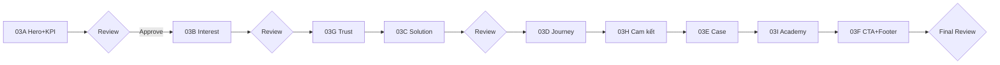

# EVCS-SPRINT-03 — Kế hoạch triển khai Homepage (chia nhỏ)

**Status:** Chờ bắt đầu 03A  
**Phụ thuộc:** Sprint 02 ✅ Approved (revision 2)  
**Nguyên tắc:** **Không code toàn bộ Homepage một lần.** Review từng phần trước khi merge.

---

## Product Principle (bắt buộc mọi sprint)

> **EVCS không bán trạm sạc.**  
> **EVCS bán sự an tâm khi đầu tư.**

Mọi copy, layout và CTA phải phản ánh nguyên tắc này — tư vấn, đồng hành, minh bạch; không commerce.

---

## Quy tắc ngôn ngữ Homepage

| Cấm | Dùng |
|-----|------|
| Sản phẩm | **Giải pháp** |
| Mua / Bán / Giá | Tư vấn / Phương án / Đồng hành |
| Catalog / Danh mục SP | Giải pháp theo quy mô |

---

## Tổng quan section → Sprint

| Section | ID | Sprint code | Merge sau review |
|---------|-----|-------------|------------------|
| §01 Hero | `#hero` | **03A** | PR 03A |
| §02 KPI | `#kpi` | **03A** (band dưới Hero) | cùng PR 03A |
| §03 Tôi đang quan tâm | `#quan-tam` | **03B** | PR 03B |
| §04 Tại sao chọn EVCS | `#tai-sao` | **03G** | PR 03G (sau 03B) |
| §05 Giải pháp | `#giai-phap` | **03C** | PR 03C |
| §06 Hành trình đầu tư | `#hanh-trinh` | **03D** | PR 03D |
| §07 Cam kết của chúng tôi | `#cam-ket` | **03H** | PR 03H (sau 03D) |
| §08 Case study | `#mo-hinh-dau-tu` | **03E** | PR 03E |
| §09 Học viện EV | `#hoc-vien` | **03I** | PR 03I (sau 03E) |
| §10 CTA cuối | `#cta` | **03F** | PR 03F |
| §11 Footer tối giản | — | **03F** | cùng PR 03F |

**Thứ tự code đề xuất:** 03A → 03B → 03G → 03C → 03D → 03H → 03E → 03I → 03F

**Thứ tự review user yêu cầu:** 03A → 03B → 03C → 03D → 03E → 03F (03G, 03H, 03I merge giữa các bước theo bảng trên)

---

## 03A — Hero + KPI

### Scope

- `HomeHero` — inspirational, không quảng cáo, không bán hàng
- `KpiBand` — mock data, thiết kế sẵn
- `HeroImage` / placeholder
- `useReveal` hook (foundation motion)
- Wire vào `HomeView` — chỉ 2 section này

### Hero tone

| Đúng | Sai |
|------|-----|
| Truyền cảm hứng, tầm nhìn xanh | “Giảm giá”, “Mua ngay”, “Ưu đãi” |
| Đồng hành, kiến tạo tương lai | Liệt kê spec trụ sạc |
| 2 CTA mềm (phương án, khảo sát) | CTA áp lực mua |

### Copy chốt

- **H1:** Kiến tạo hạ tầng sạc xanh cho tương lai
- **Sub:** Hành trình đầu tư trạm sạc VinFast — có chuyên gia đồng hành từ ý tưởng đến vận hành.

### KPI mock data

| Số | Nhãn |
|----|------|
| 50+ | Mô hình đầu tư tư vấn |
| 63 | Tỉnh thành hỗ trợ khảo sát |
| 6 | Bước triển khai minh bạch |
| 24/7 | Hỗ trợ kỹ thuật |

*Ghi chú UI: số lớn + label ngắn, 4 cột desktop / 2×2 mobile, không animation đếm số (tránh marketing feel).*

### Files

```
src/evcs/components/home/HomeHero.tsx
src/evcs/components/home/KpiBand.tsx
src/evcs/components/home/HeroImage.tsx
src/evcs/hooks/useReveal.ts
src/evcs/constants/homeContent.ts      # hero + kpi mock
src/evcs/styles/home.css               # section-scoped
```

### Acceptance 03A

- [ ] Hero inspirational tone — stakeholder sign-off copy
- [ ] Không từ “sản phẩm”
- [ ] KPI hiển thị mock 4 ô
- [ ] Không slider/carousel
- [ ] `npm run build` pass
- [ ] Không import Marketplace

### Review gate

**Dừng.** Demo `/` trên EVCS host (hoặc `EVCS_DEV_ENABLED`). Approve → merge → 03B.

---

## 03B — Interest (“Tôi đang quan tâm”)

### Scope

- `InterestGrid` + `InterestCard` × **5**
- Card thứ 5: **“Tôi chưa biết chọn trụ nào”** → `/trung-tam-dau-tu`

### 5 cards

| Card | Link |
|------|------|
| Lắp tại nhà | `/giai-phap#gia-dinh` |
| Mở trạm sạc | `/giai-phap#cafe` |
| Đầu tư kinh doanh | `/giai-phap#dau-tu` |
| Doanh nghiệp | `/giai-phap#doanh-nghiep` |
| **Tôi chưa biết chọn trụ nào** | `/trung-tam-dau-tu` |

Card 5: visual nhẹ khác (outline / badge “Tư vấn”) — không làm nổi kiểu quảng cáo.

### Acceptance 03B

- [ ] 5 cards, mobile tap target ≥ 44px
- [ ] Card 5 → Investment Center
- [ ] Stagger reveal on scroll
- [ ] Review approve → merge

---

## 03G — Tại sao chọn EVCS *(micro, sau 03B)*

### Scope

- `TrustBenefits` — 4 lợi ích (giữ Sprint 02)
- Compose vào `HomeView` sau §03

### Acceptance

- [ ] 4 check benefits, không paragraph dài
- [ ] Review → merge

---

## 03C — Giải pháp

### Scope

- `SolutionStrip` + `SolutionRow`
- Label: **Giải pháp** — không “sản phẩm”
- 6 dòng: Gia đình→AC11, Cafe→DC20, ...

### Acceptance 03C

- [ ] List format, không product grid
- [ ] Link “Xem tất cả giải pháp” → `/giai-phap`
- [ ] Zero từ “sản phẩm” trong component/copy
- [ ] Review → merge

---

## 03D — Hành trình đầu tư

### Scope

- `InvestmentTimeline` — 6 bước
- Horizontal desktop / vertical mobile
- Animation line draw (nhẹ)

### Acceptance 03D

- [ ] Semantic `<ol>`
- [ ] `prefers-reduced-motion` respected
- [ ] Review → merge

---

## 03H — Cam kết của chúng tôi *(micro, sau 03D)*

### Scope

- `CommitmentSection` — 3–4 cam kết ngắn

### Copy đề xuất

| Cam kết |
|---------|
| Minh bạch báo giá — không phí ẩn |
| Khảo sát thực tế trước khi tư vấn |
| Thi công đúng chuẩn VinFast |
| Đồng hành sau nghiệm thu |

### Acceptance

- [ ] Tone “an tâm”, không guarantee ROI
- [ ] Review → merge

---

## 03E — Case Study (theo mô hình đầu tư)

### Scope

- `CaseStudyPreview` — 2 teaser
- **Tiêu đề = tên mô hình đầu tư**, không tên dự án đơn thuần

### Mock structure

| Mô hình (H3) | Thách thức | Giải pháp | Kết quả |
|--------------|------------|-----------|---------|
| Cafe + trạm sạc công cộng | ... | ... | ... |
| Bãi xe kết hợp sạc nhanh | ... | ... | ... |

*Tên dự án (nếu có) chỉ là caption phụ, không phải headline.*

### Acceptance 03E

- [ ] Headline = mô hình đầu tư
- [ ] Không gallery ảnh
- [ ] CTA “Xem mô hình” → `/du-an`
- [ ] Review → merge

---

## 03I — Học viện EV *(micro, sau 03E)*

### Scope

- `AcademyFeatured` — 3 bài, không gọi Blog

### Acceptance

- [ ] 3 teaser, link `/hoc-vien-ev`
- [ ] Review → merge

---

## 03F — CTA cuối + Footer tối giản

### Scope

- `HomeCtaBand`
- `EvcsFooter` variant `minimal` (homepage)

### Copy chốt §10

- **H2:** Hãy để chuyên gia đồng hành cùng bạn
- **Sub:** Trao đổi qua Zalo — miễn phí, không ràng buộc.
- **CTA:** Nhận phương án đầu tư → Zalo
- **Footnote:** Gọi chuyên gia (hotline)

### Footer tối giản

```
[Logo]  Hotline · Zalo
© EVCS · Chính sách · Điều khoản
```

- Tối đa 1 hàng link pháp lý
- **Không** cột Shop/Seller/Marketplace

### Sticky mobile CTA (optional trong 03F)

- [Phương án đầu tư] [Zalo]

### Acceptance 03F

- [ ] Headline đúng copy mới
- [ ] Footer minimal spec
- [ ] Homepage full compose — all sections
- [ ] Final QA checklist Sprint 02 rev.2
- [ ] Review → merge

---

## Quy trình review / merge



1. Mỗi sprint = **1 branch** (hoặc 1 PR)
2. Chỉ touch `src/evcs/**`, `app/(evcs)/evcs/page.tsx` (HomeView), styles
3. **Không** sửa Marketplace
4. Screenshot desktop + mobile gửi kèm review
5. Reject → fix trong cùng sprint, không chuyển sprint

---

## Definition of Done — Toàn Homepage (sau 03F)

- [ ] 11 sections đúng thứ tự `EVCS-SPRINT-02.md` rev.2
- [ ] Product Principle reflected
- [ ] Không từ “sản phẩm” trên Homepage
- [ ] Hero inspirational
- [ ] 5 interest cards + Investment Center link
- [ ] Case study theo mô hình đầu tư
- [ ] CTA: “Hãy để chuyên gia đồng hành cùng bạn”
- [ ] Footer tối giản
- [ ] `npm run build` pass

---

## Không làm trong Sprint 03

- API / Database / CMS
- Calculator logic
- Admin
- SEO sitemap (Sprint 05)
- Ảnh production final (placeholder OK)

---

*Chỉ bắt đầu code khi file này và `EVCS-SPRINT-02.md` rev.2 đã đồng bộ. Sprint đầu tiên: **03A**.*
