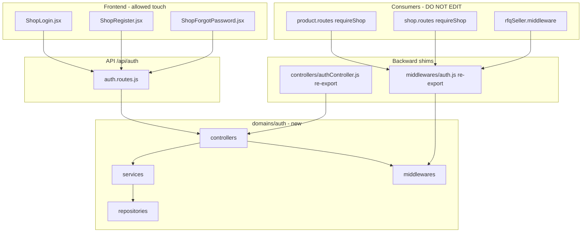

# Auth Dependency Map



## JWT contract (must preserve)

| Field | Semantics | Consumers |
|-------|-----------|-----------|
| `id` | `shop_accounts.id` | `requireShop` → `shops.accountId` |
| `role` | `"shop"` \| `"admin"` | `requireAdmin` |
| `email` | login email | optional UI |

## Additive fields (safe)

| Field | Semantics |
|-------|-----------|
| `accountId` | same as `id` |
| `shopId` | `shops.id` if exists |

## Response contract (login - preserve)

```json
{
  "token": "<jwt>",
  "shop": { "id", "accountId", "name", "email", "status" }
}
```

Optional additive: `refreshToken`, `expiresIn`.
