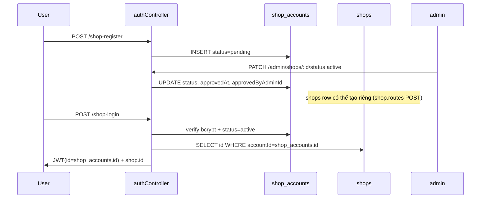

# E. Database Analysis — Otofine

**Nguồn:** `db_backup_20260524_0837.sql`, `backend/migrations/*.sql`, code references.  
**Engine:** MySQL 8 (InnoDB, utf8mb4). **Không có ORM.**

---

## 1. Tổng quan

| Metric | Giá trị |
|--------|---------|
| Bảng trong dump production | **57** |
| Migration files trong repo | **46** |
| Bảng chỉ trong migration (chưa trong dump) | `product_list_view`, `category_seo_*` (4 bảng) |
| Dual-engine | `part_knowledge` có bản MySQL + SQL Server |
| Stored procedures / triggers | **Không thấy** trong migrations |
| ORM migrations tool | **Không** — SQL thủ công + npm scripts |

---

## 2. Danh sách bảng (production dump)

### 2.1 Auth & Shop

| Bảng | Mục đích | Trạng thái |
|------|----------|------------|
| `shop_accounts` | Tài khoản login seller (email, phone, password, approval) | **Hoạt động** — core |
| `shops` | Hồ sơ storefront (avatar, địa chỉ, policies, OneSignal) | **Hoạt động** |
| `admin` | Tài khoản admin | **Hoạt động** |
| `Admin` | Legacy duplicate naming | **Rủi ro** — trùng `admin` |
| `shop_backup_20260515` | Backup snapshot | **Dư thừa** — ops only |

### 2.2 Products & Catalog

| Bảng | Mục đích |
|------|----------|
| `products` | Sản phẩm chính (shopId, partNumber, giá, mô tả…) |
| `product_images` | Ảnh sản phẩm |
| `product_meta` | Metadata mở rộng |
| `product_aliases` | Alias tìm kiếm |
| `product_car_applications` | Fitment xe ↔ sản phẩm |
| `product_categories` | Danh mục canonical |
| `product_category_map` | N-N product ↔ category |
| `product_fitment_score` | Điểm fitment |
| `product_symptoms` | Triệu chứng liên quan |
| `product_list_view` | Materialized/denormalized listing (**migration only — không trong dump**) |

### 2.3 Vehicles

| Bảng | Mục đích |
|------|----------|
| `car_models` | Model xe |
| `car_model_*` | attributes, specs, content, keywords, maintenance, relations, meta, common_faults |
| `attribute_types`, `attributes` | Thuộc tính kỹ thuật |
| `car_model_attributes` | N-N car_model ↔ attributes |

### 2.4 Knowledge & SEO

| Bảng | Mục đích |
|------|----------|
| `part_knowledge` | Kiến thức phụ tùng (SEO content) |
| `part_knowledge_backup*`, `part_knowledge_v2`, `part_knowledge_old_2026` | Backup/staging — **dư thừa tiềm năng** |
| `seo_routes` | Route registry SEO |
| `seo_page_cache` | Cache HTML/JSON trang SEO |
| `vehicle_seo_content` | Nội dung SEO theo xe |
| `global_seo_content` | SEO global |
| `category_dictionary`, `category_dictionary_queue` | Chuẩn hóa danh mục |
| `category_seo_content`, `category_relationships`, `category_faq`, `category_analytics` | **Migration 015 — không trong dump** |

### 2.5 RFQ (Request for Quote)

| Bảng | Mục đích |
|------|----------|
| `customer_profiles` | Buyer profile (phone hash) |
| `customer_vehicles` | Xe của buyer |
| `rfq_requests` | Yêu cầu báo giá |
| `rfq_dispatches` | Phân phối tới shop |
| `rfq_quotes` | Báo giá từ shop |
| `rfq_conversations`, `rfq_messages`, `rfq_message_attachments` | Chat |
| `rfq_conversation_reads` | Read cursors |
| `rfq_notifications` | Thông báo |
| `rfq_status_logs` | Audit trail RFQ |
| `rfq_escalation_jobs` | Zalo/SMS escalation |
| `rfq_auto_wave_jobs` | Auto-dispatch waves |
| `rfq_customer_events` | Analytics events |
| `rfq_push_subscriptions`, `rfq_push_sent_log` | OneSignal |
| `rfq_history_otp_challenges`, `rfq_history_sessions` | Buyer history login |
| `rfq_reminder_sends`, `rfq_reminder_outcomes` | Reminder attribution |

### 2.6 Khác

| Bảng | Mục đích |
|------|----------|
| `address` | Tỉnh/xã (địa chỉ VN) |

---

## 3. ERD dạng text (core + RFQ)

```
admin (id PK)
  ↑ FK approvedByAdminId
shop_accounts (id PK, shopId UUID UNIQUE, email UNIQUE, phone UNIQUE, status ENUM)
  │ 1:1 (accountId UNIQUE)
  ↓
shops (id PK, accountId → shop_accounts.id)
  │ 1:N shopId
  ↓
products (id PK, shopId → shops.id)
  ├── product_images (productId → products.id)
  ├── product_car_applications (productId, carModelId → car_models.id)
  └── product_category_map (product_id, category_id)

car_models (id PK)
  └── car_model_* (content, specs, meta…)

rfq_requests (id PK, customer_profile_id → customer_profiles.id)
  ├── rfq_dispatches (rfq_request_id, shop_id → shops.id)
  │     ├── rfq_quotes (dispatch_id, shop_id)
  │     └── rfq_conversations (dispatch_id)
  │           └── rfq_messages (conversation_id)
  │                 └── rfq_message_attachments
  └── rfq_status_logs, rfq_notifications, …

seo_routes (slug) ──► seo_page_cache
part_knowledge (slug) — public knowledge API
```

---

## 4. Chi tiết `shop_accounts` (ưu tiên audit)

```sql
CREATE TABLE shop_accounts (
  id INT AUTO_INCREMENT PRIMARY KEY,
  shopId VARCHAR(36) NOT NULL UNIQUE,      -- UUID public ref
  name VARCHAR(255),
  email VARCHAR(255) UNIQUE,
  phone VARCHAR(50) UNIQUE,
  passwordHash VARCHAR(255),
  createdAt TIMESTAMP DEFAULT CURRENT_TIMESTAMP,
  status ENUM('pending','active','blocked') DEFAULT 'pending',
  approvedAt DATETIME,
  approvedByAdminId INT,
  FOREIGN KEY (approvedByAdminId) REFERENCES admin(id)
);
```

```sql
CREATE TABLE shops (
  id INT AUTO_INCREMENT PRIMARY KEY,
  accountId INT UNIQUE,  -- → shop_accounts.id (legacy index name userId x3)
  name, avatar, cover, phone, email, zalo, website,
  provinceId, districtId, wardId, addressDetail,
  descriptionHtml, salePolicy, warrantyPolicy LONGTEXT,
  last_seen_at, onesignal_player_id
);
```

### Luồng dữ liệu shop_accounts



### Vấn đề schema `shop_accounts`

| Issue | Mức độ | Chi tiết |
|-------|--------|----------|
| `status='deleted'` trong code | **Cao** | `adminController.deleteShop` set `deleted` nhưng ENUM không có giá trị này → MySQL có thể lưu `''` hoặc lỗi tùy `sql_mode` |
| Không có migration versioned | Trung bình | Schema assumed tồn tại từ trước |
| `initDB.js` lỗi thời | Thấp | Dùng `shops.userId`, bảng `Admin` — không khớp production |
| Tách account vs profile | OK | Pattern hợp lý nhưng JWT `id` ≠ `shops.id` gây nhầm lẫn dev |

---

## 5. Foreign keys chính (từ dump)

- `products.shopId` → `shops.id`
- `product_car_applications` → `products`, `car_models`
- `rfq_dispatches.shop_id` → `shops.id` (RESTRICT)
- `rfq_conversations` → `rfq_dispatches`, `rfq_requests`, `shops`
- `shop_accounts.approvedByAdminId` → `admin.id`

---

## 6. Indexes & performance notes

| Bảng | Index đáng chú ý | Ghi chú |
|------|------------------|---------|
| `shops` | `idx_shops_last_seen` | RFQ presence |
| `shop_accounts` | UNIQUE email, phone, shopId | OK |
| `products` | Cần verify trên prod | Listing JOIN nặng với `product_car_applications`, `car_models` |
| `rfq_messages` | conversation_id | Chat poll |
| `seo_page_cache` | slug lookup | SEO SSR |

**Thiếu index tiềm năng:** `products(shopId, status)`, `products(partNumber, shopId)` — verify trên prod.

**`product_list_view`:** migration 001/004 định nghĩa denormalized view — **không có trong dump** → listing có thể query trực tiếp `products` + JOINs (chậm hơn).

---

## 7. Migrations timeline (nhóm)

| Range | Nội dung |
|-------|----------|
| 001–004 | Product scale, slugs, `product_list_view` |
| 005–013 | `part_knowledge` (MySQL + SQL Server) |
| 014–017 | SEO engine, category SEO, address |
| 020–037 | RFQ full module |

**Chạy migration:** `npm run migrate:rfq`, `migrate:seo`, `migrate:knowledge` + scripts riêng.

---

## 8. Bảng dư thừa / rủi ro

| Bảng | Đánh giá |
|------|----------|
| `Admin` + `admin` | Duplicate naming — chuẩn hóa về một |
| `part_knowledge_backup*`, `part_knowledge_v2`, `part_knowledge_old_2026` | Archive — document hoặc archive DB |
| `shop_backup_20260515` | Manual backup table |
| `category_seo_*` (nếu chưa migrate) | Feature SEO category chưa live trên dump |

---

## 9. Luồng dữ liệu chính

1. **Listing công khai:** `products` + JOIN shops/address/car → optional Typesense
2. **Shop CRUD:** JWT → `shop_accounts.id` → `shops.id` → `products` WHERE shopId
3. **SEO page:** `seo_routes` / `vehicle_seo_content` / `part_knowledge` → cache `seo_page_cache`
4. **RFQ:** `rfq_requests` → dispatch wave → `rfq_conversations` + push

---

## 10. Bảng quan trọng nhất (Top 10)

1. `products`
2. `shops`
3. `shop_accounts`
4. `product_car_applications`
5. `car_models`
6. `rfq_requests`
7. `rfq_dispatches`
8. `rfq_messages`
9. `part_knowledge`
10. `seo_page_cache`

---

## 11. Chuẩn hóa đề xuất (chỉ ghi nhận, không thực hiện)

- Thêm `'deleted'` vào ENUM `shop_accounts.status` hoặc dùng `deleted_at` timestamp
- Migration versioned cho `shop_accounts` + `shops` + `admin`
- Gộp/xóa bảng backup part_knowledge khi không cần
- Đảm bảo `product_list_view` được tạo và sync trên prod
- Đổi tên index `userId` trên `shops` → `accountId` (cosmetic)
