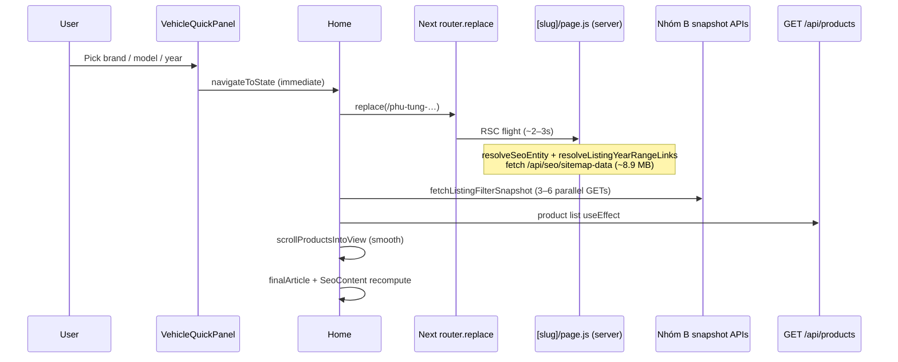

# HOME-FILTER-PERFORMANCE-REGRESSION-AUDIT-01

**Date:** 2026-06-22  
**Mode:** Read-only audit — no code changes, no fixes  
**Reported issue:** Brand, vehicle (model), and year selection on the homepage feel slower than before.

---

## Executive summary

Filter interactions are slow because **each quick-pick step (brand → model → year) triggers a full listing cascade**: immediate URL navigation, server-side SEO slug rendering, parallel facet API batch, and a separate product-list fetch — before the user has finished choosing a vehicle.

Recent IMAGE-* and SEO-* work added **measurable but secondary** cost (larger list payloads, extra backend fitment enrichment, more crawl links, `ShopRecentlyViewed` on filtered pages). The dominant regressors are **architectural**: eager navigation per step, duplicated client fetches, and **~2–3s server work on every `router.replace` to a slug URL** driven by `force-dynamic` `[slug]` pages and an 8.9 MB sitemap inventory fetch for year-range links.

**No pre-optimization filter-interaction baseline exists** in the repo. Comparisons below use `audit/performance-analysis.md` (general static notes) and inferred deltas from recent change logs.

---

## Methodology

| Signal | How measured |
|--------|----------------|
| API latency | `curl` to `127.0.0.1:5000` (backend) |
| Payload size | Response `size_download` + JSON field analysis |
| RSC navigation | `curl` with `RSC: 1` to `127.0.0.1:3000` |
| JS execution | Node microbenchmarks (`buildProductImageAlt`, JSON parse) |
| React render count | **Estimated** from state/effect graph — no Profiler instrumentation added (read-only constraint) |
| Component render cost | Static tree analysis + memo boundaries |

Environment: production PM2 processes (`otofine-frontend`, `otofine-backend`), ~7,385 public products.

---

## Interaction model (what happens on each pick)

**Key code paths**

- Immediate navigation on pick (not deferred to “Apply”): `useVehicleQuickPanel.js` `handleQuickPickBrand` / `handleQuickPickModel` / `handleQuickPickYear` → `navigateToState`.
- Facet batch on every filter dimension: `Home.jsx` Nhóm B `useEffect` → `fetchListingFilterSnapshot` (`listingBootstrapSync.js`).
- Product list: separate `Home.jsx` `useEffect` on `[category, brand, model, year, location, keyword, page, sort]`.
- Slug server render: `app/[slug]/page.js` `dynamic = "force-dynamic"` + `resolveListingYearRangeLinks` → `fetchSitemapInventory()` (8.9 MB).

---

## Measurements

### API latency & payload (single request)

| Endpoint | Latency (warm) | Payload |
|----------|----------------|---------|
| `GET /api/products` (no filter) | ~8–73 ms | ~125 KB (16 items) |
| `GET /api/products?brand=Toyota` | ~8–400 ms (cache-sensitive) | ~129 KB |
| `GET /api/products?brand=Toyota&model=Vios` | ~9 ms | ~129 KB |
| `GET /api/product-categories/canonical?brand=Toyota` | **~160–310 ms** | ~2.9 KB |
| `GET /api/products/locations?brand=Toyota` | ~6 ms | ~73 B |
| `GET /api/filter/models?brand=Toyota` | ~5 ms | ~946 B |
| `GET /api/filter/years?brand=Toyota&model=Vios` | ~3 ms | ~136 B |
| `GET /api/filter/specs?brand=Toyota&model=Vios` | ~2 ms | ~124 B |
| `GET /api/seo/sitemap-data` | **~2.0–2.5 s** | **~8.9 MB** |

### Simulated client cascade (parallel `curl`, wall time)

| User action | Parallel API set | Wall time |
|-------------|------------------|-----------|
| **Brand change** | categories + locations + models + products | **~1.09 s** |
| **Model change** | categories + locations + models + years + specs + products | **~0.21 s** |

Bottleneck on brand change: `product-categories/canonical` (~160–310 ms) and cold `products` (~400 ms). Categories stays slow even when “warm” (~165–203 ms).

### Next.js soft navigation (slug URL)

| Request | Latency | Notes |
|---------|---------|-------|
| RSC `GET /phu-tung-toyota` | **~2.2–2.8 s** | ~21 KB flight; server-bound |
| HTML `GET /phu-tung-toyota` | **~2.6 s** | Full document |
| RSC warm repeat | **~2.2 s** | No meaningful improvement — `force-dynamic` |

Each brand/model/year pick that changes the pathname triggers this path when moving off `/`.

### JS execution (client, per product grid paint)

| Operation | Cost |
|-----------|------|
| `JSON.parse` ~116–129 KB list | ~2 ms |
| `buildProductImageAlt` × 16 cards | ~0.1 ms total (~0.006 ms/card) |
| Sitemap BMY range filter × 1 | ~0.3 ms (×1000 ≈ 64 ms) |

`buildProductImageAlt` and `productImageDimensionProps` are **not** meaningful grid costs.

### Payload bloat from IMAGE-ALT / canonical enrichment

Per 16-item page, attaching `cars`, `productIdentity`, `canonicalPath`, `canonicalUrl` adds **~13 KB** (~815 B/product). List responses include fitment objects used by ALT builder (`audit/image-alt-vehicle-context-enhancement-01.md`).

Backend per list request also runs `loadPrimaryFitmentCarsByProductIds` + `buildProductIdentity` × N (`productList.service.js`).

### React render count (estimated per filter step)

No React Profiler run (read-only). From state/effect wiring:

| Phase | Estimated `Home` renders |
|-------|---------------------------|
| `navigateToState` (brand/model/year patch) | 1 |
| `router.replace` + RSC payload / Suspense | +1–2 |
| `setListBootstrapping(true)` | +1 |
| Nhóm B snapshot `startTransition` (5 facet setters) | +1 |
| Products loaded + `setListBootstrapping(false)` | +1 |
| Scroll `useEffect` on `listingState.stateKey` | +0–1 |
| **Typical total** | **~5–7** full `Home` tree passes |

`Home.jsx`: **11** `useEffect`, **13** `useMemo`, **1,596** lines. Only `HomeProductCard`, `ProductGridWrapper`, and `SeoContent` use `memo`; root and `LeftNav` do not.

---

## Baseline comparison

| Source | Filter-interaction data? | Relevant notes |
|--------|--------------------------|----------------|
| `audit/performance-analysis.md` | **No** | Flags listing SQL, uncached APIs, “Home + listing: nhiều useEffect fetch” |
| Lighthouse (`audit/lighthouse/`) | **No** | Storefront mobile, not homepage filter UX |
| Pre-optimization capture | **Not found** | Cannot quantify “before vs after” in ms or render counts |

**Inferred regression contributors (recent work)**

| Change | Likely impact |
|--------|----------------|
| IMAGE-ALT: `cars` + `productIdentity` on list API | +~13 KB/page, +DB fitment query per list |
| IMAGE-DIMENSION | Negligible JS |
| SEO-LINKGRAPH-PHASE-02: year-range caps 12→24 | More server filtering/render of link nav |
| HOTFIX `ShopRecentlyViewed` import | Component now runs on filtered slug pages (localStorage + strip) |
| Pre-existing: eager quick-pick navigation | Full cascade on each step (primary) |

---

## Ranked root causes

| Rank | Root cause | Severity | Evidence |
|------|------------|----------|----------|
| **1** | **Eager `navigateToState` on every brand/model/year pick** (not batched to Apply) | Critical | `useVehicleQuickPanel.js` handlers call `router.replace` immediately; user reports slowness on all three steps |
| **2** | **Slug soft navigation + `force-dynamic` `[slug]/page.js`** | Critical | RSC ~2.2–2.8 s per pathname change; no static/ISR benefit despite `revalidate = 3600` |
| **3** | **`resolveListingYearRangeLinks` → `GET /api/seo/sitemap-data` (8.9 MB)** on slug render | Critical | ~2 s fetch every slug server pass; phase-02 doubled link caps |
| **4** | **Nhóm B `fetchListingFilterSnapshot` on every filter dimension** | High | 3–6 parallel APIs per step; categories alone ~160–310 ms |
| **5** | **Separate product-list `useEffect`** (duplicate concern with facets) | High | Second ~129 KB fetch + backend fitment enrichment per step |
| **6** | **Monolithic `Home` rerender tree** (~5–7 passes/step) | High | 1,596-line client component; most children unmemoized |
| **7** | **`finalArticle` / `SeoContent` / `enhanceSeoArticleHtml` on every products+filter change** | Medium | `useMemo` deps include `products`, `brand`, `model`, `year`; `imageProducts={products}` |
| **8** | **`scrollProductsIntoView` on every `listingState.stateKey` change** | Medium | Smooth scroll + layout on each step adds perceived lag |
| **9** | **List API fitment enrichment** (`loadPrimaryFitmentCarsByProductIds`) | Medium | Extra DB work per list; cold brand query ~400 ms observed |
| **10** | **`ShopRecentlyViewed` on filtered slug pages** | Low–Medium | New client work post-hotfix; `pathname !== "/"` gate |
| **11** | **List payload growth from IMAGE-ALT backend fields** | Low | +~13 KB/page; parse still ~2 ms |
| **12** | **`buildProductImageAlt` / `productImageDimensionProps`** | Negligible | Microbenchmarks &lt;0.2 ms per grid |

---

## Top 20 slowest components (estimated render cost)

Ranked by impact during a filter change (server + client):

| # | Component | Why expensive |
|---|-----------|---------------|
| 1 | **`Home`** | Root; 5–7 full passes; 11 effects fire |
| 2 | **`[slug]/page.js` (RSC shell)** | Server: entity resolve + sitemap + year links |
| 3 | **`SeoContent` → `SeoArticleBlock`** | `enhanceSeoArticleHtml` + FAQ merge on filter change |
| 4 | **`VehicleQuickPanel`** | Unmemoized; props object recreated; draft fetch effects |
| 5 | **`HomeProductCard` × 16** | Remount when `products` changes; ALT + image props |
| 6 | **`ProductGridWrapper`** | Memo bypassed when `products` / `listBootstrapping` change |
| 7 | **`LeftNav`** | Unmemoized; rerenders with parent; passes unused `products` |
| 8 | **`HomeHeader` / `HomeSearch`** | Large subtree; search state independent of filters |
| 9 | **`MobileDrawers`** | Vehicle drawer + filter chrome |
| 10 | **`SearchSuggestPanel`** | Mounted in header; competes for main-thread time |
| 11 | **`ProductPagination`** | Rerenders on list state |
| 12 | **`ShopRecentlyViewed`** | Mount + `useEffect` + horizontal strip on slug pages |
| 13 | **`ListingYearRangeLinks`** | Cheap render; cost is server-side resolution |
| 14 | **`FilterBar`** | Inside `ProductGridWrapper`; city dropdown state |
| 15 | **`ListingHero`** | Title string rebuild |
| 16 | **`RightRail`** | Receives `brand` |
| 17 | **`PopularCategoriesBox`** | Category list from facet snapshot |
| 18 | **`TrustSection` / `FooterSection`** | Static content but still reconciled |
| 19 | **`ProductCardImage` (`HomeImages`)** | 16 images decode/layout per grid refresh |
| 20 | **`PartKnowledgeSeoPage`** | When `premiumArticle` present (vehicle SEO routes) |

---

## Top 20 expensive computations

| # | Computation | Where | Est. cost |
|---|-------------|-------|-----------|
| 1 | `fetchSitemapInventory()` | `buildListingYearRangeLinks.server.js` | **~2 s**, 8.9 MB |
| 2 | `resolveSeoEntity` + slug metadata | `app/[slug]/page.js` | Part of RSC ~2–3 s |
| 3 | `fetchListingFilterSnapshot` | `listingBootstrapSync.js` | **~160 ms–1 s** wall (parallel) |
| 4 | `GET /api/products` + SQL + fitment map | `productList.service.js` | **~10–400 ms** |
| 5 | `loadPrimaryFitmentCarsByProductIds` | Backend list pipeline | Per list request |
| 6 | `buildProductIdentity` × N | Backend + egress fields | Per row |
| 7 | `buildDynamicListingSeoContent` | `dynamicListingSeoComposer.js` | Scans 16 products + regex |
| 8 | `enhanceSeoArticleHtml` | `seoArticleBodyEnhance.js` | HTML mutation + image injection |
| 9 | `fetchCategoriesList` (up to 3 fallbacks) | `listingBootstrapSync.js` | Sequential on miss |
| 10 | `filterBmyRanges` / `filterCbmyRanges` on inventory | Year-range builders | ~0.3 ms once; scales with inventory size |
| 11 | `parseUrlState` / `buildListingPathForUrlState` | URL sync | Per navigation |
| 12 | `JSON.parse` product list | Client fetch handler | ~2 ms |
| 13 | `router.replace` RSC hydration | Next.js client | Coupled to #1–2 |
| 14 | `buildProductImageAlt` × 16 | `HomeProductCard` | ~0.1 ms |
| 15 | `getProductDetailHref` × 16 | `HomeProductCard` useMemo | Small |
| 16 | `productImageDimensionProps` × images | IMAGE-DIMENSION | Small |
| 17 | `vehicleQuickPanelProps` useMemo rebuild | `Home.jsx` | Object alloc; triggers panel diff |
| 18 | `scrollProductsIntoView` + layout | `Home.jsx` | Main-thread + compositor |
| 19 | `readRecentlyViewed` / localStorage | `ShopRecentlyViewed` | Sync I/O on mount |
| 20 | `attachCanonicalFieldsFromMap` | Backend egress | Per row serialization |

---

## Unnecessary rerenders & redundant work

| Issue | Location | Detail |
|-------|----------|--------|
| **Dead `products` prop** | `Home.jsx` → `LeftNav` | `LeftNav` accepts `products` but never uses it; still reconciles on every list update |
| **Facet + list double-fetch** | `Home.jsx` Nhóm B + product `useEffect` | Same filter deps; two independent async pipelines per step |
| **Immediate URL sync per pick** | `useVehicleQuickPanel` | Model/year picks refetch facets before selection is “complete” |
| **Categories refetch on year change** | Nhóm B deps include `year` | Sidebar categories rarely need year-scoped refresh every time |
| **`SeoContent` `imageProducts={products}`** | `Home.jsx` ~1428 | Forces SEO block work when only grid images change |
| **`vehicleQuickPanelProps` invalidation** | `models`/`years` in deps | Panel rerenders when facet snapshot returns even if closed |
| **`HomeProductCard.areEqual` omits `cars`/`productIdentity`** | `HomeProductCard.jsx` | Low impact today (new array each fetch); would block ALT updates if products were stable-reference |
| **Duplicate model/year fetch logic** | Panel vs Nhóm B | Panel reuses listing `models`/`years` when draft matches applied filter; still parallel paths during transition |
| **Sitemap fetch per slug request** | `resolveListingYearRangeLinks` | 8.9 MB JSON although filtering is &lt;1 ms — network/parse dominates |
| **`force-dynamic` negates `revalidate`** | `[slug]/page.js` | Every navigation pays full server cost |

---

## Audited files (findings)

### `Home.jsx`

- Hub for filter state, URL sync, facet batch (Nhóm B), product fetch, SEO article, scroll, and layout.
- `navigateToState` patches up to 5 state fields + `router.replace` per call.
- `finalArticle` recomputes dynamic SEO whenever `products` or any vehicle filter changes.
- Renders `ListingYearRangeLinks`, `ShopRecentlyViewed` (slug pages), and full product grid.

### `ShopRecentlyViewed`

- Client-only; reads localStorage on mount.
- Now rendered when `pathname !== "/"` and any filter active — extra work on SEO listing pages after hotfix import.

### SEO crawl link components

- `ListingYearRangeLinks.jsx`: lightweight client nav (up to 24 links post phase-02).
- `buildListingYearRangeLinks.server.js`: expensive part is inventory load, not JSX.

### Year-range builders

- `filterBmyRanges` / `filterCbmyRanges` / `withOptionalParent`: CPU-trivial vs sitemap fetch.
- Phase-02 doubled caps (12→24) → slightly more link DOM, more inventory scanning headroom.

### Vehicle fitment helpers

- Backend: `loadPrimaryFitmentCarsByProductIds` + `attachCanonicalFieldsFromMap` on every list response.
- Frontend: `buildProductImageAlt` → `resolvePrimaryFitmentForAlt` → `pickPrimaryFitment`; cheap on client.

### Recent IMAGE-* / SEO-* changes

- **Regression-relevant:** list payload enrichment, `ShopRecentlyViewed` enabled, linkgraph phase-02 server work.
- **Not regression-relevant:** ALT string CPU, image `width`/`height` props, sitemap XML image blocks (not in filter path).

---

## Step-by-step user journey (estimated critical path)

| Step | Server (RSC) | Client APIs | Est. renders | Dominant wait |
|------|--------------|-------------|--------------|---------------|
| Pick **brand** | ~2.5 s (new slug) | ~1.1 s parallel facets + list | ~5–7 | RSC + categories + cold list |
| Pick **model** | ~2.5 s (new slug) | ~0.2 s parallel + list | ~5–7 | RSC |
| Pick **year** | ~2.5 s (new slug) | ~0.2 s parallel + list | ~5–7 | RSC |

**Cumulative perceived latency for a full B→M→Y selection: roughly 7–10+ seconds of network/server work**, excluding UI animation — consistent with “each step got slower.”

---

## Gaps & limitations

- No React Profiler / Performance API capture (would require instrumentation).
- No historical A/B baseline for filter interactions.
- API timings vary with cache (`listCache` 60 s TTL, `clientJsonCache` 60–120 s); user cold starts may feel worse.
- Measurements from localhost; CDN/edge not in path.

---

## Conclusion

The slowdown is **not primarily** from `buildProductImageAlt` or image dimensions. It is driven by **doing a complete listing reload and SEO slug navigation on every intermediate vehicle pick**, amplified by **~2 s sitemap inventory fetch on each slug server render** and **slow category facet API**. Recent IMAGE-ALT backend enrichment adds secondary cost to every product fetch. IMAGE/SEO crawl-link work increased server-side slug render work modestly; enabling `ShopRecentlyViewed` on filtered pages adds client-side cost after the hotfix.

**No fixes proposed in this audit** (per scope).
