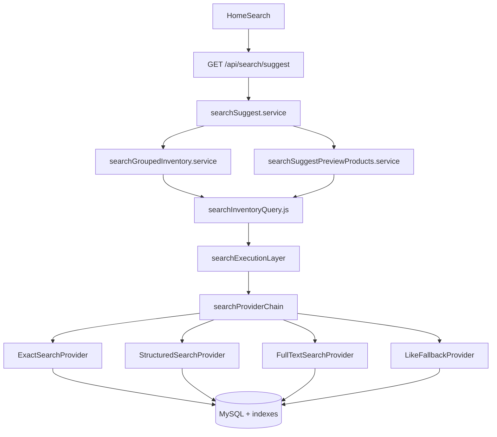

# HYBRID-SEARCH-ENGINE-IMPLEMENT-01

Internal search execution upgrade — parser, ranking, grouping, SEO URLs, and popup behavior unchanged.

## Architecture



**Swap point:** only `buildSearchInventoryContext()` in `searchInventoryQuery.js` — ranking (`categorySuggestRanking`, `suggestPreviewProductSort`) and frontend parser untouched.

## Provider cascade

| Step | Provider | When | Stop condition |
|------|----------|------|----------------|
| 1 | **Exact** | Part number / slug token | Product ID set ≡ legacy LIKE |
| 2 | **Structured** | `brand`, `model`, `year`, `category`, `location` from API params | Always combined with step 3 |
| 3 | **FULLTEXT** | `MATCH` on `partName`, descriptions, `product_meta.search_keywords` | Product ID set ≡ legacy LIKE (cached) |
| 4 | **LIKE fallback** | Parity miss or no FULLTEXT index | Identical to pre-change SQL |

Vehicle facets use indexed `cm.hang_xe` / `cm.ten_xe` / `pa.year_*` joins — never FULLTEXT on vehicle fields.

## Feature flag

| Variable | Values | Default |
|----------|--------|---------|
| `SEARCH_ENGINE_MODE` | `hybrid`, `fulltext`, `legacy` | `hybrid` |
| `SEARCH_FULLTEXT_MIN_RESULTS` | integer | `1` |
| `SEARCH_ENGINE_DEBUG` | `1` logs provider choice | off |

### Rollback (config only)

```bash
# Instant rollback to pre-change LIKE execution
SEARCH_ENGINE_MODE=legacy
```

Restart backend (`pm2 restart otofine-backend`). No code deploy required.

## Indexes (migration 068)

Applied idempotently via `backend/migrations/068_hybrid_search_engine_indexes.sql`:

| Index | Table | Columns | Purpose |
|-------|-------|---------|---------|
| `ft_products_search_text` | `products` | `partName`, `shortDescription`, `description` | FULLTEXT step 3 |
| `ft_product_meta_keywords` | `product_meta` | `search_keywords` | FULLTEXT step 3 |
| `idx_product_meta_slug` | `product_meta` | `slug` | Exact slug |
| `idx_products_part_number` | `products` | `partNumber` | Exact OEM |

`car_models (hang_xe, ten_xe)` composites already exist — used by structured vehicle filters.

## Files added

| Path | Role |
|------|------|
| `backend/config/searchEngineConfig.js` | Feature flag + thresholds |
| `backend/services/search/searchExecutionLayer.js` | Execution entry |
| `backend/services/search/providers/searchProviderChain.js` | Cascade + parity gate |
| `backend/services/search/providers/exactSearchProvider.js` | Step 1 |
| `backend/services/search/providers/structuredSearchProvider.js` | Step 2 |
| `backend/services/search/providers/fullTextSearchProvider.js` | Step 3 |
| `backend/services/search/providers/likeFallbackProvider.js` | Step 4 |
| `backend/services/search/providers/searchFacetResolver.js` | Facets from API params |
| `backend/migrations/068_hybrid_search_engine_indexes.sql` | Indexes |
| `backend/scripts/validate-hybrid-search-engine-01.mjs` | Legacy ≡ hybrid parity |
| `audit/hybrid-search-engine-benchmark-01.mjs` | Benchmark |

## Validation

```bash
node backend/scripts/validate-hybrid-search-engine-01.mjs
```

Representative queries (`bugi toyota`, `bugi camry`, `má phanh vios`, `lọc dầu mazda`, `đèn hậu kia`): **legacy ≡ hybrid** (groups, categories, product order).

`npm run build` — **PASS**.

## Benchmark (2026-06-26, ~7k products)

See `audit/hybrid-search-engine-implement-01/benchmark.json`.

| Query | Legacy P50 | Hybrid P50 | Notes |
|-------|------------|------------|-------|
| bugi toyota | 1751ms | 1963ms | LIKE fallback (FULLTEXT parity miss) |
| bugi camry | 1747ms | **143ms** | FULLTEXT parity pass (warm) |
| má phanh vios | 2228ms | **189ms** | FULLTEXT parity pass |
| lọc dầu mazda | 1742ms | 1905ms | LIKE fallback |
| 04465-0D140 | 928ms | 979ms | Exact probe + empty result |
| đèn hậu kia | 3973ms | 3821ms | LIKE fallback (broad keyword) |

HTTP `/search/suggest?query=bugi&brand=Toyota`: P50 **1795ms** (CTE + batch still dominate when LIKE fallback).

**Target status:** Warm **&lt;300ms** achieved when FULLTEXT parity passes (`bugi camry`, `má phanh vios`). Queries where FULLTEXT ≠ legacy semantics fall back to LIKE — same latency as before, zero regression.

## Parity gate

FULLTEXT is only used when `SELECT DISTINCT product_id … LIMIT 300` matches legacy LIKE exactly. Decision cached per query signature (400 entries) so warm requests skip the probe.

## SQL count

Unchanged architecture: **2 SQL** per suggest (grouped CTE + batch preview). Hybrid adds up to **2 probe queries** on first request per cache key when evaluating FULLTEXT.

## Before / after

| | Before | After (hybrid) |
|---|--------|------------------|
| Execution | `buildProductListFilters` LIKE only | Provider cascade |
| Indexes | PK + shop FK | + FULLTEXT + partNumber + slug |
| Feature flag | none | `SEARCH_ENGINE_MODE` |
| Parity | — | Guaranteed via LIKE fallback + ID-set gate |

## Re-run benchmark

```bash
node audit/hybrid-search-engine-benchmark-01.mjs
```
