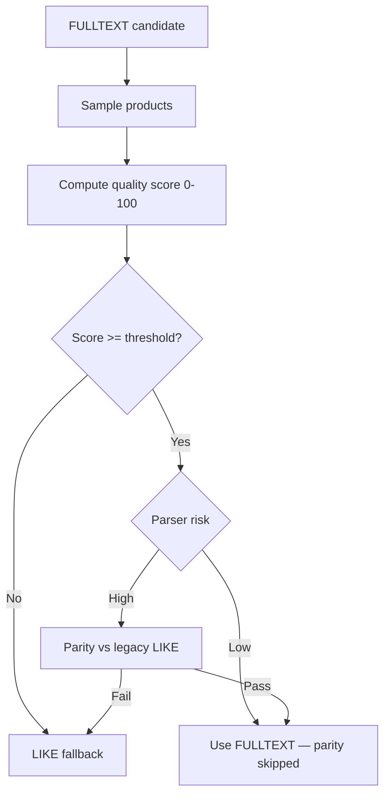

# HYBRID-SEARCH-QUALITY-GATE-01

Quality-based FULLTEXT vs LIKE decision layer. Providers, parser, ranking, grouping, popup, and SEO unchanged.

## Decision flow



## Quality scoring (default weights → 100)

| Dimension | Weight | When applied |
|-----------|--------|--------------|
| Category match | 40 | `category` param or keyword tokens |
| Brand match | 20 | `brand` param |
| Model match | 20 | `model` param |
| Year match | 5 | `year` param |
| Part number | 10 | OEM token |
| Phrase match | 5 | Keyword in title |
| Structured coverage | +5 | Facet alignment bonus |

**Threshold:** `QUALITY_GATE_THRESHOLD` (default **85**)

## Parser risk

| Risk | Examples | Parity |
|------|----------|--------|
| **Low** | `bugi` + Toyota, brand+model, part number, multi-word + facets | Skipped |
| **High** | `bugi`, `lọc`, lone brand token | Required after quality pass |

## Config

| Variable | Default | Purpose |
|----------|---------|---------|
| `SEARCH_ENGINE_MODE` | `hybrid` | `legacy` / `hybrid` / `fulltext` |
| `QUALITY_GATE_THRESHOLD` | `85` | Minimum score for FULLTEXT |
| `QUALITY_WEIGHT_*` | see weights | Override individual dimensions |
| `SEARCH_DECISION_MODE` | `quality_gate` | `strict_parity` for benchmark only |
| `SEARCH_ENGINE_DEBUG` | off | Log score, provider, parity |

### Rollback

```bash
# Full rollback to LIKE-only
SEARCH_ENGINE_MODE=legacy

# Or disable quality gate (strict ID parity — previous hybrid)
SEARCH_DECISION_MODE=strict_parity
```

## Development logging

With `SEARCH_ENGINE_DEBUG=1`:

```
[search-quality-gate] query="bugi" score=94 provider=structured+fulltext parity=Skipped risk=low/brand+keyword reason=quality-pass-low-risk
```

## Before / after benchmark (2026-06-26)

| Query | Strict parity P50 | Quality gate P50 | Provider (QG) |
|-------|-------------------|------------------|---------------|
| bugi toyota | 2759ms | **204ms** | structured+fulltext |
| bugi | 2710ms | 2651ms | like-fallback |
| má phanh vios | 1431ms | **262ms** | structured+fulltext |
| lọc dầu mazda | 2823ms | 1904ms | like-fallback (score 73) |
| đèn hậu kia | 4148ms | 3996ms | like-fallback |

| Metric | Strict parity | Quality gate |
|--------|---------------|--------------|
| FULLTEXT usage | 17% | **33%** |
| LIKE fallback | 83% | 67% |

## Files

| Path | Role |
|------|------|
| `backend/services/search/providers/searchQualityGate.js` | Scoring + risk + decision |
| `backend/services/search/providers/searchProviderChain.js` | Wired decision layer |
| `backend/config/searchEngineConfig.js` | Threshold + weights |
| `backend/scripts/validate-hybrid-search-quality-gate-01.mjs` | Validation |
| `audit/hybrid-search-quality-gate-benchmark-01.mjs` | Benchmark |

## Validation

```bash
node backend/scripts/validate-hybrid-search-quality-gate-01.mjs
node backend/scripts/validate-hybrid-search-engine-01.mjs  # popup groups parity
```

`npm run build` — **PASS**

## Re-run benchmark

```bash
node audit/hybrid-search-quality-gate-benchmark-01.mjs
```
