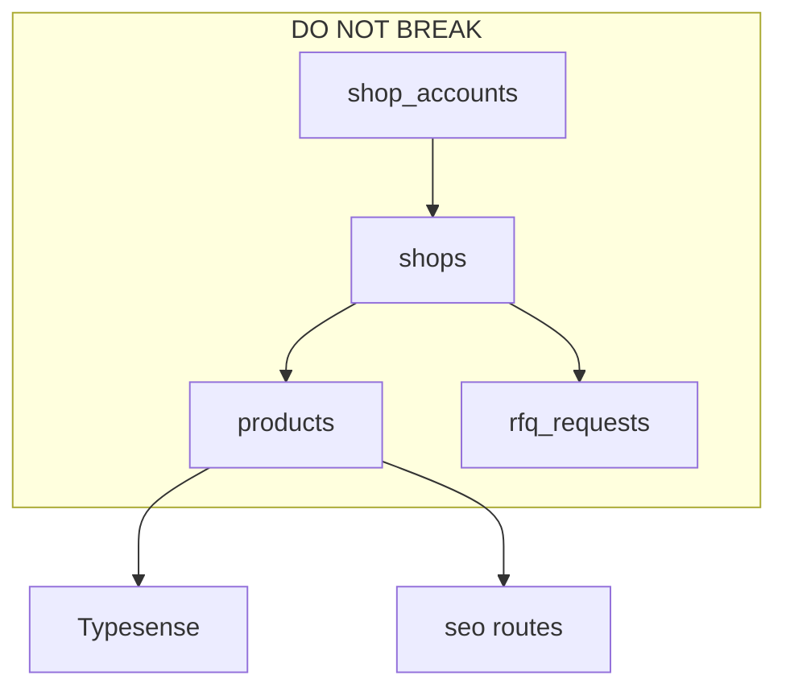

# I, J, K — Chuẩn hóa, Roadmap & Vùng cấm

---

## I. Đề xuất chuẩn hóa kiến trúc

### 1. Tầng backend

```
routes/          → chỉ mapping HTTP
controllers/     → parse request, call service, format response  
services/        → business logic
repositories/    → SQL only (mở rộng từ RFQ pattern)
validators/      → Joi/Zod schemas (mới)
```

### 2. Naming conventions

| Hiện tại | Chuẩn đề xuất |
|----------|---------------|
| `product.service.js` + `productService.js` | `productCrud.service.js` + `productSearchSync.service.js` |
| `shops.userId` index name | `accountId` only |
| `Admin` vs `admin` table | Single `admin_users` |
| `/api/auth` + `/api/admin` duplicate | Single `/api/auth` |

### 3. shop_accounts module hóa (đề xuất)

Tạo bounded context rõ ràng (không chỉ table):

```
modules/seller-account/
  sellerAccount.repository.js   → shop_accounts SQL
  sellerAccount.service.js        → register, login, status
  sellerProfile.repository.js     → shops SQL
  routes/sellerAuth.routes.js
  routes/adminSeller.routes.js
```

**Không đổi behavior** trong phase 1 — chỉ move code.

### 4. Database

- Migration `039_shop_accounts_status_deleted.sql` — fix ENUM
- Baseline migration từ `db_backup` cho new environments
- Document `product_list_view` sync contract

### 5. Frontend

- Design tokens (Tailwind config extend)
- Shared `components/ui/` primitives
- Single API client module
- Server actions hoặc BFF cho shop admin (giảm localStorage auth)

### 6. DevOps

- `ecosystem.config.cjs` trong repo
- `backend/.env.example` đầy đủ
- GitHub Actions: lint + test + build
- Loại bỏ `*-rfq-dev` copies → feature branches

---

## H. Technical debt tổng hợp

| ID | Debt | Impact |
|----|------|--------|
| TD1 | No ORM / migration drift | High |
| TD2 | shop_accounts no migration | High |
| TD3 | ENUM deleted mismatch | High |
| TD4 | Duplicate auth routes | Medium |
| TD5 | server.js god file | Medium |
| TD6 | 1000-line services | Medium |
| TD7 | Client-only guards | High |
| TD8 | RFQ in-memory rate limits | Medium at scale |
| TD9 | No tests in CI | High |
| TD10 | Dev/prod tree duplication | High |
| TD11 | Legacy SEO Next routes | Low |
| TD12 | part_knowledge backup tables | Low |
| TD13 | Forgot password plaintext | Critical security |
| TD14 | Zalo test endpoint | Critical security |

---

## J. Roadmap refactor (theo thứ tự ưu tiên)

### Phase 0 — Safety (1–2 tuần) 🔴

**Không đổi business logic**

1. Gỡ/vô hiệu `GET /api/zalo/test-send` trên production
2. Sửa admin forgot-password → email flow (hoặc tạm disable endpoint)
3. Migration fix `shop_accounts.status` ENUM + data repair
4. Thêm `backend/.env.example`
5. Document `RFQ_MODULE_ENABLED` state trên prod
6. Rate limit `POST /api/auth/shop-login`

### Phase 1 — shop_accounts & auth clarity (2–4 tuần)

1. Extract `modules/seller-account/` từ authController + adminController
2. Document dual-ID (`shop_accounts.id` vs `shops.id`) trong README nội bộ
3. Wire `shopForgotPassword` hoặc remove dead code
4. Auto-create `shops` row on register (nếu product yêu cầu)
5. JWT refresh token (optional nhưng recommended)

### Phase 2 — Data layer stability (3–5 tuần)

1. Verify + deploy `product_list_view` trên prod
2. Repository pattern cho products + shops
3. Consolidate `product.service` / `productService` naming
4. EXPLAIN slow queries + add indexes
5. Typesense sync monitoring

### Phase 3 — API hygiene (4–6 tuần)

1. Remove duplicate `/api/admin` auth routes
2. Global error handler + consistent error schema
3. OpenAPI spec generation
4. Input validation middleware
5. Tách Zalo routes → `routes/zalo.routes.js`, register before listen

### Phase 4 — RFQ production hardening (song song nếu RFQ live)

1. Redis rate limits
2. E2E tests cho OTP + conversation
3. PM2 ecosystem cho workers
4. R2-only media (deprecate local uploads)

### Phase 5 — Frontend modernization (6–10 tuần)

1. Merge `frontend-rfq-dev` → `frontend` + feature flags
2. Design system baseline
3. Server-side auth check middleware Next.js
4. Dynamic import Quill/OneSignal

### Phase 6 — Platform (dài hạn)

1. Docker compose dev environment
2. CI/CD pipeline
3. Read replica MySQL
4. Event queue (BullMQ) cho import/export

---

## K. Những phần KHÔNG được đụng (rủi ro cao)

| Vùng | Lý do |
|------|-------|
| **JWT payload shape** (`id` = shop_accounts.id) | Break tất cả shop sessions + RFQ shop auth |
| **`shops.id` trên `products.shopId`** | Sai ID → lộ/xóa nhầm sản phẩm shop khác |
| **RFQ viewer token hash algorithm** | Invalidate toàn bộ buyer links đang mở |
| **`rfq_dispatches` wave logic** | Ảnh hưởng phân phối seller đang chạy |
| **Typesense schema/document shape** | Search outage |
| **SEO slug format `phu-tung-o-to`** | 404 hàng loạt trên Google |
| **`part_knowledge` slug URLs đã index** | Mất traffic SEO |
| **Production DB migration không rollback** | Đặc biệt RFQ 020–037 đã apply |
| **R2 bucket paths đang dùng** | Broken images |
| **OneSignal player ID mapping** | Mất push notifications |
| **bcrypt password hashes** | Không rehash hàng loạt không cần thiết |
| **Chạy `initDB.js` trên prod** | Schema conflict |
| **Force push `db_backup` vào git** | Secret leak |

### Quy trình an toàn khi buộc phải đụng

1. Backup DB trước (`mysqldump`)
2. Feature flag + canary
3. Migration reversible khi có thể
4. Monitor PM2 logs + error rate 24h

---

## Điểm yếu lớn nhất (tóm tắt executive)

1. **Auth/security gaps** — forgot password, Zalo endpoints, client-only guards
2. **Schema drift** — shop_accounts, product_list_view, ENUM bugs
3. **Monolith coupling** — server.js, giant services, no tests
4. **Operational immaturity** — no CI/CD, dev/prod code duplication
5. **Dual ID confusion** — shop_accounts vs shops (onboarding risk)

## Phần nguy hiểm nhất khi scale lớn

- Product listing SQL without materialized view
- RFQ in-memory rate limits + polling chat
- Single-node PM2 without load balancer sticky sessions
- Excel import blocking event loop

## Nơi cần refactor trước

1. `shop_accounts` + auth module (Phase 0–1)
2. `productList` + `product_list_view` (Phase 2)
3. Security hotfixes (Phase 0)
4. RFQ nếu đang beta production (Phase 4)

---

## Phụ lục: Dependency graph (modules)



---

*Báo cáo audit hoàn tất. Không có thay đổi code trong repository application code.*
