# SEARCH-END-TO-END-LATENCY-AUDIT-01

**Mode:** Read-only audit — no code, SQL, config, or feature-flag changes.  
**Date:** 2026-06-22  
**Question:** Why do real users wait **4–5 s** while benchmarks show **~77 ms**?

---

## Executive answer

The **~77 ms** figure is **in-process inverted-runtime stage timing** (normalize → retrieval → ranking → grouping → popup) on warm localhost. It is **not** keypress-to-popup latency.

Production uses **`SEARCH_RUNTIME=legacy`** (default). Real users pay:

1. **300 ms** debounce  
2. **~120 ms** TLS/connect  
3. **0.4–5.2 s** backend `GET /api/search/suggest` (TTFB)  
4. **~5–15 ms** JSON parse + React render  

**Measured production TTFB (curl 2026-06-22):**

| Query | TTFB |
|-------|------|
| bugi + Toyota | 528 ms |
| má phanh + Vios | 402 ms |
| lọc dầu + Mazda | 2.1 s |
| bố thắng | 4.0 s |
| **đèn hậu + Kia** | **4.5 s** |

Adding debounce → **~4.8–5.0 s** user wait for the slow class. Matches reported **4–5 s**.

---

## End-to-end timeline (slow path)

```mermaid
gantt
    title đèn hậu Kia — keypress to popup (ms)
    dateFormat X
    axisFormat %L

    section Frontend
    Debounce           :0, 300
    HTTP connect       :300, 420

    section Backend Legacy
    Ranking SQL        :420, 2006
    Grouping SQL       :2006, 4657
    Popup hydration    :4657, 4964

    section Frontend
    React render       :4964, 4994
```

---

## Stage ownership (% of ~5000 ms E2E, đèn hậu Kia)

| Stage | ms | % |
|-------|-----|---|
| Backend legacy suggest | ~4537 | **91%** |
| Debounce | 300 | 6% |
| Network connect/TLS | ~120 | 2% |
| React + JSON | ~15 | <1% |

---

## Runtime & flags (verified)

| Setting | Production value |
|---------|------------------|
| `SEARCH_RUNTIME` | **legacy** (unset → default) |
| `SEARCH_CANARY` | off |
| `SEARCH_ENGINE_MODE` | hybrid |
| Inverted ranking/grouping v2 | **not active** (requires inverted runtime) |

Evidence: `backend/.env`, config defaults, production curl matching legacy canary p95.

---

## Frontend checks

| Check | Finding |
|-------|---------|
| Debounce | 300 ms (`Home.jsx`, `searchSuggestPerformance.js`) |
| AbortController | Yes — abort prior fetch on new debounce |
| requestId stale guard | Yes — ignores late responses |
| Cache | In-memory 120 s + inflight dedup; no SWR |
| Requests per final query | **1** suggest (+ `/products` only on commit) |
| Duplicate/cancelled | Aborted requests discarded; dedup for same key |
| JSON → popup render | ~5–15 ms estimated; not bottleneck |
| Cold cache UX | Empty dropdown shell (no top-level skeleton) during wait |
| Mobile vs desktop | Same fetch path; mobile adds overlay/keyboard handling only |

---

## Backend checks

| Check | Finding |
|-------|---------|
| Active runtime | **LegacySearchRuntime** |
| Pipeline | products CTE → grouping → batch preview hydration |
| Index usage | 0% `product_search_index` on legacy trace |
| Slowest stage | Grouping + LIKE-fallback SQL (823–842 ms × repeats) |
| đèn hậu Kia | 863 legacy category groups, 101 KB JSON |
| Inverted benchmark | 89–144 ms in-process; **not deployed path** |

---

## Latency table (sources cross-reference)

| Query | Inverted bench (ms) | Legacy canary avg (ms) | Prod curl TTFB (ms) | E2E estimate (ms) |
|-------|---------------------|------------------------|---------------------|-------------------|
| bugi Toyota | 89 | ~175 | 528 | ~850 |
| má phanh Vios | 85 | ~200 | 402 | ~720 |
| lọc dầu Mazda | 38 | ~1690 | 2085 | ~2400 |
| bố thắng | 28 | ~2300 | 4000 | ~4400 |
| đèn hậu Kia | 144 | ~4500 p95 | 4537 | **~4970** |

E2E estimate = debounce 300 + connect 120 + TTFB + render 15.

---

## Flame graph (text)

See `backend-trace.json` → `flame_graph_hierarchy_text`. Dominant frame: `fetchGroupedInventoryFromMatchedCte` → MySQL products JOINs under legacy LIKE-fallback.

---

## Deliverables

| File | Contents |
|------|----------|
| [timeline.json](./timeline.json) | Staged waterfall with offsets (fast + slow + benchmark-only) |
| [frontend-trace.json](./frontend-trace.json) | Debounce, abort, cache, React, focus, races |
| [backend-trace.json](./backend-trace.json) | Runtime verification, legacy vs inverted stages |
| [network.json](./network.json) | Production curl, request counts, cancellation |
| [rootcause.md](./rootcause.md) | Root cause narrative |

---

## Root cause (one line)

**Benchmark measures warm inverted in-process stages (~77 ms); production serves legacy monolithic suggest over HTTP with 2–5 s SQL-heavy backend — plus 300 ms debounce.**

Diagnosis only — no fixes implemented in this audit.
