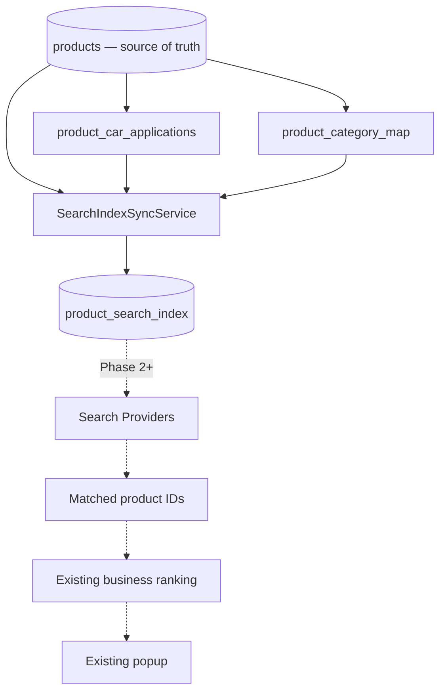
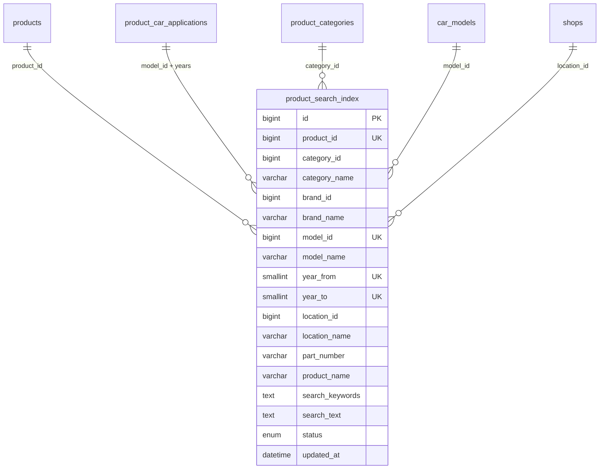

# SEARCH-INDEX-ARCHITECTURE-PHASE-01

Phase 1: dedicated search index **schema + sync + backfill + validation only**.  
**No runtime search usage** — hybrid engine, providers, and quality gate still query `products`.

## Architecture



## ER diagram



**Document grain:** one row per **product × vehicle fitment** (`product_id`, `model_id`, `year_from`, `year_to`).  
Products without fitment → one row with `model_id = 0`, `year_from/year_to = 0`.

Example:

| product | vehicle doc |
|---------|-------------|
| Brake Pad | Toyota Camry → doc 1 |
| Brake Pad | Toyota Vios → doc 2 |
| Brake Pad | Toyota Altis → doc 3 |

Grouped later by `product_id` (unchanged ranking/grouping).

## Table `product_search_index`

| Column | Notes |
|--------|-------|
| `search_text` | Product text only (`part_number`, `product_name`, keywords, descriptions) — **FULLTEXT** |
| `status` | `active` / `inactive` (non-public products removed from index) |
| Sentinels | `model_id=0`, `year_*=0` when unknown (avoids MySQL UNIQUE+NULL duplicates) |

**Indexes:** `product_id`, `brand_id`, `model_id`, `category_id`, `location_id`, `part_number`, `ft_psi_search_text`

**Migration:** `backend/migrations/069_product_search_index.sql`

## SearchIndexSyncService

`backend/services/search/SearchIndexSyncService.js`

| Function | Purpose |
|----------|---------|
| `syncProduct(id)` | Upsert docs for one product; prune stale fitments |
| `deleteProduct(id)` | Remove all docs for product |
| `syncVehicle(carModelId)` | Resync products with that model |
| `syncCategory(categoryId)` | Resync products in category |
| `rebuildProduct(id)` | Alias of `syncProduct` |
| `rebuildAll(opts)` | Full backfill of public products |

**No production callers in Phase 1.**

## Sync flow

```
syncProduct(productId)
  → load product + primary category + shop location + fitments
  → skip/delete if not publicly visible
  → dedupe fitment rows (model + year range)
  → build N documents (searchIndexDocument.builder.js)
  → UPSERT into product_search_index
  → delete stale rows for product
```

## Backfill CLI

```bash
cd backend
node scripts/rebuild-search-index.js              # full rebuild (truncates first)
node scripts/rebuild-search-index.js --product=123
npm run rebuild:search-index
```

Idempotent upsert per `(product_id, model_id, year_from, year_to)`.

## Validation

```bash
node backend/scripts/validate-search-index-phase-01.mjs
```

Compares (public catalog):

| Metric | Legacy (distinct fitment keys) | Index |
|--------|-------------------------------|-------|
| Products | 7385 | 7385 |
| Vehicle documents | 8598 | 8598 |
| Total documents | 8602 | 8602 |

**PASS** — index matches legacy inventory shape.

## What did NOT change

- Parser, vehicle scope, ranking, grouping, popup, SEO URLs, canonical, sitemaps
- Product/listing APIs, search UI
- Search providers, hybrid engine, quality gate (still use `products`)

## Rollback

```bash
# Drop index table only — search unaffected (still uses products)
mysql ... < backend/migrations/069_product_search_index.rollback.sql
```

## Files

| Path | Role |
|------|------|
| `migrations/069_product_search_index.sql` | Schema |
| `services/search/searchIndexDocument.builder.js` | Document builder |
| `services/search/SearchIndexSyncService.js` | Sync API |
| `scripts/rebuild-search-index.js` | Backfill CLI |
| `scripts/validate-search-index-phase-01.mjs` | Count parity |

`npm run build` — **PASS**
