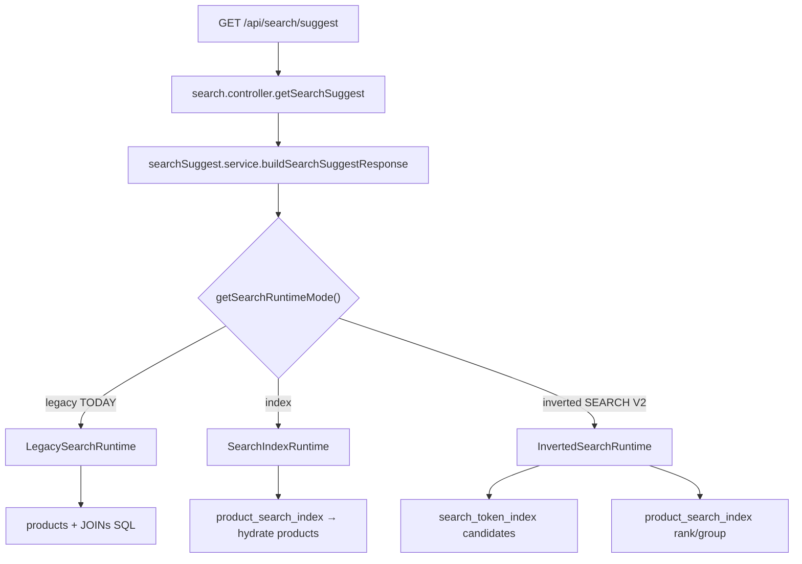

# SEARCH-RUNTIME-ACTIVATION-AUDIT-01

**Mode:** Read-only — no code, config, env, or PM2 changes.  
**Date:** 2026-06-22

---

## Five questions answered

### 1. Which runtime is serving production today?

**`LegacySearchRuntime`** (`SEARCH_RUNTIME=legacy`).

Evidence:
- No `SEARCH_*` keys in `backend/.env` or PM2 env for `otofine-backend`
- Live config eval on running backend: `effective_runtime_mode: "legacy"`
- Live `GET /api/search/suggest?query=bugi&brand=Toyota` executes products SQL path (see [request-trace.md](./request-trace.md))
- Production latency profile matches legacy canary (e.g. đèn hậu Kia ~4.5 s TTFB)

---

### 2. Why is that runtime selected?

`getSearchRuntimeMode()` in `backend/config/searchRuntimeConfig.js`:

```javascript
String(process.env.SEARCH_RUNTIME || "legacy")
```

Because `SEARCH_RUNTIME` is **unset**, the default **`legacy`** is returned → `getSearchRuntime()` returns **`LegacySearchRuntime`**.

Canary shadow mode is **off** (`SEARCH_CANARY=0`), so `buildSearchSuggestResponse()` does not force a special path — it calls `getSearchRuntime().searchSuggest()` directly.

---

### 3. Which feature flags must change to activate Search V2?

**Search V2** = inverted runtime + parity-validated sub-flags:

| Flag | Production today | Search V2 target |
|------|------------------|------------------|
| **`SEARCH_RUNTIME`** | unset → `legacy` | **`inverted`** |
| **`SEARCH_CANDIDATE_POLICY`** | unset → `strict` | **`adaptive`** |
| **`SEARCH_RANKING_MODE`** | unset → `legacy` | **`weighted_v2`** |
| **`SEARCH_GROUPING_MODE`** | unset → `legacy` | **`quality_gate_v2`** |

**Strongly recommended (operational, not runtime selector):**

| Flag | Today | Target |
|------|-------|--------|
| **`SEARCH_INVERTED_INDEX`** | `0` | **`1`** (keep `search_token_index` in sync on product updates) |

**Optional rollout helpers:**

| Flag | Purpose |
|------|---------|
| `SEARCH_CANARY=1` | Shadow (Stage 1) or live monitoring (Stage 2) |
| `SEARCH_CANARY_SAMPLE_RATE` | Sample rate for background comparison |

**Not required for Search V2:** `SEARCH_POPUP_INDEX`, `SEARCH_RUNTIME=index`, `SEARCH_GROUP_INDEX`.

Details: [feature-flags.md](./feature-flags.md)

---

### 4. After changing flags — PM2 restart sufficient, or rebuild/reindex?

| Step | Required? |
|------|-----------|
| **PM2 restart** (`pm2 restart otofine-backend`) | **YES** — runtime cached at process start |
| Frontend rebuild | **NO** |
| Backend npm rebuild | **NO** (unless deploying new code separately) |
| Full reindex | **NO** for initial cutover — tables already populated (8,602 PSI / 352k token rows) |
| Enable `SEARCH_INVERTED_INDEX=1` | **Recommended** so future product changes maintain tokens |

See [activation-checklist.md](./activation-checklist.md).

---

### 5. Is Search V2 ready for production?

**Conditionally ready for staged rollout; not fully cleared against strict canary gates.**

| Validation | Result | Notes |
|------------|--------|-------|
| SEARCH-RANKING-PARITY-01 | **PASS** | Top10 98.57%, recall 97.19% with `weighted_v2` |
| SEARCH-CANDIDATE-POLICY-PARITY-01 | **PASS** | Recall 97.19% with `adaptive` |
| SEARCH-GROUPING-PARITY-01 | **FAIL** | Popup 100%, but Top10 98.57% (<99%), Top20 95% (<99.5%) |
| SEARCH-INVERTED-RUNTIME-CANARY-01 | **FAIL** | Avg Top10 parity 67.69% on 26-query corpus (pre/full-stack tuning) |
| SEARCH-INVERTED-MISMATCH-ROOTCAUSE-01 | **NO-GO** | Score 62/100; recommends shadow canary before live inverted |

**Implementation status:** Code paths exist and indexes are populated. Combined stack (`inverted` + `adaptive` + `weighted_v2` + `quality_gate_v2`) shows strong improvement in validation scripts but **does not meet all 99%+ Top10/Top20 acceptance targets**.

**Recommendation:** Use **Stage 0 shadow canary** (`SEARCH_CANARY=1`, `SEARCH_RUNTIME=legacy`) before live inverted. Treat Search V2 as **technically deployable but parity-gated** — suitable for controlled rollout with monitoring, not blind full cutover against strict 99% SLAs.

---

## Runtime comparison



---

## SQL source summary

| Runtime | products | product_search_index | search_token_index |
|---------|----------|----------------------|-------------------|
| **Legacy (active)** | **Primary** | No | No |
| Index | Hydration | Primary match/group | No |
| Inverted (V2) | Minimal (paths only) | Rank/group/popup | **Candidate retrieval** |

---

## Deliverables

| File | Contents |
|------|----------|
| [runtime-selector.md](./runtime-selector.md) | `getSearchRuntime()` logic |
| [feature-flags.md](./feature-flags.md) | All seven flags, defaults, read sites |
| [effective-config.md](./effective-config.md) | .env, PM2, startup, table counts |
| [request-trace.md](./request-trace.md) | Live suggest call chain + SQL |
| [activation-checklist.md](./activation-checklist.md) | Staged activation steps (not executed) |

Diagnosis only — no implementation.
