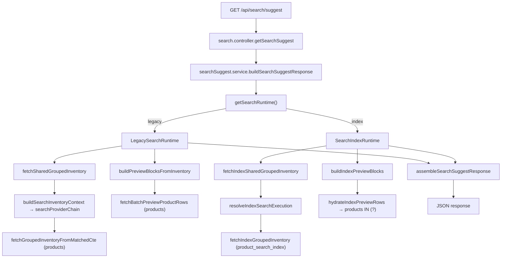

# SEARCH-RUNTIME-TRACE-AUDIT-01

Generated: 2026-06-27T01:58:07.055Z

## Current configuration

| Setting | Value |
|---------|-------|
| SEARCH_RUNTIME | (unset → legacy) |
| Effective runtime | **LegacySearchRuntime** (`legacy`) |
| SEARCH_ENGINE_MODE | (unset → hybrid) |
| Effective engine mode | `hybrid` |
| SEARCH_INDEX_SYNC | (unset → enabled) (v1) |
| SEARCH_DECISION_MODE | (unset → quality_gate) |

## Architecture



## Execution traces (GET /api/search/suggest)

### bugi toyota

**Query:** `{"query":"bugi","brand":"Toyota"}`
**Provider:** `structured+fulltext`
**Wall time:** 347ms
**Response:** 3 groups, 6 preview products, 9 categories

```
Controller  → search.controller.getSearchSuggest
Service     → searchSuggest.service.buildSearchSuggestResponse
Runtime     → LegacySearchRuntime (legacy)
Provider    → structured+fulltext
Pipeline    → fetchSharedGroupedInventory → buildSearchInventoryContext → searchProviderChain
Pipeline    → fetchGroupedInventoryFromMatchedCte (products CTE)
Pipeline    → buildPreviewBlocksFromInventory → fetchBatchPreviewProductRows (products hydration inline)
Pipeline    → assembleSearchSuggestResponse
```

**SQL executed:** 7 statements

| # | ms | rows | class | FULLTEXT | LIKE | psi | products | pca | car_models |
|---|-----|------|-------|----------|------|-----|----------|-----|------------|
| 1 | 44.25 | 20 | OTHER |  |  |  |  |  |  |
| 2 | 3.58 | 20 | OTHER |  |  |  |  |  |  |
| 3 | 4.67 | 4 | OTHER |  |  |  |  |  |  |
| 4 | 71.05 | 41 | PRODUCTS_ONLY | Y |  |  | Y | Y | Y |
| 5 | 59.23 | 32 | PRODUCTS_ONLY | Y |  |  | Y | Y | Y |
| 6 | 25.27 | 31 | PRODUCTS_ONLY |  |  |  | Y | Y | Y |
| 7 | 76.97 | 13 | PRODUCTS_ONLY | Y | Y |  | Y | Y | Y |

### má phanh vios

**Query:** `{"query":"má phanh vios","brand":"Toyota","model":"Vios"}`
**Provider:** `structured+fulltext`
**Wall time:** 246.76ms
**Response:** 3 groups, 6 preview products, 14 categories

```
Controller  → search.controller.getSearchSuggest
Service     → searchSuggest.service.buildSearchSuggestResponse
Runtime     → LegacySearchRuntime (legacy)
Provider    → structured+fulltext
Pipeline    → fetchSharedGroupedInventory → buildSearchInventoryContext → searchProviderChain
Pipeline    → fetchGroupedInventoryFromMatchedCte (products CTE)
Pipeline    → buildPreviewBlocksFromInventory → fetchBatchPreviewProductRows (products hydration inline)
Pipeline    → assembleSearchSuggestResponse
```

**SQL executed:** 3 statements

| # | ms | rows | class | FULLTEXT | LIKE | psi | products | pca | car_models |
|---|-----|------|-------|----------|------|-----|----------|-----|------------|
| 8 | 69.91 | 20 | PRODUCTS_ONLY | Y |  |  | Y | Y | Y |
| 9 | 85.95 | 28 | PRODUCTS_ONLY | Y |  |  | Y | Y | Y |
| 10 | 84.02 | 7 | PRODUCTS_ONLY | Y | Y |  | Y | Y | Y |

### lọc dầu mazda

**Query:** `{"query":"lọc dầu","brand":"Mazda"}`
**Provider:** `like-fallback`
**Wall time:** 1748.98ms
**Response:** 3 groups, 2 preview products, 2 categories

```
Controller  → search.controller.getSearchSuggest
Service     → searchSuggest.service.buildSearchSuggestResponse
Runtime     → LegacySearchRuntime (legacy)
Provider    → like-fallback
Pipeline    → fetchSharedGroupedInventory → buildSearchInventoryContext → searchProviderChain
Pipeline    → fetchGroupedInventoryFromMatchedCte (products CTE)
Pipeline    → buildPreviewBlocksFromInventory → fetchBatchPreviewProductRows (products hydration inline)
Pipeline    → assembleSearchSuggestResponse
```

**SQL executed:** 4 statements

| # | ms | rows | class | FULLTEXT | LIKE | psi | products | pca | car_models |
|---|-----|------|-------|----------|------|-----|----------|-----|------------|
| 11 | 63.72 | 21 | PRODUCTS_ONLY | Y |  |  | Y | Y | Y |
| 12 | 842.7 | 13 | PRODUCTS_ONLY |  | Y |  | Y | Y | Y |
| 13 | 12.81 | 11 | PRODUCTS_ONLY |  |  |  | Y | Y | Y |
| 14 | 823.92 | 4 | PRODUCTS_ONLY |  | Y |  | Y | Y | Y |

### 04465-0D140

**Query:** `{"query":"04465-0D140"}`
**Provider:** `like-fallback`
**Wall time:** 824ms
**Response:** 0 groups, 0 preview products, 0 categories

```
Controller  → search.controller.getSearchSuggest
Service     → searchSuggest.service.buildSearchSuggestResponse
Runtime     → LegacySearchRuntime (legacy)
Provider    → like-fallback
Pipeline    → fetchSharedGroupedInventory → buildSearchInventoryContext → searchProviderChain
Pipeline    → fetchGroupedInventoryFromMatchedCte (products CTE)
Pipeline    → buildPreviewBlocksFromInventory → fetchBatchPreviewProductRows (products hydration inline)
Pipeline    → assembleSearchSuggestResponse
```

**SQL executed:** 2 statements

| # | ms | rows | class | FULLTEXT | LIKE | psi | products | pca | car_models |
|---|-----|------|-------|----------|------|-----|----------|-----|------------|
| 15 | 19.99 | 0 | PRODUCTS_ONLY |  |  |  | Y | Y | Y |
| 16 | 802.05 | 0 | PRODUCTS_ONLY |  | Y |  | Y | Y | Y |


## Search function index usage (sample: bugi toyota)

| Function | Index used | SQL count | Index SQL | Products SQL |
|----------|------------|-----------|-----------|--------------|
| searchSuggest | **NO** | 2 | 0 | 2 |
| searchSidebar | **NO** | 1 | 0 | 1 |
| searchPreview | **NO** | 2 | 0 | 2 |
| searchInventory | **NO** | 1 | 0 | 1 |
| searchProducts | **NO** | 5 | 0 | 4 |

## Hydration flow

- Begins from products: **YES**
- Begins from product_search_index: **NO**
- Hydrates after ID match: **NO**

- fetchGroupedInventoryFromMatchedCte — products + category_map + fitment JOINs
- fetchBatchPreviewProductRows — products + LATERAL product_car_applications
- getModels — car_models (when brand-only scope)

## Index usage

- **0%** of traced SQL statements touch `product_search_index`
- Remaining statements query `products`, `car_models`, `product_images`, or metadata

## Top bottlenecks

### Slowest SQL (by max duration)

1. `842.7ms` (8×) [PRODUCTS_ONLY] — WITH matched AS ( SELECT DISTINCT `p`.`id` AS product_id, COALESCE(NULLIF(pc.canonical_name, ''), pc.category_name) AS canonical_name, COALESCE(NULLIF(pc.canonical_slug, ''), pc.category_slug) AS cano…
2. `823.92ms` (5×) [PRODUCTS_ONLY] — SELECT * FROM ( SELECT `p`.`id` AS id, `p`.`shopId` AS shopId, `p`.`partNumber` AS partNumber, `p`.`partName` AS partName, `p`.`price` AS price, `p`.`origin` AS origin, `p`.`stock` AS stock, `p`.`upda…
3. `71.05ms` (5×) [PRODUCTS_ONLY] — SELECT DISTINCT `p`.`id` AS id, `p`.`partName` AS title, `p`.`partNumber` AS partNumber, COALESCE(NULLIF(pc.canonical_name, ''), pc.category_name) AS category_name, cm.hang_xe AS brand, cm.ten_xe AS m…
4. `68.3ms` (1×) [PRODUCTS_ONLY] — SELECT p.id FROM products p JOIN shops s ON s.id = p.shopId WHERE 1=1 AND TRIM(LOWER(`s`.`public_status`)) = 'public' AND TRIM(LOWER(`p`.`moderation_status`)) = 'approved' AND `p`.`stock` > 0 AND (( L…
5. `47.46ms` (1×) [PRODUCTS_ONLY] — SELECT COUNT(*) AS c FROM ( SELECT p.id FROM products p JOIN shops s ON s.id = p.shopId WHERE 1=1 AND TRIM(LOWER(`s`.`public_status`)) = 'public' AND TRIM(LOWER(`p`.`moderation_status`)) = 'approved' …

### Most repeated SQL

1. `8×` total 2039.28ms [PRODUCTS_ONLY] — WITH matched AS ( SELECT DISTINCT `p`.`id` AS product_id, COALESCE(NULLIF(pc.canonical_name, ''), pc.category_name) AS canonical_name, COALESCE(NULLIF(pc.canonical_slug, ''), pc.category_slug) AS cano…
2. `5×` total 254.09ms [PRODUCTS_ONLY] — SELECT DISTINCT `p`.`id` AS id, `p`.`partName` AS title, `p`.`partNumber` AS partNumber, COALESCE(NULLIF(pc.canonical_name, ''), pc.category_name) AS category_name, cm.hang_xe AS brand, cm.ten_xe AS m…
3. `5×` total 1118.46ms [PRODUCTS_ONLY] — SELECT * FROM ( SELECT `p`.`id` AS id, `p`.`shopId` AS shopId, `p`.`partNumber` AS partNumber, `p`.`partName` AS partName, `p`.`price` AS price, `p`.`origin` AS origin, `p`.`stock` AS stock, `p`.`upda…
4. `2×` total 47.83ms [OTHER] — SELECT COLUMN_NAME FROM INFORMATION_SCHEMA.COLUMNS WHERE TABLE_SCHEMA = DATABASE() AND TABLE_NAME = 'products'…
5. `2×` total 38.08ms [PRODUCTS_ONLY] — SELECT cm.ten_xe, COUNT(DISTINCT `p`.`id`) AS total FROM products p INNER JOIN shops s ON s.id = p.shopId JOIN product_car_applications pa ON pa.productId = `p`.`id` JOIN car_models cm ON cm.id = pa.c…

### Largest scans (EXPLAIN ANALYZE)

1. rows examined: **0**, returned: 0, 0ms [PRODUCTS_ONLY]
2. rows examined: **0**, returned: 0, 0ms [PRODUCTS_ONLY]
3. rows examined: **0**, returned: 0, 0ms [PRODUCTS_ONLY]
4. rows examined: **0**, returned: 0, 0ms [PRODUCTS_ONLY]
5. rows examined: **0**, returned: 0, 0ms [PRODUCTS_ONLY]
6. rows examined: **0**, returned: 0, 0ms [OTHER]

Diagnosis only — no fixes recommended.
