# Shop Public Pages — Database & Schema Impact

**Companion to:** `shop-public-pages-overview.md`
**Status:** Proposal — no migration written or run yet.

The goal is to keep this delta as small and additive as humanly
possible. Every column we add is optional; every default is safe;
nothing is dropped, renamed, or has its type narrowed. Existing
queries continue to work byte-identically.

---

## 1. Current schema recap (from `audit/database-analysis.md` + backend audit)

`shops` (effective columns; source: production dump
`db_backup_20260524_0837.sql`):

```sql
CREATE TABLE `shops` (
  `id`                  int AUTO_INCREMENT PRIMARY KEY,
  `accountId`           int UNIQUE,           -- FK shop_accounts.id (triple legacy unique index)
  `name`                varchar(255),
  `avatar`              varchar(500),
  `cover`               varchar(500),
  `phone`               varchar(50),
  `email`               varchar(255),
  `zalo`                varchar(50),
  `website`             varchar(255),
  `provinceId`          int,
  `districtId`          int,
  `wardId`              int,
  `addressDetail`       varchar(500),
  `descriptionHtml`     longtext,
  `salePolicy`          longtext,
  `warrantyPolicy`      longtext,
  `createdAt`           timestamp DEFAULT CURRENT_TIMESTAMP,
  `updatedAt`           timestamp DEFAULT CURRENT_TIMESTAMP ON UPDATE CURRENT_TIMESTAMP,
  `last_seen_at`        datetime(3),          -- migration 020
  `onesignal_player_id` varchar(255)          -- added manually, no migration
);
```

`shop_accounts`:

```sql
CREATE TABLE `shop_accounts` (
  `id`                int AUTO_INCREMENT PRIMARY KEY,
  `shopId`            varchar(36) NOT NULL UNIQUE,  -- UUID
  `name`              varchar(255),
  `email`             varchar(255) UNIQUE,
  `phone`             varchar(50)  UNIQUE,
  `passwordHash`      varchar(255),
  `createdAt`         timestamp,
  `status`            enum('pending','active','blocked','suspended','deleted')
                          NOT NULL DEFAULT 'pending', -- migration 038
  `approvedAt`        datetime,
  `approvedByAdminId` int,
  FOREIGN KEY (approvedByAdminId) REFERENCES admin(id)
);
```

`products` (relevant parts):

```sql
CREATE TABLE `products` (
  `id`         int AUTO_INCREMENT PRIMARY KEY,
  `shopId`     int NULL,
  -- ... part fields ...
  UNIQUE KEY `unique_part_shop` (`shopId`, `partNumber`),
  CONSTRAINT `fk_products_shop` FOREIGN KEY (`shopId`) REFERENCES `shops`(`id`)
);
```

The FK + composite unique key on `(shopId, partNumber)` already lets
us safely scope public listings to a single shop.

---

## 2. Proposed schema delta — `shops`

Single new migration, named `040_shops_public_site.sql`. All ALTERs
are `ADD COLUMN ... NULL DEFAULT NULL`. Nothing is `NOT NULL`. No
indexes are dropped.

| Column                | Type                                            | Required for                | Notes                                                                                       |
| --------------------- | ----------------------------------------------- | --------------------------- | ------------------------------------------------------------------------------------------- |
| `slug`                | `varchar(63) NULL DEFAULT NULL UNIQUE`          | tenant resolution           | RFC 1035-ish DNS-safe; regex `^[a-z0-9][a-z0-9-]{1,40}[a-z0-9]$` enforced by app + CHECK constraint (Phase 2). UNIQUE so two shops can't claim the same subdomain |
| `public_status`       | `ENUM('pending','public','suspended') NULL DEFAULT 'pending'` | gating                      | `public` = visible on the subdomain; any other value → 404                                  |
| `published_at`        | `datetime NULL DEFAULT NULL`                    | audit                       | Set when admin (Phase 1-2) or seller (Phase 3) flips to `public`                            |
| `bio`                 | `varchar(255) NULL`                             | meta description / header  | Short one-liner, 160 char target for SEO                                                    |
| `intro_html`          | `longtext NULL`                                 | `/gioi-thieu` page          | Rich text from Quill editor; sanitized before render                                        |
| `facebook_url`        | `varchar(255) NULL`                             | `/lien-he`                  | Full URL; validated (`^https?://(www\.)?facebook\.com/`)                                    |
| `working_hours`       | `varchar(255) NULL`                             | `/lien-he` + JSON-LD        | Free-form human label PLUS a schema-friendly format we generate (e.g. `Mo-Su 08:00-18:00`)  |
| `lat`                 | `decimal(10,7) NULL`                            | map embed                   | Used to build Google embed URL when address geocoding is unavailable                        |
| `lng`                 | `decimal(10,7) NULL`                            | map embed                   | Optional                                                                                    |
| `map_embed_url`       | `varchar(500) NULL`                             | manual override             | Override for the auto-built map URL when seller pastes a Google Maps share link             |
| `verified_at`         | `datetime NULL`                                 | "Đã xác minh" badge         | Admin sets when shop passes manual verification — optional badge in header                  |

**`shop_accounts` is NOT modified.** Auth flows already done by the
previous refactor (`audit/auth-runtime-debug.md`).

**`products` is NOT modified.** We rely on the existing
`fk_products_shop` + `UNIQUE (shopId, partNumber)` for scoping.

### 2.1 Migration SQL (proposed)

```sql
-- backend/migrations/040_shops_public_site.sql
-- Additive only. Safe to re-run on production.

-- 1. New columns.
ALTER TABLE shops
  ADD COLUMN slug          varchar(63)  NULL DEFAULT NULL AFTER name,
  ADD COLUMN public_status enum('pending','public','suspended') NULL DEFAULT 'pending' AFTER slug,
  ADD COLUMN published_at  datetime     NULL DEFAULT NULL AFTER public_status,
  ADD COLUMN bio           varchar(255) NULL DEFAULT NULL AFTER cover,
  ADD COLUMN intro_html    longtext     NULL DEFAULT NULL AFTER descriptionHtml,
  ADD COLUMN facebook_url  varchar(255) NULL DEFAULT NULL AFTER zalo,
  ADD COLUMN working_hours varchar(255) NULL DEFAULT NULL AFTER addressDetail,
  ADD COLUMN lat           decimal(10,7) NULL DEFAULT NULL AFTER working_hours,
  ADD COLUMN lng           decimal(10,7) NULL DEFAULT NULL AFTER lat,
  ADD COLUMN map_embed_url varchar(500) NULL DEFAULT NULL AFTER lng,
  ADD COLUMN verified_at   datetime     NULL DEFAULT NULL AFTER published_at;

-- 2. Unique index on slug (must be UNIQUE; one slug per shop).
ALTER TABLE shops
  ADD UNIQUE KEY idx_shops_slug (slug);

-- 3. Composite index for the most common public lookup path:
--    "is this slug publicly visible right now?"
ALTER TABLE shops
  ADD INDEX idx_shops_slug_status (slug, public_status);

-- 4. Backfill: leave slug NULL for everyone (opt-in claim later).
--    public_status defaults to 'pending' for all existing rows.
--    No data is moved.
```

### 2.2 What we DO NOT do in migration 040

- We do not drop the legacy duplicate unique indexes (`userId`,
  `userId_2`, `userId_3`) on `shops.accountId`. They're cosmetic
  noise but removing them is a separate hygiene migration with its
  own risk; this work package is additive.
- We do not move `descriptionHtml` / `salePolicy` / `warrantyPolicy`
  out of the row (e.g. into a `shop_pages` child table). They're
  used today by seller-center pages and possibly by product detail's
  shop-info block. Keep them.
- We do not change `shop_accounts.status` ENUM further; migration
  038 already widened it.
- We do not touch `products` at all.

---

## 3. New table — NONE required

Everything fits on `shops`. We considered adding a `shop_pages` table
for the rich text blocks but rejected it because:

- Only one rich text field (`intro_html`) is being added.
- Sellers manage one shop (1:1 with the row) so JSONB-style key/value
  isn't justified.
- A child table would force every read to JOIN even though the
  cardinality is 1:1.

---

## 4. Index strategy

| Index                                    | Why                                                                        |
| ---------------------------------------- | -------------------------------------------------------------------------- |
| `UNIQUE idx_shops_slug (slug)`           | Tenant resolution lookup; enforces "one slug per shop"                     |
| `INDEX idx_shops_slug_status (slug, public_status)` | Hot path: `WHERE slug = ? AND public_status = 'public'` — covering index   |
| Existing `idx_shops_last_seen`           | Untouched (RFQ presence)                                                  |
| Existing `unique_part_shop (shopId, partNumber)` on `products` | Untouched, already optimal for per-shop listings    |
| Existing `fk_products_shop (shopId)`     | Untouched, already covers `WHERE shopId = ?` scans                         |

We will NOT add `INDEX idx_shops_public_status`. Lookups always know
the slug; standalone `public_status` queries (admin lists) tolerate a
full scan because `shops` is small (~1k rows historically).

---

## 5. Data lifecycle

```mermaid
stateDiagram-v2
  [*] --> NoSlug : shop registered, accountId set
  NoSlug --> Claimed : seller picks slug (Phase 3) OR admin assigns (Phase 1-2)
  Claimed --> Pending : public_status='pending' (default)
  Pending --> Public : admin/seller flips to 'public', sets published_at
  Public --> Suspended : admin sets 'suspended' (e.g. abuse)
  Suspended --> Public : admin restores
  Public --> Pending : seller hides; published_at retained for audit
```



### 5.1 Slug claim rules (enforced in app, not DB)

1. Regex match `^[a-z0-9][a-z0-9-]{1,40}[a-z0-9]$`.
2. Not in the reserved set (see `shop-subdomain-routing.md §5`).
3. Not currently in use (UNIQUE constraint enforces this at DB).
4. Phase 1-2: admin enters the slug from the admin panel.
5. Phase 3: seller enters in seller-center; backend validates,
   inserts, returns 409 if taken.

### 5.2 Slug changes

A slug change is treated as `UPDATE shops SET slug = ?, slug_old_*`.
Out of scope for Phase 1; needs a redirect table
(`shop_slug_history`) when implemented to avoid SEO link-rot. We
park this in `shop-public-rollout-plan.md` Phase 3+.

---

## 6. Read query patterns (NEW)

These are the only new queries the public site introduces. All are
indexed and parameterized.

### 6.1 Resolve slug → public shop (per request, hot path)

```sql
SELECT id, slug, name, avatar, cover, bio,
       intro_html, descriptionHtml, salePolicy, warrantyPolicy,
       phone, email, zalo, website, facebook_url,
       provinceId, districtId, wardId, addressDetail,
       working_hours, lat, lng, map_embed_url,
       public_status, published_at, verified_at,
       createdAt
FROM shops
WHERE slug = ? AND public_status = 'public'
LIMIT 1;
```

Plan: index `idx_shops_slug_status` → 1 row read. Microseconds.
Result cached in Redis 5 min keyed by slug + an LRU 1000-entry
in-process fallback.

### 6.2 Public products list for shop

```sql
SELECT p.id, p.partName, p.partNumber, p.price, p.slug,
       pi.url AS image_url,
       cm.hang_xe, cm.ten_xe
FROM products p
LEFT JOIN product_images pi
       ON pi.productId = p.id AND pi.isPrimary = 1
LEFT JOIN product_car_applications pca ON pca.productId = p.id
LEFT JOIN car_models cm                ON cm.id = pca.carModelId
WHERE p.shopId = ?
  AND ( ? IS NULL OR cm.hang_xe = ? )
  AND ( ? IS NULL OR cm.ten_xe  = ? )
  AND ( ? IS NULL OR (pca.year_from <= ? AND pca.year_to >= ?) )
  AND ( ? IS NULL OR MATCH(p.partName, p.partNumber) AGAINST (? IN NATURAL LANGUAGE MODE) )
GROUP BY p.id
ORDER BY p.createdAt DESC
LIMIT 16 OFFSET ?;
```

The query is a thin variant of the existing
`buildProductListingJoinSql` — we simply pre-bind `shopId` and
reuse the same indices. No new index required;
`fk_products_shop (shopId)` already covers it.

### 6.3 Public filters (distinct brand/model/year for THIS shop)

```sql
SELECT DISTINCT cm.hang_xe
FROM products p
JOIN product_car_applications pca ON pca.productId = p.id
JOIN car_models cm ON cm.id = pca.carModelId
WHERE p.shopId = ?
ORDER BY cm.hang_xe;
```

Same pattern for models and years. Cached 10 minutes per shop.

### 6.4 Sitemap aggregator (cross-shop, admin/cron)

```sql
SELECT slug, name, published_at, updatedAt
FROM shops
WHERE public_status = 'public' AND slug IS NOT NULL
ORDER BY published_at DESC;
```

Runs at most every 10 minutes when `sitemap-index.xml` is requested
or pre-warmed by a cron. Result is cached at the edge.

---

## 7. Write paths

| Operation                          | Who                | Frequency                     | Table |
| ---------------------------------- | ------------------ | ----------------------------- | ----- |
| Claim/assign slug                  | Admin (P1-2), seller (P3) | Once per shop, rare       | `shops` |
| Update profile (bio, intro, etc.)  | Seller in shop-settings    | Occasional                | `shops` |
| Flip `public_status`               | Admin (P1-2), seller (P3) | Rare                      | `shops` |
| Verify (set `verified_at`)         | Admin              | Rare                          | `shops` |

All four reuse existing seller-center / admin-panel endpoints with
**additional fields**; no new write endpoints required for Phase 1.
Admin endpoint that needs the new fields:
`PATCH /api/admin/shops/:id` — `{ slug, public_status, verified_at }`.
Seller endpoint `PUT /api/shop/me` is widened to accept `bio`,
`intro_html`, `facebook_url`, `working_hours`, `lat`, `lng`,
`map_embed_url`. The validators must reject these on `requireShop`
when the shop's `public_status='suspended'` (Phase 2 nicety).

---

## 8. Cache & invalidation

| Layer                               | Key                                    | TTL    | Invalidate on                                   |
| ----------------------------------- | -------------------------------------- | ------ | ----------------------------------------------- |
| Redis (per shop)                    | `pubshop:<slug>`                       | 5 min  | Any write to that `shops` row                   |
| Express in-process LRU (fallback)   | `pubshop:<slug>`                       | 5 min  | Same                                            |
| Next.js `unstable_cache` (per shop) | `shop-public:<slug>`                   | 60 sec | Same (revalidated by ETag on miss)              |
| Browser                             | `Cache-Control: s-maxage=60, swr=300`  | 60 sec | Soft (stale-while-revalidate)                   |

Invalidation hook: every `PUT /api/shop/me` and
`PATCH /api/admin/shops/:id` calls `cache.publicShop.invalidate(slug)`
which DELs Redis + LRU. Next.js's `unstable_cache` is cleared by
re-rendering on next request after the upstream miss.

---

## 9. Risk register (DB-specific)

| Risk                                                                  | Severity | Mitigation                                                                       |
| --------------------------------------------------------------------- | -------- | -------------------------------------------------------------------------------- |
| Migration 040 deploy fails halfway → partial schema                   | HIGH     | All ALTERs in a single `ALTER TABLE` statement (atomic in MySQL 8); rollback by `DROP COLUMN` migration prepared in advance |
| `slug` collisions during seller self-service (Phase 3)                | MEDIUM   | UNIQUE constraint + 409 response + suggested alternates                          |
| `intro_html` XSS                                                      | HIGH     | Sanitize at write time AND at render time (defense in depth); reuse the sanitizer used by existing seo composer |
| `slug` legal/profanity issues                                         | MEDIUM   | Phase 1-2 admin pre-moderation; Phase 3 keep an admin allow-list / deny-list table |
| Reading old cached row after schema change                            | LOW      | Cache is JSON-shaped; missing fields render as empty defaults                     |
| Reading a slug-less shop on the public site                           | LOW      | `WHERE slug = ?` returns 0 rows → 404; no panic                                  |
| `lat`/`lng` legal (PII?)                                              | LOW      | Map coordinates of a business address are public information; OK to store        |

---

## 10. What we are NOT building in this work package

For clarity / scope control:

- No `shop_reviews` / `shop_ratings` table.
- No `shop_visits_analytics` table.
- No `shop_slug_history` redirect table (slug changes deferred).
- No `shop_themes` (custom color / font) table.
- No per-shop `shop_settings` JSON column.
- No new index on `products` beyond what already exists.

These are all credible Phase 4+ ideas. They do not need to be
planned right now to ship Phase 1.
