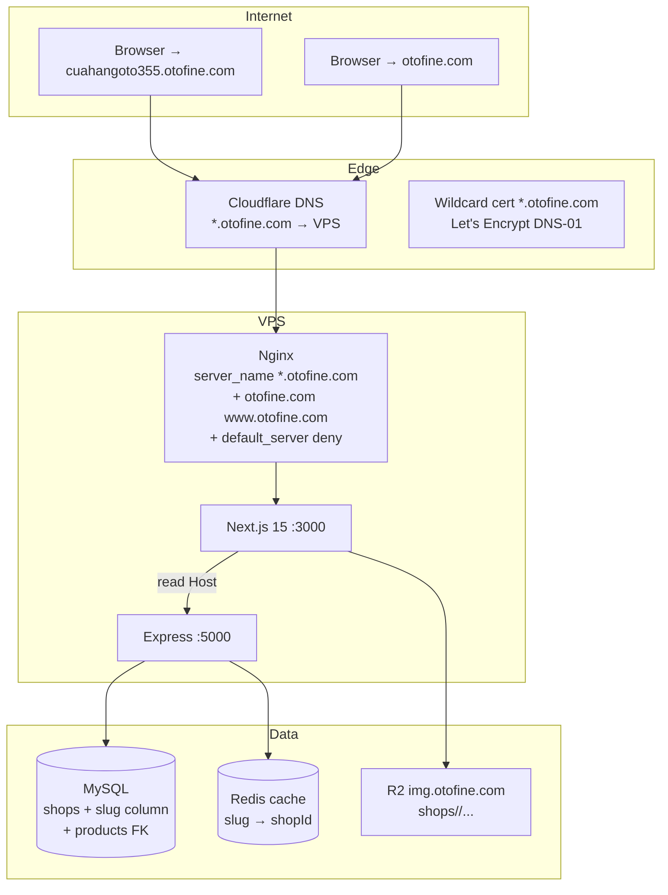

# Shop Public Pages — Overview & Architecture Proposal

**Date:** 2026-05-24
**Status:** Audit + proposal only. **No implementation yet.**
**Goal:** Build per-shop public storefronts under
`<shop-slug>.otofine.com` (e.g. `cuahangoto355.otofine.com`,
`abcparts.otofine.com`) **without breaking** products, SEO, RFQ, seller
center, auth, or production product routing.

---

## 0. TL;DR

| Item                                            | Decision                                                                                                                       |
| ----------------------------------------------- | ------------------------------------------------------------------------------------------------------------------------------ |
| Tenant resolution                               | **Wildcard subdomain** `*.otofine.com` resolved by a new Next.js middleware → tenant slug → backend lookup                     |
| New Next.js route group                         | `app/(shopsite)/` — a parallel route tree that ONLY renders when the request host is a shop subdomain                          |
| Reused apex routes                              | `/product/[id]`, `/api/products*`, `/api/seo-page/*`, the entire seller center, admin, RFQ — **not touched**                   |
| Product detail page                             | Linked back to apex `https://otofine.com/product/[id]` (single canonical, zero duplicate content)                              |
| New backend endpoints                           | `GET /api/public/shops/:slug`, `GET /api/public/shops/:slug/products`, `GET /api/public/shops/:slug/filters`, sitemap variants |
| `shops` schema delta                            | Add `slug VARCHAR(63) UNIQUE`, `public_status ENUM`, plus 4 optional content columns. No drop, no rename.                      |
| Cert / DNS                                      | Wildcard cert `*.otofine.com` via Let's Encrypt DNS-01 (Cloudflare) or terminate at Cloudflare Universal SSL                   |
| Rollout                                         | Phase 1: 1 demo shop hand-configured · Phase 2: public beta with allow-list · Phase 3: seller self-service slug claim          |

The rest of this document explains **what we have today**, **what we
will reuse vs. build new**, **what the architecture looks like end-to-
end**, and **what is absolutely off-limits** to touch during this work.

---

## 1. What exists today (audit results)

The full evidence is in:

- `audit/system-overview.md`
- `audit/frontend-analysis.md`
- `audit/backend-analysis.md`
- `audit/database-analysis.md`
- `audit/security-analysis.md`
- `audit/performance-analysis.md`

This section is a focused recap of the facts that matter for the
shop-public-page work.

### 1.1 Frontend (Next.js 15 App Router) — current routing surface

| Path                       | File                              | Role                             | Cache               |
| -------------------------- | --------------------------------- | -------------------------------- | ------------------- |
| `/`                        | `app/page.js`                     | Marketing home (`<Home>`, 3K LOC) | Static/SSR          |
| `/[slug]`                  | `app/[slug]/page.js`              | **Catch-all SEO landing**        | force-dynamic + revalidate 3600 (conflicting) |
| `/product/[id]`            | `app/product/[id]/page.js`        | Public product detail            | SSR + metadata      |
| `/shop/*`                  | `app/shop/**`                     | Seller center (Login, Settings, Products, …) | CSR + `ShopGuard` |
| `/admin/*`                 | `app/admin/**`                    | Admin panel                      | CSR + `AdminGuard`  |
| `/rfq/*`                   | `app/rfq/**`                      | Buyer + seller RFQ chat          | Mixed               |
| `/robots.txt`              | `app/robots.js`                   | Disallows `/shop/`, `/product/`, `/rfq/`, `/admin/`, `/*?*` | Generated |
| `/sitemap.xml`             | `app/sitemap.js`                  | Apex products + brand/model      | Generated           |

Middleware today (`frontend/middleware.js`) is **14 lines** that ONLY
redirect `/product` → `/`. No host header inspection. No subdomain
awareness anywhere. `next.config.mjs` has no `has:` host rules.

`lib/seo/siteUrl.js` resolves `NEXT_PUBLIC_SITE_URL` → `VERCEL_URL` →
hard fallback `https://otofine.com`. The fallback is duplicated in
`app/[slug]/page.js` and `Home.jsx`.

There is **no public shop storefront route today**. `app/shop/page.js`
redirects to `/shop/login` (seller). `app/shop/[id]/page.js` does not
exist.

### 1.2 Backend (Express 5 ESM) — current shop API surface

- `routes/shop.routes.js` is mounted at **both** `/api/shop` and
  `/api/shops`. Every route requires `requireAuth` (and most require
  `requireShop`). It is **not a public surface.**
- `/api/products` and `/api/products/search` accept `brand`, `model`,
  `year`, `category`, `keyword`, `cityId`, `city`, `location`, `page`,
  `sort` — **no `shopId` parameter** (whitelist in
  `utils/listingQueryNormalize.js`). Adding one is a small change in
  `productList.repository.js`.
- The Typesense schema (`productSearch.service.js`) does **not** index
  `shopId` — search by shop will need either a re-index or fallback to
  MySQL.
- The only place `shops` data leaks publicly today is
  `ProductDetail.controller.js` lines 142-145, which embeds
  `SELECT avatar, zalo FROM shops WHERE id = ?` into the product
  payload.
- `requireShop` resolves tenancy from the JWT only; **no middleware
  reads `req.headers.host` or `req.subdomains`**.

### 1.3 Database — current `shops` schema (effective)

Source: `db_backup_20260524_0837.sql` (no canonical migration exists).

```
shops:
  id INT PK AI
  accountId INT UNIQUE (legacy triple-index userId/userId_2/userId_3)
  name, avatar, cover, phone, email, zalo, website
  provinceId, districtId, wardId, addressDetail
  descriptionHtml, salePolicy, warrantyPolicy LONGTEXT
  createdAt, updatedAt
  last_seen_at DATETIME(3)        (migration 020)
  onesignal_player_id VARCHAR(255) (added manually, no migration)
```

**Missing for public site:** `slug`, `subdomain`, `public_status`,
`bio`, `intro_html`, `facebook_url`, `working_hours`, `lat`, `lng`,
`map_embed_url`, `published_at`.

Products: `products.shopId INT NULL` with FK to `shops.id` and
`UNIQUE (shopId, partNumber)`. That FK already lets us safely scope a
public listing query by `shopId`.

### 1.4 Infra — current nginx + TLS

- `/etc/nginx/sites-enabled/otofine` — single block for
  `otofine.com` + `www.otofine.com`, port 443, Let's Encrypt cert via
  `authenticator = nginx` (HTTP-01) — **cannot issue wildcard certs**.
- No `default_server` directive. Any subdomain pointing at this VPS
  today silently lands on the apex block with a cert mismatch warning.
- No `limit_req`, no `proxy_cache`, no `gzip_types`. Only protection
  is `client_max_body_size 12m` and app-layer `loginRateLimit`.
- No Cloudflare proxy in front of the apex (confirmed by absence of
  Cloudflare config in repo; only Cloudflare R2 is used, as `img.otofine.com` / `rfq-img.otofine.com`).

### 1.5 SEO — current canonical & sitemap behavior

- `app/robots.js` globally disallows `/shop/`, `/product/`, `/rfq/`,
  `/admin/`, `/*?*`. **This applies per-host**: a robots file served
  on `<shop>.otofine.com` is a fresh document — by default Next.js
  will render the **same** rules under each subdomain, which would
  block crawling of the shop storefront if not host-aware.
- `app/sitemap.js` fetches `/api/seo/sitemap-data` — apex-only,
  zero shop URLs.
- JSON-LD WebSite + Organization is emitted in `app/layout.js` with a
  fixed `name: "Otofine"` and `url: getSiteUrl()`.

---

## 2. Architecture proposal — high level



### 2.1 Tenant resolution layer (new)

A single Next.js middleware reads `request.headers.get("host")` and
classifies every request as one of:

| Host shape                          | Tenant                | Route group              |
| ----------------------------------- | --------------------- | ------------------------ |
| `otofine.com`, `www.otofine.com`    | Apex marketplace      | existing `app/(root)`    |
| `<slug>.otofine.com` where `<slug>` matches `^[a-z0-9][a-z0-9-]{1,40}[a-z0-9]$` and isn't reserved | Shop storefront tenant | new `app/(shopsite)/`    |
| Anything else                       | 404 / default_server  | nginx terminates earlier |

Reserved subdomains (never resolved to a shop tenant):
`www`, `api`, `img`, `rfq`, `rfq-img`, `admin`, `seller`, `static`,
`cdn`, `mail`, `m`, `mobile`, `app`, `staging`, `dev`, `qa`, `test`,
`status`, `docs`, `blog`, `help`, `support`, `account`.

The middleware sets request headers (`x-shop-slug`, `x-shop-id` after
backend lookup) that the Next.js server components read via
`next/headers`. Backend gets the same context via the existing
`Host` / `X-Forwarded-Host` chain (nginx already forwards `Host`; we
just need to add `X-Forwarded-Host`).

### 2.2 New Next.js route group `app/(shopsite)/`

```
app/
├── (root)/           ← existing layout & pages, unchanged
│   ├── layout.js
│   ├── page.js
│   ├── [slug]/
│   ├── product/[id]/
│   ├── shop/         ← seller center (unchanged URL)
│   ├── admin/
│   ├── rfq/
│   ├── robots.js     ← apex-only (host-aware via getSiteUrl)
│   └── sitemap.js
│
└── (shopsite)/       ← NEW — only mounted when middleware tags request as shop tenant
    ├── layout.js     ← shop chrome (cover + tabs + sticky header)
    ├── page.js       ← / (Trang chủ)
    ├── gioi-thieu/page.js
    ├── san-pham/page.js
    ├── lien-he/page.js
    ├── robots.ts     ← per-shop crawl policy
    └── sitemap.ts    ← per-shop product/category list
```

**No new product detail page in `(shopsite)/`.** All product cards
link back to `https://otofine.com/product/[id]` with `target="_self"`
(same browser tab, cross-subdomain navigation). This is the only way
to keep one canonical URL per product and avoid duplicate-content SEO
penalties (see `audit/shop-public-seo-strategy.md`).

### 2.3 New backend endpoints (public, read-only)

| Method | Path                                          | Purpose                                                     | Auth |
| ------ | --------------------------------------------- | ----------------------------------------------------------- | ---- |
| GET    | `/api/public/shops/:slug`                     | Resolve slug → public shop profile (name, bio, avatar, cover, contact, intro_html, working_hours) | none |
| GET    | `/api/public/shops/:slug/products`            | Paginated products list scoped to that shop. Accepts `brand`, `model`, `year`, `q`, `sort`, `page` — same shape as `/api/products` | none |
| GET    | `/api/public/shops/:slug/filters`             | Distinct brand/model/year values present in this shop's catalogue | none |
| GET    | `/api/public/shops/:slug/sitemap`             | Per-shop XML sitemap (consumed by `app/(shopsite)/sitemap.ts`) | none |
| GET    | `/api/public/shops/:slug/feature`             | Homepage feature: highlighted products + counters           | none |

All five mount under a **new route file** `routes/publicShop.routes.js`
that is gated by a feature flag `PUBLIC_SHOPSITE_ENABLED=true`. If
the flag is off, the routes don't even register — production behavior
is exactly as today.

`requireAuth` / `requireShop` / `requireAdmin` are never applied here.
Every endpoint that reads `shops` must:

1. Verify `slug` matches our reserved-subdomain rules.
2. `SELECT id, public_status FROM shops WHERE slug = ?`.
3. Reject with 404 if `public_status != 'public'` (no enumeration: 404
   for "not found" AND "not yet published" — same response shape).
4. Cache the slug→id mapping in Redis with 5-min TTL.

### 2.4 Reuse vs. rebuild matrix

| Existing piece                                     | Reuse | Wrap | Build new |
| -------------------------------------------------- | :---: | :--: | :-------: |
| `app/product/[id]/page.js`                         |   ✓   |      |           |
| `lib/seo/getProductDetailCached.js`                |   ✓   |      |           |
| `services/productList.service.js`                  |       |   ✓   |           |
| `repositories/productList.repository.js`           |       |   ✓ (add optional `shopId` filter) |           |
| `productSearch.service.js` Typesense               |       |   ✓ (re-index with `shopId`, or MySQL fallback per-shop) |           |
| `controllers/ProductDetail.controller.js`          |   ✓   |      |           |
| `routes/shop.routes.js` (seller center)            |   ✓   |      |           |
| `domains/auth/*`                                   |   ✓   |      |           |
| `middlewares/auth.js`                              |   ✓   |      |           |
| `next.config.mjs` `rewrites()`                     |   ✓   |      |           |
| `app/robots.js`                                    |       |   ✓ (host-aware) |           |
| `app/sitemap.js`                                   |       |   ✓ (host-aware) |           |
| Shop layout (cover/avatar/tabs)                    |       |      |     ✓     |
| Slug→shop middleware                               |       |      |     ✓     |
| `routes/publicShop.routes.js`                      |       |      |     ✓     |
| `shops.slug` + `public_status` columns             |       |      |     ✓     |
| Wildcard nginx server block                        |       |      |     ✓     |
| Wildcard cert (DNS-01 or Cloudflare)               |       |      |     ✓     |
| Per-shop sitemap aggregator                        |       |      |     ✓     |

### 2.5 Backward compatibility contract — what we will NOT touch

These are the production-critical surfaces with active users and SEO
ranking. Any of these changing is a "stop the line" condition:

1. **Product detail URL contract** — `https://otofine.com/product/<id>`
   must continue to be the canonical URL for every product. JSON-LD,
   sitemap, canonical link, and OG URL must all keep emitting the apex
   form regardless of which subdomain the user navigated from.
2. **`/api/products`, `/api/products/search`, `/api/products/related`,
   `/api/products/brands`, `/api/products/models`, `/api/products/locations`,
   `/api/products/card-list`** — accepted parameters and response
   shapes stay identical. Adding `shopId` is **opt-in** via a new
   query parameter on `/api/products` (or, preferred, a separate
   route under `/api/public/shops/:slug/products`). The default
   behavior with no `shopId` is byte-identical to today.
3. **SEO routes** — `[slug]/page.js`, `app/sitemap.js`,
   `app/robots.js`, `api/seo-page/:slug`. The catch-all `[slug]` route
   lives only on the apex host; per-shop subdomains will NOT execute
   it. We must not change the apex `robots.js` rules — only add a new
   per-host one.
4. **RFQ entire module** — `app/rfq/**`, `modules/rfq/**`, RFQ workers,
   buyer history, push registration. The shop subdomain must NOT serve
   any RFQ URL; nginx + middleware route them back to apex.
5. **Seller center** — `app/shop/login`, `register`, `settings`,
   `products`, `add-product`, `change-password`, `forgot-password`,
   `reset-password`. Sellers continue to use `https://otofine.com/shop/login`.
   Any per-shop subdomain that resolves a request to `/shop/login` MUST
   either (a) 301-redirect to the apex equivalent, or (b) refuse the
   request — never serve seller pages under a shop tenant host.
6. **Admin** — `app/admin/**` and `/api/admin/*`. Off-limits everywhere
   except apex.
7. **Auth JWT shape** — `id` field stays `shop_accounts.id`; new fields
   are additive only. (Already enforced by the previous auth refactor;
   see `audit/auth-runtime-debug.md`.)
8. **R2 bucket and `R2_PUBLIC_URL`** — `https://img.otofine.com` stays
   the single public origin for product/shop assets. We do NOT create
   per-shop CDN hostnames (per-shop subdomains do not require per-shop
   image origins).
9. **Typesense `otofine_products` collection name** — re-index with an
   added `shopId` field; do not rename the collection.

### 2.6 Risk register (high-level)

Detailed risks are in the per-area files; the cross-cutting top risks:

| Risk                                                                                 | Severity | Mitigation                                                                                  |
| ------------------------------------------------------------------------------------ | -------- | ------------------------------------------------------------------------------------------- |
| Wildcard DNS resolves to apex VPS without cert → cert warning today                  | HIGH     | Add nginx `default_server` returning 444 BEFORE rolling out wildcard DNS                    |
| `app/[slug]/page.js` catch-all collides if subdomain logic mis-routes to apex        | HIGH     | Middleware MUST detect `host !== otofine.com && host !== www.otofine.com` and switch route group; verify with Playwright before each release |
| SEO duplicate content if shop pages re-render product detail                         | HIGH     | Hard rule: product detail link always points to `https://otofine.com/product/<id>`; per-shop pages set `<link rel="canonical">` to apex when listing a product card |
| Forgot to add `shopId` to Typesense → search degrades                                | MEDIUM   | Fall back to MySQL search when caller is per-shop; re-index Typesense as Phase 2            |
| Seller logs into apex, then visits `<shop>.otofine.com/shop/settings` and gets 401 because cookie is host-scoped | MEDIUM   | JWT travels in `Authorization` header, NOT cookies — already host-agnostic                  |
| Per-shop subdomain accidentally serves `/api/zalo/oa/callback`                       | HIGH     | nginx-level `location ~ ^/(api/zalo|api/admin)/` block returning 404 on non-apex `server_name` |
| Reserved/profanity slug claimed by seller                                            | MEDIUM   | Strict allow-list at slug claim time + admin pre-moderation in Phase 1 & 2                  |
| Shop deleted but subdomain still cached at edge / browser                            | MEDIUM   | Set `Cache-Control: public, s-maxage=60, stale-while-revalidate=300` on all `/api/public/shops/*` responses |

---

## 3. URL structure (final spec)

| Page                         | URL                                                      | Notes                                                                |
| ---------------------------- | -------------------------------------------------------- | -------------------------------------------------------------------- |
| Storefront home              | `https://<slug>.otofine.com/`                            | Hero + featured products + stats + CTA                               |
| About                        | `https://<slug>.otofine.com/gioi-thieu`                  | `intro_html` rich text + structured data                             |
| Products listing             | `https://<slug>.otofine.com/san-pham`                    | Same shop, with brand/model/year/search filters                      |
| Contact                      | `https://<slug>.otofine.com/lien-he`                     | Phone, Zalo, Facebook, address, hours, map                           |
| Product detail (link out)    | `https://otofine.com/product/<id>`                       | **No** per-shop product route. Single canonical                      |
| Seller center (link out)     | `https://otofine.com/shop/login` etc.                    | Subdomain refuses; redirect to apex                                  |
| RFQ                          | `https://otofine.com/rfq/...`                            | Same                                                                 |
| Per-shop sitemap             | `https://<slug>.otofine.com/sitemap.xml`                 | Shop home + 3 tabs + product cards (all linking to apex `/product/`) |
| Per-shop robots              | `https://<slug>.otofine.com/robots.txt`                  | Allow `/`, `/gioi-thieu`, `/san-pham`, `/lien-he`; disallow `/api`, `/shop`, `/admin`, `/rfq`, `/product` |

Apex URL behavior is **unchanged**.

---

## 4. Cross-references

| Topic                                       | Document                                  |
| ------------------------------------------- | ----------------------------------------- |
| Subdomain routing, middleware, nginx, certs | `shop-subdomain-routing.md`               |
| UI/UX (header, tabs, cards, sticky)         | `shop-public-ui-proposal.md`              |
| Canonical, sitemap, JSON-LD, robots         | `shop-public-seo-strategy.md`             |
| Schema delta, indexes, migration order      | `shop-public-db-impact.md`                |
| 3-phase rollout, deploy checklist           | `shop-public-rollout-plan.md`             |
| Existing auth runtime fixes (depended on)   | `auth-runtime-debug.md`                   |
| Existing system context                     | `system-overview.md`                      |
