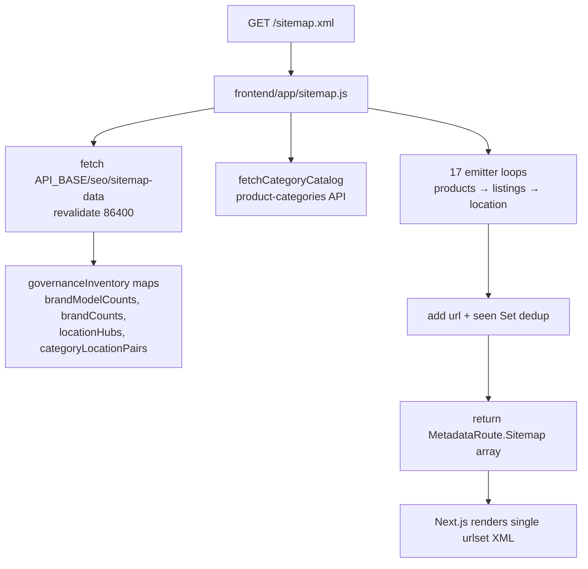

# SITEMAP-PARTITION-AUTOSCALE-READINESS-AUDIT-01

**Date:** 2026-06-22  
**Mode:** Read-only — no application code changes  
**Environment:** Production stack via `127.0.0.1:3000` / `127.0.0.1:5000`  
**Approved target architecture:**

```
sitemap.xml                          (sitemap index)
├─ sitemap-products.xml
├─ sitemap-marketplace-core.xml
├─ sitemap-marketplace-location.xml
└─ sitemap-shops.xml
```

**Autoscale threshold:** 45,000 URLs per sitemap file

---

## Executive summary

| Signal | Finding |
|--------|---------|
| **Current apex scale** | 12,010 URLs in one monolithic `urlset` (~2.19 MB XML) |
| **Largest group today** | PRODUCTS — 7,402 URLs (61.6% of apex); still **6.1× below** 45k partition threshold |
| **Shops in apex** | **Not present** — 481 URLs across 3 shop subdomains, served separately |
| **Memory model** | Full in-memory: API payload (~8 MB JSON) + `out[]` array + `seen` Set |
| **Recommended architecture** | Route handlers for named child sitemaps + shared projection module; `generateSitemaps()` only if `/sitemap/[id].xml` naming is acceptable |
| **Zero-regression readiness** | **Conditional YES** — safe to implement after Phase 1 parity harness; not urgent at current scale |

**Final verdict:** **YES** — ready for implementation **with preconditions** (parity tests, `sitemap-shops.xml` semantics locked, phased rollout). No partition split is required today; the work is architectural readiness before any group crosses 45k.

---

## Step 1 — Current sitemap architecture inventory

### 1.1 Generation flow (marketplace apex)



| Layer | File | Role |
|-------|------|------|
| **Entry** | `frontend/app/sitemap.js` | Sole apex generator; monolithic `urlset`; no `generateSitemaps()` |
| **Governance** | `frontend/lib/seo/sitemapGovernance.server.js` | Thin wrappers → `urlGovernance.isSitemapEligible` per namespace |
| **Path builders** | `frontend/lib/listing/adapters/sitemapListingPath.ts`, `frontend/lib/seo/productSeoUrl.js` | Canonical path construction |
| **API provider** | `backend/controllers/seo.controller.js` → `GET /api/seo/sitemap-data` | Single JSON blob: products + 11 listing inventories + governance aggregates |
| **Listing quality SQL** | `backend/utils/*SitemapQuality.server.js` (11 files) | Pre-aggregated listing rows with `productCount` |
| **Robots pointer** | `frontend/app/robots.js` | `sitemap: ${base}/sitemap.xml` only |
| **Shop sitemap** | `frontend/app/(shopsite)/shops/[slug]/sitemap.xml/route.js` | Per-shop `urlset`; **never merged into apex** |
| **Shop loader** | `frontend/lib/shopseo/loadShopSeoSitemap.js` + `projectShopSitemap.js` | Capped namespaces, strict count filtering |
| **Subdomain routing** | `frontend/middleware.js` | `{slug}.otofine.com/sitemap.xml` → `/shops/{slug}/sitemap.xml` |

### 1.2 Emitter order in `sitemap.js` (governance-gated)

| # | Emitter | Namespace gate | Location? |
|---|---------|----------------|-----------|
| 0 | Homepage | — | Core |
| 1 | Products | `PRODUCT` | Products |
| 2 | Brand/model + brand-only | `VEHICLE` | Core |
| 3 | Categories | `CATEGORY` | Core |
| 4 | Location hub | `LOCATION` (+ seller) | Location |
| 5 | Category × location | `CATEGORY_LOCATION` | Location |
| 6 | Brand × location | `BRAND_LOCATION` | Location |
| 7 | Brand × model × location | `BRAND_VEHICLE_LOCATION` | Location |
| 8 | BMY range × location | `BRAND_VEHICLE_YEAR_RANGE_LOCATION` | Location |
| 9 | CBMY range × location | `CATEGORY_BRAND_VEHICLE_YEAR_RANGE_LOCATION` | Location |
| 10 | Category × brand × location | `CATEGORY_BRAND_LOCATION` | Location |
| 11 | Category × brand × model × location | `CATEGORY_BRAND_VEHICLE_LOCATION` | Location |
| 12 | Category × brand | `CATEGORY_BRAND` | Core |
| 13 | CBM | `CBM` | Core |
| 14 | BMY (single year) | `VEHICLE_YEAR` | Core |
| 15 | BMY range | `VEHICLE_YEAR_RANGE` | Core |
| 16 | CBMY range | `CATEGORY_BRAND_VEHICLE_YEAR_RANGE` | Core |

**Dead inventory:** `remote.partNames` is fetched by the API but **never emitted** in `sitemap.js`.

**Dedup:** Global `seen` Set on full URL string — live apex has **0 duplicates** (12,010 locs, 12,010 unique).

### 1.3 Shop sitemap flow (separate)

```
{slug}.otofine.com/sitemap.xml
  → middleware rewrite
  → /shops/{slug}/sitemap.xml/route.js
  → loadShopSeoSitemap(slug)
  → shop APIs + strict count verification
  → projectShopSitemap (HOME, ABOUT, CONTACT, COLLECTION, SEO landings)
  → manual XML render (route handler)
```

Shop sitemaps exclude product PDPs and marketplace location URLs by design (`ARCH-07.1`).

---

## Step 2 — URL classification

### Classification rules (target partition mapping)

| Group | Rule |
|-------|------|
| **PRODUCTS** | URLs emitted from the `remote.products` loop (`resolveProductSitemapPath`) |
| **MARKETPLACE_CORE** | Homepage + all listing URLs **without** `-tai-` segment (categories, brands, vehicles, CBM, BMY, BMY_RANGE, CBMY_RANGE, CATEGORY_BRAND) |
| **MARKETPLACE_LOCATION** | Any apex URL whose path contains `-tai-` (location hub, category/brand/vehicle location variants) |
| **SHOPS** | All URLs in per-shop subdomain sitemaps (currently **outside** apex) |

### Exact counts — live apex (`127.0.0.1:3000/sitemap.xml`)

| Group | Count | Notes |
|-------|------:|-------|
| PRODUCTS | **7,402** | Path-heuristic match to PDP canonical patterns |
| MARKETPLACE_CORE | **2,873** | Includes homepage (`/`) |
| MARKETPLACE_LOCATION | **1,734** | All paths match `-tai-` |
| **Apex total** | **12,010** | Verified unique |

### Emitter simulation (governance replay from `/api/seo/sitemap-data`)

| Emitter | Gated count |
|---------|------------:|
| products | 7,385 |
| vehicle_model | 236 |
| vehicle_brand | 26 |
| category | 1,007 |
| category_brand | 211 |
| cbm | 515 |
| bmy | 170 |
| bmy_range | 106 |
| cbmy_range | 651 |
| location_hub | 1 |
| category_location | 280 |
| brand_location | 19 |
| brand_vehicle_location | 107 |
| bmy_range_location | 380 |
| cbmy_range_location | 651 |
| category_brand_location | 211 |
| category_brand_vehicle_location | 54 |
| **Simulated total** | **12,011** |

Simulation vs live delta: **+1 URL** (likely category-catalog vs sitemap path edge). Acceptable for planning; Phase 1 parity test must enforce **exact** match.

### Shop counts (separate from apex)

| Metric | Value |
|--------|------:|
| Active shop subdomains probed | 3 |
| Total shop sitemap URLs | **481** |
| Average per shop | ~160 |

Sample: `phutungoto355` ≈ 224 URLs (INDEX tier).

### Ungated inventory headroom (API raw — not all eligible)

| Inventory key | Raw rows | Gated in sitemap |
|---------------|----------|------------------|
| products | 7,385 | 7,402 |
| categoryBrandListings | 4,063 | 211 |
| cbmListings | 515 | 515 |
| cbmyRangeListings | 3,665 | 651 |
| categoryBrandVehicleLocationListings | 6,476 | 54 |
| categoryBrandVehicleYearRangeLocationListings | 3,665 | 651 |

Location and CBMY namespaces have the largest **ungated → gated** compression; future growth in gated rows drives partition timing more than raw SQL row counts.

---

## Step 3 — Current totals

### Apex marketplace (`sitemap.xml`)

| Group | Count | % of apex |
|-------|------:|----------:|
| PRODUCTS | 7,402 | 61.6% |
| MARKETPLACE_CORE | 2,873 | 23.9% |
| MARKETPLACE_LOCATION | 1,734 | 14.4% |
| **Total** | **12,010** | **100%** |

### Full platform (apex + shops)

| Group | Count | % of platform |
|-------|------:|--------------:|
| PRODUCTS | 7,402 | 59.3% |
| MARKETPLACE_CORE | 2,873 | 23.0% |
| MARKETPLACE_LOCATION | 1,734 | 13.9% |
| SHOPS | 481 | 3.9% |
| **Total** | **12,491** | **100%** |

---

## Step 4 — Partition simulation (threshold = 45,000)

### 4.1 Per-group isolation (if a single group reached N URLs)

Files needed = `ceil(N / 45000)` (minimum 1):

| Group | 50,000 URLs | 100,000 | 250,000 | 500,000 |
|-------|------------:|--------:|--------:|--------:|
| PRODUCTS | 2 | 3 | 6 | 12 |
| MARKETPLACE_CORE | 2 | 3 | 6 | 12 |
| MARKETPLACE_LOCATION | 2 | 3 | 6 | 12 |
| SHOPS | 2 | 3 | 6 | 12 |

### 4.2 Holistic growth (proportional to current mix)

Assumes current ratios: Products 61.6% / Core 23.9% / Location 14.4% / Shops 3.9% of combined inventory.

| Total platform URLs | Products (files) | Core (files) | Location (files) | Shops (files) | **Index children** |
|--------------------:|-----------------:|-------------:|-----------------:|--------------:|-------------------:|
| 50,000 | 30,745 (1) | 11,961 (1) | 7,219 (1) | 2,002 (1) | **4** |
| 100,000 | 61,490 (2) | 23,922 (1) | 14,438 (1) | 4,005 (1) | **5** |
| 250,000 | 153,726 (4) | 59,804 (2) | 36,095 (1) | 10,012 (1) | **8** |
| 500,000 | 307,452 (7) | 119,609 (3) | 72,190 (2) | 20,025 (1) | **13** |

**First partition trigger (current mix):** PRODUCTS group crosses 45k at ~**73,000** apex URLs (≈6× today). If governance relaxes or location inventory gates widen, LOCATION could approach threshold sooner due to 3,665 raw CBMY-location rows vs 651 gated.

### 4.3 Target autoscale naming at split

When a group exceeds 45k, recommended child naming:

```
sitemap-products.xml          → sitemap-products-1.xml … sitemap-products-N.xml
sitemap-marketplace-core.xml  → sitemap-marketplace-core-1.xml …
sitemap-marketplace-location.xml → …
sitemap-shops.xml             → sitemap-shops-1.xml … OR nested shop-index (see Step 7)
```

Parent `sitemap.xml` remains a **sitemap index** listing all leaf `urlset` files.

---

## Step 5 — Memory audit

### Does generation load everything into memory?

**Yes — fully eager, single pass.**

| Stage | In memory | Evidence |
|-------|-----------|----------|
| API response | Entire `sitemap-data` JSON | `remote = await res.json()` — no streaming |
| Product enrichment | All products + car applications | Backend builds full `enrichedProducts` array |
| Listing inventories | All 11 listing arrays simultaneously | `Promise.all` in controller |
| Frontend output | Full `out[]` + `seen` Set | Returns complete `MetadataRoute.Sitemap` |
| XML render | Full urlset string | Next.js serializes entire array |

Shop sitemaps are smaller but also build full `entries[]` before XML string join in the route handler.

### Measured / estimated footprint

| Scenario | API JSON | Apex XML | `out[]` + `seen` (est.) | **Peak est.** |
|----------|----------|----------|-------------------------|---------------|
| **Current (~12k)** | 8.0 MB | 2.19 MB | ~3.2 MB | **~13–15 MB** |
| **100k URLs** | ~67 MB (scaled) | ~18 MB | ~27 MB | **~94 MB** |
| **500k URLs** | ~335 MB (scaled) | ~91 MB | ~134 MB | **~468 MB** |

Estimates assume ~280 bytes per URL entry (url string + metadata + Set overhead) and linear API scaling. Node heap on PM2 `otofine-frontend` can absorb current load; **500k would risk OOM or multi-second GC pauses** without partitioned generation or streaming.

### Backend DB memory (same request)

`getSitemapData` runs **15+ SQL queries** and holds all results before `res.json()`. At scale, the API endpoint becomes the bottleneck before XML rendering.

**Mitigation path (implementation, not done here):**

1. Group-scoped API endpoints or cursor pagination per partition
2. Generate each child sitemap independently (only load that group's source rows)
3. Optional: stream XML from route handler instead of materializing full string

---

## Step 6 — Next.js architecture comparison

| Approach | Pros | Cons | Fit for target naming |
|----------|------|------|----------------------|
| **A. `app/sitemap.js` (current)** | Native MetadataRoute; ISR via `revalidate: 86400`; simple | Single file only; full memory; cannot produce `sitemap-products.xml` names | ❌ |
| **B. `generateSitemaps()`** | Native partition support in Next 15; splits memory per id | URLs are `/sitemap/[id].xml`, not semantic names; still returns array per id | ⚠️ Partial |
| **C. Route handlers** | Exact filenames (`sitemap-products.xml/route.js`); manual XML; matches shop pattern; can add streaming | More boilerplate; must own cache headers & lastmod | ✅ **Best** |

### Recommendation: **Hybrid C + shared module**

1. **Extract** `projectMarketplaceSitemap(remote, categoryRows)` from `sitemap.js` — returns tagged entries `{ group, url, lastModified, … }`.
2. **Apex index** — `app/sitemap.xml/route.js` (or keep `sitemap.js` as index-only via Next sitemap index support) lists child sitemap URLs.
3. **Child urlsets** — route handlers per group, each applying 45k pagination:
   - `app/sitemap-products.xml/route.js` (+ `sitemap-products-[n].xml` when scaled)
   - `app/sitemap-marketplace-core.xml/route.js`
   - `app/sitemap-marketplace-location.xml/route.js`
   - `app/sitemap-shops.xml/route.js`
4. **Reuse** shop `renderSitemapXml` helper (extract to shared util).
5. **Do not use** `generateSitemaps()` unless product accepts `/sitemap/0.xml` URLs and 301 map from old apex urlset (adds GSC churn).

`generateSitemaps()` remains a viable **internal** implementation detail inside each named route (partition by id, expose single stable URL via index).

---

## Step 7 — Migration risks

| Risk | Severity | Mitigation |
|------|----------|------------|
| **Missing URLs** | P0 | Golden parity test: monolithic `sitemap.js` URL set === union of all child sitemaps; run in CI before cutover |
| **Duplicate URLs** | P1 | Per-group `seen` + cross-group assert; homepage only in `marketplace-core` |
| **Partition boundary errors** | P1 | Stable sort before slice (e.g. `url` asc); document ordering; test slice math at 44,999 / 45,000 / 45,001 |
| **Canonical impact** | Low | Child sitemaps list same canonical URLs; no change to page `rel=canonical` |
| **GSC churn** | Medium | Apex changes from `urlset` → `sitemap index`; Google handles this natively — resubmit `sitemap.xml`, monitor Coverage report for 2–4 weeks |
| **Cached old monolith** | Medium | CDN/s-maxage on new routes; purge on deploy; keep temporary redirect only if old URL had external links (unlikely for sitemap) |
| **`sitemap-shops.xml` semantics** | **P0 decision** | Two valid models (see below) — wrong choice duplicates or omits shop URLs in GSC |
| **Governance drift** | Medium | Single projection module shared by all partitions; gates stay in one place |
| **Shop BLOCK tier** | Low | `projectShopSitemap` returns `[]` for BLOCK — index must skip or omit blocked shops |
| **Middleware subdomain** | Low | Shop subdomain sitemaps stay as-is; apex `sitemap-shops.xml` is additive discovery path |

### `sitemap-shops.xml` — required product decision

| Model | Contents | When to use |
|-------|----------|-------------|
| **A. Shop sitemap index** | Lists `https://{slug}.otofine.com/sitemap.xml` per INDEX-tier shop | Preferred — preserves shop canonical subdomain ownership; scales to thousands of shops |
| **B. Flat URL aggregation** | All shop landing URLs on apex host | Avoid — conflicts with subdomain canonical model documented in SEO-INDEXATION-READINESS-AUDIT-01 |

**Recommendation:** Model **A** — `sitemap-shops.xml` is a sitemap index of per-shop sitemap URLs, not a flat urlset of shop pages.

### URLs at risk during careless partition

- Homepage must appear **once** in `marketplace-core` only
- Product `canonicalPath` vs `buildProductSeoUrl` fallback must remain identical
- Location slugs built inline in `sitemap.js` (not `buildSitemapListingPath`) — partition must not refactor path logic
- Category catalog from `fetchCategoryCatalog()` is a **second data source** — core partition must still call it

---

## Step 8 — Implementation plan (zero SEO regression)

### Phase 1 — Extract & parity (no public URL change)

**Goal:** Same `sitemap.xml` output; internal refactor only.

1. Create `frontend/lib/seo/projectMarketplaceSitemap.server.js` — pure projection from API payload → tagged entries.
2. Add `frontend/scripts/validate-sitemap-parity-01.mjs` — compare current live URL set to projection (sorted diff must be empty).
3. Document emitter order and group tags in code (order affects tie-breaking if dedup keys collide).
4. Add memory/size metrics log on generation (entry count, JSON bytes).

**Exit criteria:** Parity script PASS; `npm run build` clean; live count still 12,010.

### Phase 2 — Partition cutover (apex marketplace)

**Goal:** `sitemap.xml` becomes sitemap index; marketplace URLs split across three children; **URL set unchanged**.

1. Implement route handlers:
   - `sitemap-products.xml`
   - `sitemap-marketplace-core.xml`
   - `sitemap-marketplace-location.xml`
2. Implement apex `sitemap.xml` as index listing the three children (and placeholder for shops).
3. Run parity: `∪(children) === current_monolith` (12,010 URLs).
4. Deploy; resubmit `https://otofine.com/sitemap.xml` in GSC.
5. Monitor GSC “Sitemap index” processing + indexed URL delta (14 days).

**Rollback:** Feature flag to serve monolithic urlset at `sitemap.xml` if index errors.

### Phase 3 — Shops index + autoscale

**Goal:** Complete target architecture; future-proof 45k splits.

1. Add `sitemap-shops.xml` — sitemap index of `{slug}.otofine.com/sitemap.xml` for INDEX-tier shops (Model A).
2. Add `GET /api/public/shops?indexableOnly=1` if not present — lightweight slug list for shop index.
3. Implement 45k autoscale within each group:
   - `ceil(count / 45000)` leaf files
   - Parent group index OR flat listing in apex index (prefer flat apex index of all leaves for shallow tree).
4. Optional API split: `/api/seo/sitemap-data?group=products` to reduce memory per request.
5. Set cache: `s-maxage=86400` on marketplace children; shops index `s-maxage=3600`.

**Exit criteria:** All four children present; no group file >45k URLs; memory per request <50 MB at current scale; GSC shows “Success” on index.

---

## FINAL VERDICT

### Ready for implementation?

## **YES** (conditional)

| Condition | Status |
|-----------|--------|
| Current scale requires immediate split | **No** — largest group 7,402 ≪ 45,000 |
| Architecture documented | ✅ |
| Parity harness defined | ✅ (must be built in Phase 1) |
| `sitemap-shops.xml` semantics | ⚠️ Lock Model A (shop sitemap index) before Phase 3 |
| GSC regression risk manageable | ✅ With phased rollout + monitoring |

**Proceed with Phase 1 immediately** as low-risk refactor. **Phase 2** can ship when convenient (structural improvement, not emergency). **Phase 3** before PRODUCTS group exceeds ~40k URLs or shop count exceeds ~200 INDEX-tier shops.

---

## Appendix — Key file references

| Path | Purpose |
|------|---------|
| `frontend/app/sitemap.js` | Monolithic apex generator (395 lines) |
| `frontend/lib/seo/sitemapGovernance.server.js` | Namespace gates |
| `backend/controllers/seo.controller.js` | `getSitemapData` API |
| `frontend/app/(shopsite)/shops/[slug]/sitemap.xml/route.js` | Shop route handler pattern to reuse |
| `frontend/lib/shopseo/loadShopSeoSitemap.js` | Shop load + caps + strict counts |
| `frontend/middleware.js` | Subdomain sitemap rewrite |
| `frontend/app/robots.js` | Points to apex `/sitemap.xml` |

**Live measurements (2026-06-22):** apex 12,010 URLs · API 8.03 MB · apex XML 2.19 MB · shops 481 URLs / 3 subdomains.
