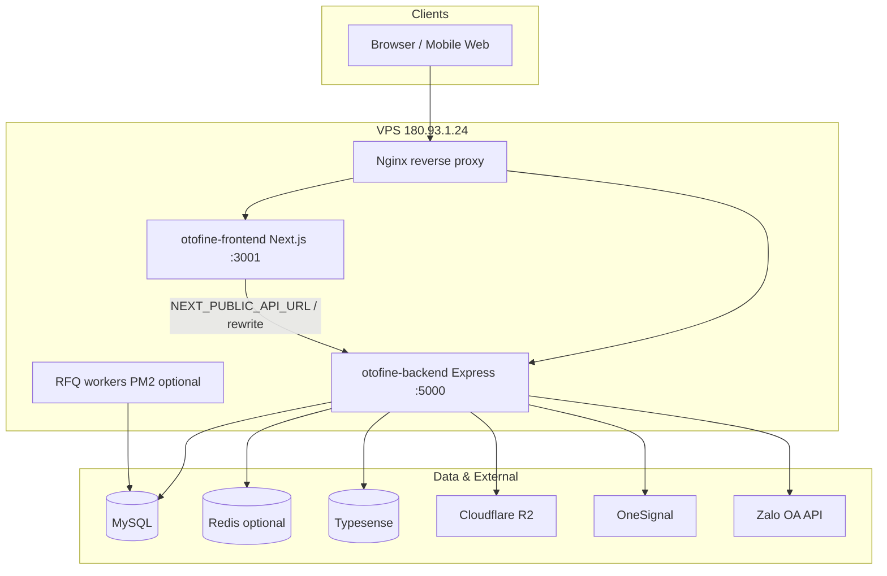
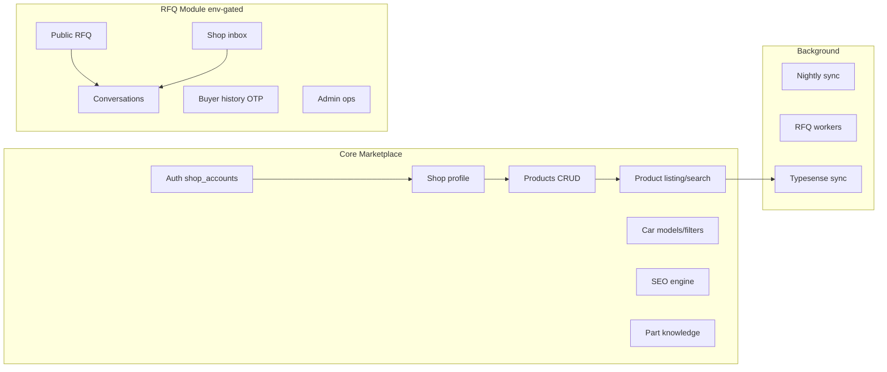
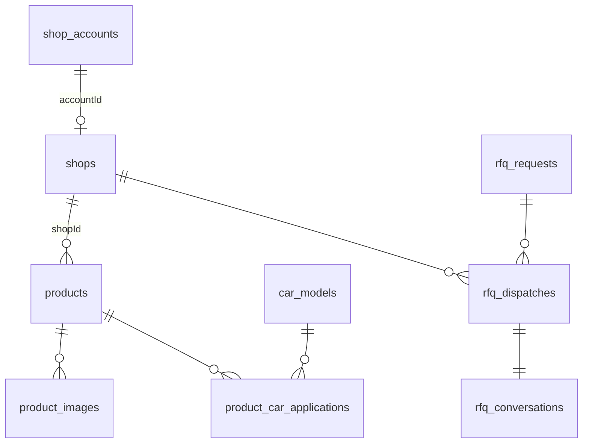

# A. Tổng quan hệ thống — Otofine

**Ngày audit:** 2026-05-24  
**Phạm vi:** `/var/www/otofine` (production + dev copies)  
**Phương pháp:** Chỉ đọc source, migrations, DB dump, PM2 backup — không sửa code.

---

## 1. Mô tả business

**Otofine** là nền tảng marketplace phụ tùng ô tô tại Việt Nam:

- **Người mua:** duyệt sản phẩm, SEO landing theo xe/hãng/danh mục, tạo RFQ (báo giá), chat với seller.
- **Shop (seller):** đăng ký → admin duyệt → quản lý sản phẩm, storefront, RFQ inbox.
- **Admin:** duyệt shop, quản lý part knowledge, SEO, RFQ ops.

**Không có:** giỏ hàng, thanh toán online, đơn hàng e-commerce truyền thống (chỉ RFQ/quote flow).

---

## 2. Tech stack

| Layer | Công nghệ | Ghi chú |
|-------|-----------|---------|
| Frontend | Next.js 15.3, React 19, App Router | Port dev 3001 |
| Backend | Express 5, ESM (`"type": "module"`) | Port 5000 |
| Database | MySQL 8 (`mysql2/promise`) | Không ORM |
| Search | Typesense 3.x | Product search index |
| Cache | Redis (`ioredis`) + in-memory fallback | `redisCache.service.js` |
| File storage | Cloudflare R2 (S3 API), local `uploads/` | Sharp resize |
| Auth | JWT 7 ngày, bcryptjs | Shop + Admin roles |
| Push | OneSignal | Shop + RFQ buyer |
| Messaging | Zalo OA (webhook, OAuth callback) | Ops/escalation |
| Package manager | npm | Frontend + Backend riêng |
| Process manager | PM2 | Không có ecosystem.config trong repo |
| Reverse proxy | Nginx (host, không versioned) | Docs trong RFQ module |
| CI/CD | **Không có** | Deploy thủ công |
| Container | **Không có** Docker | |

---

## 3. Sơ đồ tổng quan hệ thống



---

## 4. Cấu trúc repository

```
/var/www/otofine/
├── frontend/              # Production Next.js
├── backend/               # Production Express API
├── frontend-rfq-dev/      # Dev copy RFQ UI
├── backend-rfq-dev/       # Dev copy API + auto-wave worker
├── audit/                 # Báo cáo audit (file này)
├── db_backup_*.sql        # Full schema dumps (~110MB)
├── pm2_backup_*.json      # PM2 process snapshot
└── package.json           # Root stub (react-quill-new only)
```

---

## 5. Dependency chính

### Backend (`backend/package.json`)

| Package | Mục đích |
|---------|----------|
| express ^5 | HTTP API |
| mysql2 | DB pool |
| jsonwebtoken, bcryptjs | Auth |
| cors, dotenv | Middleware / env |
| multer, @aws-sdk/client-s3, sharp | Upload R2 |
| typesense | Search |
| ioredis | Cache |
| xlsx | Excel import/export |
| node-cron | Scheduler jobs |
| axios | Zalo, external HTTP |
| mssql | Optional part_knowledge on SQL Server |
| uuid | shopId, RFQ IDs |

### Frontend (`frontend/package.json`)

| Package | Mục đích |
|---------|----------|
| next ^15.3 | SSR/SSG/App Router |
| react ^19 | UI |
| axios | API client |
| jwt-decode | Client token parse |
| react-icons | Icons |
| react-onesignal | Web push |
| react-quill-new | Rich text shop settings/products |
| tailwindcss | Utility CSS |

---

## 6. Cấu trúc module (logical)



---

## 7. Environment variables (tổng hợp)

### Backend (từ code + `.env.rfq-r2.example`, không có `.env.example` chính)

| Biến | Mục đích |
|------|----------|
| `DB_HOST`, `DB_USER`, `DB_PASSWORD`, `DB_NAME`, `DB_PORT` | MySQL |
| `DB_ENGINE` / `DB_TYPE` | `mysql` (default) hoặc `mssql` |
| `JWT_SECRET` | Ký JWT |
| `PORT` | API port (5000) |
| `CORS_ORIGINS` | Extra CORS origins |
| `JSON_BODY_LIMIT` | Body size (25mb) |
| `RFQ_MODULE_ENABLED` | Bật/tắt RFQ routes |
| R2: `RFQ_R2_*`, product R2 vars | Upload media |
| Typesense host/key | Search |
| Redis URL | Cache |
| `ZALO_OA_*` | Zalo integration |
| OneSignal keys | Push |

### Frontend (`frontend/.env.example`)

| Biến | Mục đích |
|------|----------|
| `NEXT_PUBLIC_API_URL` / `NEXT_PUBLIC_API_BASE_URL` | API client |
| `NEXT_PUBLIC_SITE_URL` | Canonical, sitemap |
| `API_INTERNAL_ORIGIN` | Next rewrite proxy |
| `NEXT_PUBLIC_ONESIGNAL_APP_ID` | Push |
| `OTOFINE_SEO_*`, `GEMINI_API_KEY` | SEO AI (legacy routes 410) |

---

## 8. Deploy architecture

| Process PM2 | CWD | Command |
|-------------|-----|---------|
| `otofine-frontend` | `/var/www/otofine/frontend` | `npm start` |
| `otofine-backend` | `/var/www/otofine/backend` | `node server.js` |
| `frontend-rfq-dev` | `frontend-rfq-dev` | `npm run dev -p 3001` |
| `backend-rfq-dev` | `backend-rfq-dev` | `npm start` |
| `rfq-auto-wave-worker` | `backend-rfq-dev` | `worker:rfq-auto-wave` |

**Flow deploy hiện tại:** SSH → pull/copy code → PM2 restart → chạy migrations thủ công (`npm run migrate:*`).

**Rủi ro:** Không có CI, không Docker, nginx config ngoài repo, 2 bản dev song song có thể lệch production.

---

## 9. API structure (high-level)

- Prefix: `/api/*`
- Pattern: Routes → Controllers → Services → SQL / Repositories
- RFQ: module riêng `backend/modules/rfq/` (~88 files)
- Static: `/uploads/*` từ disk

Chi tiết: `audit/api-analysis.md`

---

## 10. `shop_accounts` — điểm quan trọng

**Không phải module code** — là bảng MySQL quản lý tài khoản đăng nhập seller.

| Khía cạnh | Chi tiết |
|-----------|----------|
| Files | `authController.js`, `adminController.js`, `middlewares/auth.js` |
| Quan hệ | `shop_accounts.id` ← JWT `id`; `shops.accountId` → business profile |
| Luồng | Register `pending` → Admin `active` → Login |
| Frontend | `/shop/login`, `/shop/register`, `/admin/shops` |
| Migration | **Không có** trong `backend/migrations/` |
| Schema drift | Code dùng `status='deleted'` nhưng ENUM DB chỉ `pending\|active\|blocked` |

Chi tiết: `audit/backend-analysis.md`, `audit/database-analysis.md`

---

## 11. Tree structure rút gọn

```
otofine/
├── frontend/
│   ├── app/           # Routes (/, [slug], product, shop, admin, rfq)
│   ├── components/    # UI (pages, rfq, seo, guards)
│   ├── lib/           # rfq, seo, product helpers
│   ├── api/           # axios clients
│   └── data/seo/      # Static SEO JSON cache
├── backend/
│   ├── server.js      # Entry
│   ├── routes/        # 21 route files
│   ├── controllers/   # 31 controllers
│   ├── services/      # 54 services
│   ├── modules/rfq/   # RFQ feature module
│   ├── migrations/    # 46 SQL files
│   ├── jobs/          # Cron/workers
│   └── scripts/       # CLI ops
└── audit/             # Báo cáo
```

---

## 12. Module relationship diagram



---

## 13. Thông tin thiếu / cần xác minh thêm

- Nginx site config thực tế trên host (`/etc/nginx/`)
- Giá trị `RFQ_MODULE_ENABLED` trên production
- Typesense/Redis có đang bật trên prod không
- Quy trình backup DB tự động (chỉ thấy dump manual trong repo)
- SSL/TLS termination layer

---

## 14. Liên kết báo cáo

| File | Nội dung |
|------|----------|
| `backend-analysis.md` | Backend chi tiết |
| `frontend-analysis.md` | Frontend chi tiết |
| `database-analysis.md` | ERD, bảng, migrations |
| `api-analysis.md` | Toàn bộ endpoints |
| `security-analysis.md` | F, G security issues |
| `performance-analysis.md` | Bottleneck |
| `full-feature-list.md` | C — Danh sách tính năng |
| `refactor-roadmap.md` | I, J, K — Roadmap & không đụng |
