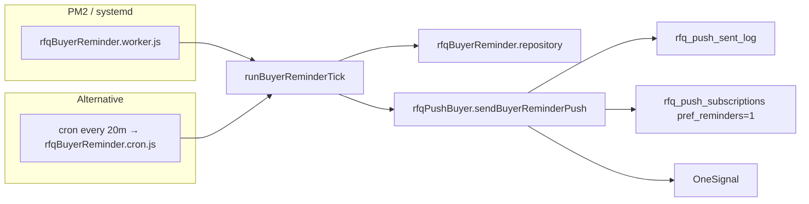

# RFQ Buyer Inactive Reminder System (Phase 2)

## Cron architecture



| Process | Command | Interval |
|---------|---------|----------|
| **Worker (recommended)** | `npm run worker:rfq-buyer-reminder` | Poll every 15–30 min (default 20) |
| **One-shot cron** | `npm run cron:rfq-buyer-reminder` | systemd/cron timer |

**Flags:** `RFQ_MODULE_ENABLED=true` + `RFQ_BUYER_REMINDER_ENABLED=true`

---

## Trigger rules

Only RFQs with **at least one** `rfq_push_subscriptions` row where `pref_reminders = 1`.

Excludes: `closed`, `cancelled`, `expired`, `pending_otp`, `spam_flag = 1`, past `expires_at`.

**At most one reminder per RFQ per tick** (priority order):

| Priority | Type | Conditions |
|----------|------|------------|
| 1 | `unread_messages` | `unread_count > 0` (shop msgs); last buyer activity > **30m** |
| 2 | `quote_unseen` | Quote exists; latest quote age > **1h**; no `customer_quotes_surface_view` after latest quote |
| 3 | `inactive` | RFQ age > **6h**; status `open`/`dispatching`; **no buyer chat messages** ever |

### Last buyer activity (for unread reminder)

`GREATEST(` last buyer message, last buyer read cursor, last `customer_token_open` / `customer_quotes_surface_view` `)`

---

## Notification copy

| Type | Heading |
|------|---------|
| `inactive` | Bạn vẫn đang tìm phụ tùng? |
| `quote_unseen` | Bạn có báo giá chưa xem |
| `unread_messages` | Bạn có phản hồi mới chưa đọc |

Deep link: `/rfq/history` (via existing `viewer_path` fallback in push service).

Structured event: `rfq.reminder.{type}`

---

## Dedup strategy

1. **Rolling 24h** — query `rfq_push_sent_log` for same `(rfq_request_id, event_type)` within `RFQ_BUYER_REMINDER_DEDUP_HOURS` (default 24)
2. **Day bucket key** — `event_key = {type}:{epoch_day}` on insert (backup against race)
3. **One reminder per RFQ per tick** — merge candidates by priority
4. **Opt-in only** — `pref_reminders = 1`
5. **Batch cap** — `RFQ_BUYER_REMINDER_BATCH` (default 50) per type per tick

Real-time pushes (`rfq.message.received`, `rfq.quote.received`) use separate event types — no conflict.

---

## Env vars

| Variable | Default | Purpose |
|----------|---------|---------|
| `RFQ_BUYER_REMINDER_ENABLED` | `false` | Master switch |
| `RFQ_BUYER_REMINDER_POLL_MS` | `1200000` (20m) | Worker interval (clamped 15–30m) |
| `RFQ_BUYER_REMINDER_DEDUP_HOURS` | `24` | Min hours between same reminder type |
| `RFQ_BUYER_REMINDER_INACTIVE_HOURS` | `6` | Inactive RFQ threshold |
| `RFQ_BUYER_REMINDER_QUOTE_HOURS` | `1` | Unseen quote threshold |
| `RFQ_BUYER_REMINDER_UNREAD_MIN` | `30` | Buyer inactive before unread nudge |
| `RFQ_BUYER_REMINDER_BATCH` | `50` | Max candidates per type per tick |
| `RFQ_BUYER_REMINDER_DRY_RUN` | `false` | Log only, no OneSignal send |

---

## Rollout plan

1. **Dry run (staging)**
   ```bash
   RFQ_BUYER_REMINDER_ENABLED=true RFQ_BUYER_REMINDER_DRY_RUN=true npm run cron:rfq-buyer-reminder
   ```
   Verify logs: `rfq.reminder.tick_completed`, candidate counts.

2. **Enable worker (staging)**
   ```bash
   RFQ_BUYER_REMINDER_ENABLED=true pm2 start npm --name rfq-buyer-reminder-worker -- run worker:rfq-buyer-reminder
   ```

3. **Production** — enable flag + PM2 process; monitor `buyer_reminder_*_sent` counters and OneSignal delivery.

4. **Tune** — increase thresholds if opt-out/complaints; decrease batch if DB load spikes.

---

## Analytics & attribution (Phase 2b)

See **`RFQ_REMINDER_ANALYTICS.md`** for attribution model, admin endpoint, and anti-double-counting.

**Admin metrics:** `GET /api/admin/rfq/reminder-metrics?days=7` (JWT admin)

**Client open tracking:** `POST /api/rfq-push/reminder-event` with `{ attributionId, event: "opened" }`

**Structured logs:** `rfq.reminder.sent`, `rfq.reminder.opened`, `rfq.reminder.converted`, `rfq.reminder.dismissed`, `rfq.reminder.opt_out`

---

## Rollback

| Action | Effect |
|--------|--------|
| `RFQ_BUYER_REMINDER_ENABLED=false` | Worker/cron no-ops immediately |
| Stop PM2 process | No reminders sent |
| Revert service files | Real-time pushes unaffected |
| `rfq_push_sent_log` rows | Harmless audit trail |

No migration required — reuses `036` schema (`pref_reminders`, `rfq_push_sent_log`).

---

## Files

| File | Role |
|------|------|
| `jobs/rfqBuyerReminder.worker.js` | Long-poll worker |
| `jobs/rfqBuyerReminder.cron.js` | One-shot for systemd |
| `services/rfqBuyerReminder.service.js` | Tick orchestration + priority merge |
| `repositories/rfqBuyerReminder.repository.js` | Candidate SQL |
| `services/rfqPushBuyer.service.js` | `sendBuyerReminderPush` |
