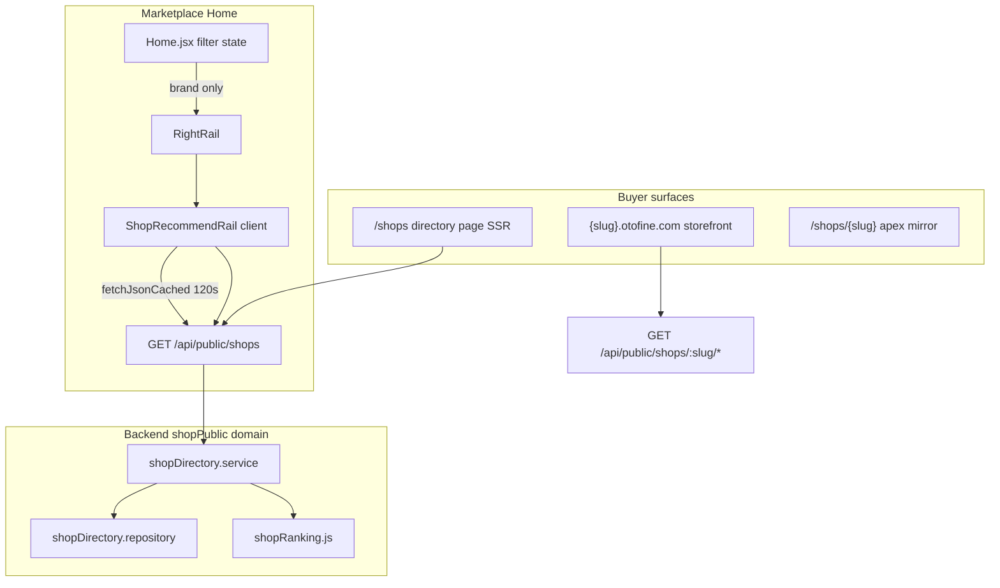
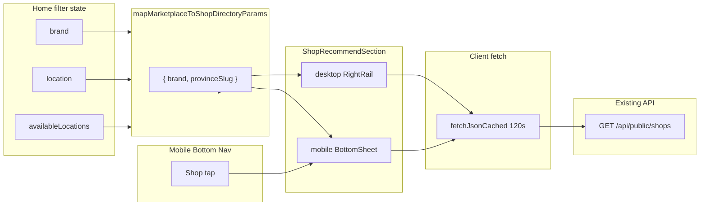

# MOBILE-UX-PHASE-3A — Shop Matching Architecture Audit

**Mode:** READ ONLY — no code, build, or restart  
**Audit date:** 2026-06-22  
**Scope:** Safest architecture for mobile Bottom Nav **Shop** → BottomSheet **Shop phù hợp** based on current marketplace filter state  
**Constraint:** Reuse existing marketplace / shop-public architecture; no duplicate datasource; no duplicate API; no new routing unless absolutely necessary

---

## Executive summary

Otofine already has a **production-ready shop discovery stack** (Phase 7.1): public directory API, deterministic `rankShop()` scoring, desktop `ShopRecommendRail`, and `/shops` directory page. The mobile gap is **UX wiring only** — bottom nav Shop currently routes to **seller login**, not buyer shop discovery.

**Recommended approach:** Extract `ShopRecommendSection` from `ShopRecommendRail` (mirror Phase 1/2 pattern), mount in a mobile BottomSheet, pass **the same filter→API mapping desktop already uses** (`brand` only today), reuse `GET /api/public/shops` + `fetchJsonCached` + `buildShopStorefrontUrl`.

| Area | Verdict |
|------|---------|
| Existing shop architecture | **PASS** — mature, documented |
| Datasource recommendation | **PASS** — single API, no new tables |
| Filter matching (brand) | **PASS** — already wired on desktop |
| Filter matching (category/model/year) | **WARNING** — not in directory API; desktop also ignores |
| Filter matching (province) | **WARNING** — API ready; desktop not wired yet |
| Performance for mobile sheet | **PASS** — cached, bounded query |
| Navigation | **PASS** — reuse storefront + `/shops` |
| Seller section | **PASS** — existing auth routes |
| Future scalability | **PASS** — directory filters extensible |
| Regression risk | **PASS** — low if extracted like Phase 1/2 |
| Implementation readiness | **PASS** — ready for Phase 3B |

**Overall readiness score:** **88 / 100**

**Recommendation:** **Proceed to Phase 3B (implement)** using extraction + BottomSheet; optional Phase 3B+ for `provinceSlug` passthrough and directory `category` filter extension.

---

## SECTION 1 — Current shop architecture

### High-level flow (today)



### Backend — public shop domain

**Mount:** `/api/public/shops` when `PUBLIC_SHOPSITE_ENABLED=true` (`backend/server.js`, `backend/routes/publicShop.routes.js`)

| Layer | Path | Role |
|-------|------|------|
| Controllers | `backend/domains/shopPublic/controllers/shopDirectory.controller.js` | Directory list, facets, related |
| Controllers | `backend/domains/shopPublic/controllers/shopPublic.controller.js` | Single-shop profile, products |
| Services | `shopDirectory.service.js` | Sanitize → fetch → rank → paginate |
| Services | `shopPublic.service.js` | Storefront DTOs |
| Repositories | `shopDirectory.repository.js` | Filter SQL, bulk enrich (counts, brands, province) |
| Repositories | `shopPublicProducts.repository.js` | Per-shop product list with category/brand/model/year |
| Ranking | `ranking/shopRanking.js` | Deterministic 0–100 score |
| Cache | `cache/caches.js` + `responseCache.middleware.js` | LRU + CDN headers |

### Key public endpoints

| Endpoint | Purpose |
|----------|---------|
| `GET /api/public/shops` | **Directory** — filtered shop list (primary datasource) |
| `GET /api/public/shops/_facets/provinces` | Province dropdown |
| `GET /api/public/shops/_facets/brands` | Brand dropdown |
| `GET /api/public/shops/:slug` | Storefront profile |
| `GET /api/public/shops/:slug/products` | Shop inventory (supports category, brand, model, year) |
| `GET /api/public/shops/:slug/related` | Similar shops (brand overlap + province) |

### Frontend — marketplace integration

| Component | Location | Role |
|-----------|----------|------|
| **ShopRecommendRail** | `frontend/components/pages/home/sections/ShopRecommendRail.jsx` | Desktop **Shop phù hợp** — client fetch, 5 shops |
| **RightRail** | `sections/RightRail.jsx` | Passes `brand` to rail |
| **FeaturedShops** | `components/shopsite/FeaturedShops.jsx` | Server component — **not mounted on Home** |
| **ShopCard** | `components/shopsite/ShopCard.jsx` | Directory / featured cards |
| **ShopDirectoryFilters** | `components/shopsite/ShopDirectoryFilters.jsx` | `/shops` page filters |
| **shopPublic.service.js** | SSR fetch helpers | `fetchPublicShopDirectorySafe` |

### Current bottom nav Shop behavior

```1541:1544:frontend/components/pages/Home.jsx
          onClick={() => {
            router.push("/shop/login");
          }}
```

**Shop** → **seller login** (`/shop/login`), not buyer discovery. Phase 3A target changes this to a **Shop phù hợp BottomSheet** (buyer) with seller links below.

### Shop homepage routes

| Surface | URL | Notes |
|---------|-----|-------|
| Storefront (canonical) | `https://{slug}.otofine.com/` | `buildShopStorefrontUrl()` |
| Apex mirror | `/shops/{slug}` | Discovery; `noindex` on mirror |
| Directory | `/shops` | Indexable; `?brand=&province=` filters |
| Seller center | `/shop/login`, `/shop/register`, `/shop/products`, … | Separate auth namespace |

---

## SECTION 2 — Datasource recommendation

### Candidates evaluated

| Candidate | Verdict | Reason |
|-----------|---------|--------|
| **`GET /api/public/shops` (directory)** | **RECOMMENDED** | Already powers `ShopRecommendRail`, `/shops`, `FeaturedShops`; ranked; cached; filter params exist |
| Per-shop `/products` aggregation | **FAIL** | N shops × 1 request = N+1; heavy |
| Marketplace product list (`/api/products`) | **FAIL** | Product-centric; `SeoArticleEnriched.buildShopRanking` counts `shopName` in current page only — incomplete, not shop cards |
| RFQ matching engine | **FAIL** | RFQ-only; different scorer; not buyer discovery |
| New table / materialized view | **FAIL** | User constraint: do not invent tables |
| `fetchListingCatalogSeed` / vehicle-hot | **FAIL** | Vehicle SEO chips, not shops |

### Recommendation

**Use exactly one datasource:** `GET /api/public/shops` via existing client helper pattern:

```javascript
fetchJsonCached(`${API_BASE}/public/shops?${params}`, { ttlMs: 120_000 })
```

Same as `ShopRecommendRail.jsx` lines 64–74.

**Why:**

1. **Already proven** on desktop rail (5 shops, brand-aware).
2. **Ranking built-in** — `sort=rank` + `rankShop()` server-side.
3. **Bounded cost** — max 200 rows scanned (`HARD_CAP`), ~4 SQL round-trips.
4. **Dual cache** — client 120s TTL + server `responseCache` (30s) + CDN `s-maxage=60`.
5. **No duplicate API** — mobile sheet reads same endpoint as desktop rail and `/shops`.

### Filter params to pass (existing API)

| API param | Source in marketplace state |
|-----------|----------------------------|
| `brand` | `brand` filter (direct) |
| `provinceSlug` | `deriveSelectedCityFromLocation(location, availableLocations)?.slug` (**enhancement** — API supports; desktop rail does not pass today) |
| `sort` | `"rank"` (default) |
| `perPage` | `5` (rail) or `8` (mobile sheet — tune in 3B) |
| `page` | `1` |

**Do NOT pass:** `keyword` (product search ≠ shop name search), `category`, `model`, `year` (not supported at directory layer — see Section 3).

---

## SECTION 3 — Matching logic

### Marketplace filter state (Home.jsx / useListingController)

| Field | Participate in shop matching? | Evidence |
|-------|------------------------------|----------|
| **None** | **Yes** — top shops by rank | `ShopRecommendRail`: no `brand` → fetch all public, client re-sort by `productCount` |
| **category** | **No (today)** | Directory SQL has no category EXISTS; desktop `RightRail` passes only `brand`, not category |
| **brand** | **Yes** | Directory `brand` filter: shop has product with `car_models.hang_xe = brand` |
| **model** | **No** | Not in `buildFilterClause`; per-shop products API supports model only |
| **year** | **No** | Not in directory; would sharply reduce pool |
| **location** (province) | **Partial** | API supports `provinceSlug`; marketplace uses display name — map via `availableLocations[].slug` |
| **keyword** | **No** | Different semantics (`q` = shop name/bio, not part search) |
| **sort** (listing) | **No** | Listing sort unrelated to shop directory sort |

### Decision matrix (recommended Phase 3B behavior)

| Marketplace state | Directory query | UX label | Match desktop? |
|-------------------|-----------------|----------|----------------|
| No vehicle/location filter | `sort=rank`, no filters; optional client sort by productCount | Shop phù hợp | ✓ Same as rail |
| Brand only | `brand={brand}` | Shop chuyên {brand} | ✓ Same as rail |
| Brand + model | `brand={brand}` only | Shop chuyên {brand} | ✓ Desktop ignores model too |
| Category only | No directory filter | Shop phù hợp (global rank) | ✓ Desktop ignores category |
| Category + brand | `brand={brand}` | Shop chuyên {brand} | ✓ |
| Location only | `provinceSlug={slug}` | Shop tại {province} | **Enhancement** (API ready) |
| Brand + location | both params | Combined | **Enhancement** |
| Year set | **Do not filter by year** | Use brand (if any) only | Avoid over-narrowing |

### Year — evidence

- Directory brand filter uses `EXISTS` on `product_car_applications` + `car_models` **without year predicate** (`shopDirectory.repository.js` L100–110).
- Per-shop products API applies year via fitment range (`shopPublicProducts.repository.js`) — shop-level, not directory.
- Adding year to directory would require new SQL (similar to products repo) and likely **exclude shops** with year-adjacent inventory only.
- **Recommendation:** **Exclude year from Phase 3B matching.** Optional future extension with telemetry on empty results.

### Category — evidence

- Desktop already shows **non-category-matched** shops when user filters by category alone (`RightRail` → `ShopRecommendRail brand={brand}` where `brand=""`).
- True category→shop matching requires **directory filter extension** (new `buildFilterClause` EXISTS on `product_categories`) — Phase 3B+ backend, not Phase 3A architecture blocker.
- **Recommendation:** Phase 3B mirror desktop (brand-only passthrough); document category gap; extend API in Phase 3C if product requirement tightens.

---

## SECTION 4 — Ranking

### Existing ranking (`shopRanking.js`)

**Max score: 100** — computed in-process per request after SQL filter.

| Group | Signals | Max pts |
|-------|---------|---------|
| Trust | verified, established years, phone+IM, avatar+cover+bio | 35 |
| Inventory | product count tiers, brand coverage (top brands ×2), freshness <30d | 30 |
| Storefront | intro HTML, Facebook, working hours | 20 |
| Discovery | human slug, province set, map embed | 15 |

**Sort modes:** `rank` (default), `newest`, `name`.

### Related-shop ranking (storefront only)

`listRelatedShops`: `brandOverlap * 10 + (sameProvince ? 3 : 0)` — not used for marketplace sheet.

### Client-side adjustments (ShopRecommendRail)

When **no brand filter:** re-sort fetched items by `productCount` descending (lines 80–84). When brand set: trust server rank order.

### Recommendation for mobile sheet

| Priority | Signal | Source |
|----------|--------|--------|
| 1 | Server `rankShop()` score | `sort=rank` |
| 2 | Brand filter match | API `brand` param |
| 3 | Province filter match | API `provinceSlug` (when wired) |
| 4 | Client productCount tie-break | Only when no brand (match rail) |
| 5 | Verified badge display | DTO `verified` — display only, not re-sort |

**Do not implement** RFQ scorer, SeoArticleEnriched product-count heuristic, or new composite score in Phase 3B.

**Future signals (no refactor needed):** `verified=true` param exists; editorial `featured_at` column mentioned in Phase 7.1 audit; engagement metrics can feed `rankShop()` breakdown.

---

## SECTION 5 — Performance

### Current query cost (`GET /api/public/shops`)

| Step | Cost |
|------|------|
| SQL filter | `COUNT(*)` + `SELECT … LIMIT 200` on `shops` |
| Enrichment | 3 parallel bulk queries (product counts, top brands, provinces) |
| Ranking | O(n) JS `rankShop()` on n ≤ 200 |
| Pagination | In-memory slice |

**Typical n:** tens of public shops (Vietnam-scale catalogue); HARD_CAP 200 is safety bound.

### Cache layers

| Layer | TTL | Evidence |
|-------|-----|----------|
| Client `fetchJsonCached` | 120s | `ShopRecommendRail.jsx` |
| Server `responseCache` | 30s (`TTL_MS.productsList`) | `publicShop.routes.js` L63 |
| HTTP `Cache-Control` | `s-maxage=60, stale-while-revalidate=300` | `shopDirectory.controller.js` L22 |
| Next SSR (`FeaturedShops`) | `revalidate: 60` | `shopPublic.service.js` |

### Can current API serve mobile sheet without new heavy query?

**Yes — PASS.**

- Mobile sheet needs **5–8 shops**, same as desktop rail.
- One request per filter signature per 120s on client.
- Opening/closing BottomSheet does not refetch if cache warm.
- No snapshot or new materialized view required for Phase 3B.

### Reuse checklist

| Item | Reuse? |
|------|--------|
| API endpoint | ✓ Same |
| Client cache helper | ✓ `fetchJsonCached` |
| DTO shape | ✓ Directory card (`slug`, `name`, `avatar`, `productCount`, `topBrands`, `verified`) |
| Ranking | ✓ Server-side |
| SSR loader | Optional — sheet is client-mounted like rail (no SSR needed) |

**WARNING:** If Phase 3C adds category filter to directory SQL, monitor query plan; may need index on `product_category_map` (existing joins in products repo).

---

## SECTION 6 — Navigation

### When user taps shop row (e.g. Auto PT 355)

| Option | Current pattern | Recommendation |
|--------|-----------------|----------------|
| Shop homepage (subdomain) | `buildShopStorefrontUrl(slug)` in `ShopRecommendRail` L114 | **RECOMMENDED** — canonical buyer entry |
| Apex `/shops/{slug}` | `ShopCard.jsx` L78 | Fallback if subdomain disabled |
| Shop products filtered by marketplace state | Not implemented | **Phase 3C+** — deep link e.g. `{subdomain}/phu-tung-o-to` or SEO path via `shopEntityToFilterState` |
| Seller login | Wrong for buyer tap | Only for seller section links |

**Phase 3B recommendation:** Match desktop rail — `buildShopStorefrontUrl(shop.slug)` on card tap (full navigation, not `router.push` from Home filter logic).

### “Xem tất cả Shop”

Existing rail:

```101:103:frontend/components/pages/home/sections/ShopRecommendRail.jsx
  const directoryHref = brand
    ? `/shops?brand=${encodeURIComponent(brand)}`
    : "/shops";
```

**Extend in 3B:** append `province` / `provinceSlug` when location filter active. Reuse `/shops` — **no new route**.

### Back / history

- BottomSheet close: local state only (mirror Phase 1/2).
- Shop card: standard link navigation — browser history unchanged from desktop rail behavior.

---

## SECTION 7 — Seller section

### Current auth flow (reuse)

| User | Action | Route |
|------|--------|-------|
| Guest | Đăng nhập Shop | `/shop/login` |
| Guest | Đăng ký Shop | `/shop/register` |
| Guest | Header CTA | `/shop/register` (float **Đăng bán**) |
| Logged-in seller | Seller Center | `/shop/products` (default hub) |
| Logged-in seller | RFQ inbox | `/rfq/shop/inbox` |
| Logged-in seller | Settings | `/shop/settings` |

**Detection:** `getShopToken()` / `getShopAuth()` from `@/lib/auth/storage` (same as `SellerMobileBottomNav.jsx`, `ShopGuard.jsx`).

### Recommended BottomSheet footer (architecture only)

```
─── seller block ───
[ Chưa đăng nhập ]
  → Đăng nhập Shop    (/shop/login)
  → Đăng ký Shop      (/shop/register)

[ Đã đăng nhập ]
  → Quản lý sản phẩm  (/shop/products)
  → Hộp thư RFQ       (/rfq/shop/inbox)  [optional badge]
```

**Do not** merge seller nav into buyer shop list — separate section below **Xem tất cả Shop**, same visual hierarchy as Phase 2 category sheet.

---

## SECTION 8 — Future scalability

| Feature | Supported without refactor? | Mechanism |
|---------|----------------------------|-----------|
| **Nearby shops** | Partial | `provinceSlug` filter exists; geo distance not in API |
| **Verified shops** | **Yes** | `verified=true` query param |
| **Top sellers** | **Yes** | `sort=rank` + inventory signals in `rankShop()` |
| **Promotion / featured** | **Yes** | `FeaturedShops` params; future `featured_at` column |
| **Category-matched shops** | Needs API extension | Add filter to `buildFilterClause` — component unchanged |
| **Model-matched shops** | Needs API extension | Extend brand EXISTS with `cm.dong_xe` |
| **Deep link to filtered storefront** | **Yes** | `buildShopStorefrontUrl(slug, { subPath })` + shop SEO paths |
| **Shop drawer in RFQ** | **Yes** | Same `ShopRecommendSection` + different handler |

Component API (proposed, mirrors Phase 1/2):

```javascript
ShopRecommendSection({
  filterParams: { brand?, provinceSlug? },  // mapped from marketplace state
  variant: "desktop" | "mobile",
  limit: 5,
  onShopClick?,           // optional; default = storefront URL
  directoryHref?,         // optional; default = buildDirectoryHref(filterParams)
  showSellerLinks: true,
})
```

---

## SECTION 9 — Mobile BottomSheet layout (architecture)

Mirror **Chọn xe** / **Danh mục** sheet framework (`mobile-drawer` → `mobile-panel` → `mobile-head` → scroll body).

```
┌─────────────────────────────────────┐
│  Shop                          Xem  │  ← mobile-head (close)
├─────────────────────────────────────┤
│  SHOP PHÙ HỢP                       │  ← section title (rail parity)
│                                     │
│  [avatar] Auto PT 355               │
│           Shop chuyên Toyota • 1.2k SP ⭐│
│  ─────────────────────────────────  │
│  [avatar] ABC Parts                 │
│           Shop chuyên Toyota • 890 SP   │
│  ... (scroll, max 5–8)              │
│                                     │
│  Xem tất cả Shop →                  │  ← Link /shops?...
│                                     │
│  ─── dành cho người bán ───         │
│  Đăng nhập Shop                     │
│  Đăng ký Shop                       │
│  (or seller shortcuts if authed)    │
└─────────────────────────────────────┘
```

**State:** new `mobileShop` boolean (or reuse pattern from `mobileFilter` / `mobileMenu`).

**Components:**

```
Home.jsx
└── MobileDrawers
    ├── vehicle sheet (Phase 1)
    ├── category sheet (Phase 2)
    └── shop sheet (Phase 3B)
        └── ShopRecommendSection variant="mobile"
```

**Desktop:** extract `ShopRecommendRail` → `ShopRecommendSection variant="desktop"` inside `RightRail` — HTML/CSS unchanged.

---

## SECTION 10 — Regression risk

| Surface | Risk | Mitigation |
|---------|------|------------|
| **Home.jsx** | Low | Props + bottom nav handler + `closeMobileShopPanel` wrapper only (Phase 1/2 pattern) |
| **Search** | None | No HomeSearch changes |
| **SEO** | None | No SSR/robots/sitemap changes; sheet is client UI |
| **Discovery** | None | No discovery nav changes |
| **Router** | Low | Bottom nav stops pushing `/shop/login` for buyer tap; seller links keep existing routes |
| **Marketplace filters** | None | Read-only passthrough to directory params |
| **Desktop rail** | Low | Extract-only refactor |
| **Shop domain API** | None | Read existing endpoint |

### Feature flag?

| Flag | Needed? |
|------|---------|
| `PUBLIC_SHOPSITE_ENABLED` | **Already exists** — gate API; sheet should hide or show empty if disabled |
| New mobile flag | **Optional** — `NEXT_PUBLIC_MOBILE_SHOP_SHEET=1` for gradual rollout; not required if extraction is safe |

### Extraction required?

**Yes — recommended** (consistent with Phase 1/2):

- `ShopRecommendSection` ← extract from `ShopRecommendRail`
- `mapMarketplaceToShopDirectoryParams(state, availableLocations)` ← small pure helper (new file, no API)
- `MobileDrawers` ← add shop sheet block
- `Home.jsx` ← wire state + mapped params only

**Do not** copy JSX into `Home.jsx`.

---

## Architecture diagram (target Phase 3B)



---

## Data flow

1. User sets marketplace filters (category, brand, model, year, location, keyword) — **unchanged**.
2. On Shop sheet open, read `brand`, `location`, `availableLocations`.
3. `mapMarketplaceToShopDirectoryParams()` → `{ brand?, provinceSlug? }`.
4. `GET /api/public/shops?sort=rank&perPage=5&page=1&brand=…&provinceSlug=…`
5. Server: SQL filter → enrich → `rankShop()` → return DTOs.
6. Client: render list; optional productCount re-sort if no brand.
7. Tap shop → `buildShopStorefrontUrl(slug)`.
8. **Xem tất cả Shop** → `/shops?brand=…&province=…`
9. Seller links → existing `/shop/*` routes.

---

## Summary table

| Section | Result | Notes |
|---------|--------|-------|
| 1 Shop architecture | **PASS** | Mature shopPublic domain |
| 2 Datasource | **PASS** | `GET /api/public/shops` only |
| 3 Matching logic | **WARNING** | Brand yes; category/model/year no (matches desktop) |
| 4 Ranking | **PASS** | Reuse `rankShop()` + rail client rules |
| 5 Performance | **PASS** | Cached, bounded, 1 req per open |
| 6 Navigation | **PASS** | Storefront URL + `/shops` directory |
| 7 Seller section | **PASS** | Existing auth routes |
| 8 Future scalability | **PASS** | Extensible params + component |
| 9 BottomSheet layout | **PASS** | Reuse Phase 1/2 framework |
| 10 Regression risk | **PASS** | Low with extraction pattern |

---

## Scores

| Score | Value |
|-------|-------|
| **Overall readiness** | **88 / 100** |
| Architecture fit | 92 / 100 |
| Performance safety | 90 / 100 |
| Filter fidelity | 72 / 100 (category/model/year gap) |
| Regression safety | 91 / 100 |

---

## Implementation recommendation

### Phase 3B (implement)

1. Extract **`ShopRecommendSection`** from `ShopRecommendRail` (desktop HTML identical).
2. Add **`mapMarketplaceToShopDirectoryParams`** helper.
3. Wire **mobile Shop BottomSheet** in `MobileDrawers` (same shell as Chọn xe / Danh mục).
4. Change bottom nav **Shop** → open sheet (buyer); keep seller links inside sheet footer.
5. Gate on **`PUBLIC_SHOPSITE_ENABLED`** / empty state.

### Phase 3C (optional enhancements)

1. Pass **`provinceSlug`** from location filter (API ready; desktop rail doesn't use yet).
2. Extend directory API with **`category`** filter for true category→shop matching.
3. Deep link shop card to filtered storefront collection when brand+category set.

### Do NOT (Phase 3B)

- Create new API or tables
- Duplicate shop fetch logic in `Home.jsx`
- Change marketplace search, router, SEO, Discovery
- Use RFQ matching engine for buyer shop list

---

**Audit complete.** Evidence-only; no source changes performed.
