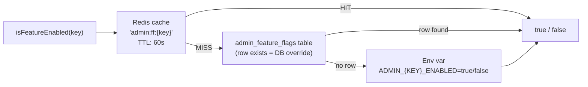

# Otofine — Admin Foundation Implementation Plan

> **Phase:** Implementation Planning Only  
> **Date:** 2026-05-26  
> **Scope:** Exact implementation plan for the Admin Foundation layer (Phase 1). No code changes. No migrations applied. No deployments.  
> **Source of truth:** `/docs/system-audit/` (all 5 audit documents) + `/docs/admin-platform/admin-platform-architecture.md`

---

## Table of Contents

1. [Backend Module Scaffolding](#1-backend-module-scaffolding)
2. [Frontend Admin Structure](#2-frontend-admin-structure)
3. [Database Migration Plan](#3-database-migration-plan)
4. [RBAC Foundation Design](#4-rbac-foundation-design)
5. [Audit Logging Foundation Design](#5-audit-logging-foundation-design)
6. [Feature Flag Infrastructure](#6-feature-flag-infrastructure)
7. [Admin Navigation Architecture](#7-admin-navigation-architecture)
8. [Safe Deployment Sequence](#8-safe-deployment-sequence)
9. [Rollback Strategy](#9-rollback-strategy)
10. [Production Safety Constraints](#10-production-safety-constraints)

---

## 1. Backend Module Scaffolding

### 1.1 Mount Strategy

The new admin platform module is mounted in `backend/server.js` as three additive `app.use()` calls after all existing route mounts. The existing `routes/admin.routes.js` mount at `/api/admin` is **not modified**. New sub-paths are distinct from all existing paths.

**Existing mounts (untouched):**
```
app.use('/api/admin', adminRoutes)   ← routes/admin.routes.js — NOT CHANGED
```

**New additive mounts (appended after existing):**
```
app.use('/api/admin/rbac',         rbacAdminRoutes)
app.use('/api/admin/audit-log',    auditLogAdminRoutes)
app.use('/api/admin/platform',     platformAdminRoutes)
```

No path collision exists with existing `/api/admin` routes:

| Existing path | New path | Conflict? |
|---|---|---|
| `/api/admin/shops` | `/api/admin/rbac/*` | No |
| `/api/admin/part-knowledge` | `/api/admin/audit-log/*` | No |
| `/api/admin/admin-login` | `/api/admin/platform/*` | No |

### 1.2 Complete File Tree

```
backend/modules/admin/
│
├── index.js
│     Barrel file. Imports and re-exports rbacRoutes, auditLogRoutes,
│     platformRoutes. Does NOT mount anything — server.js does the mounting.
│
├── config/
│   └── adminPlatform.config.js
│         Reads all ADMIN_* env vars. Exports a frozen config object.
│         Also exposes isFeatureEnabled(key) — checks DB table first,
│         falls back to env var. Cache layer described in §6.
│
├── core/
│   │
│   ├── rbac/
│   │   ├── routes/
│   │   │   └── rbac.admin.routes.js
│   │   │         Mounts all RBAC endpoints.
│   │   │         Every route applies: requireAuth → requireAdmin → requireAdminPermission
│   │   │         (see §4 for exact route table)
│   │   │
│   │   ├── controllers/
│   │   │   ├── adminRole.controller.js
│   │   │   │     Handlers: listRoles, createRole, updateRole, deleteRole,
│   │   │   │               assignPermissionsToRole
│   │   │   ├── adminPermission.controller.js
│   │   │   │     Handlers: listPermissions, syncPermissions
│   │   │   │     (syncPermissions seeds DB from the hardcoded PERMISSIONS_REGISTRY)
│   │   │   └── adminAccount.controller.js
│   │   │         Handlers: listAccounts, createAccount, deactivateAccount,
│   │   │                   assignRoles, removeRole, getMe (current admin profile)
│   │   │
│   │   ├── services/
│   │   │   ├── adminRole.service.js
│   │   │   │     Business logic for role CRUD.
│   │   │   │     Guards: cannot delete system roles (is_system = 1).
│   │   │   ├── adminPermission.service.js
│   │   │   │     Manages PERMISSIONS_REGISTRY (source of truth for all permission codes).
│   │   │   │     Provides syncPermissionsToDb() — upserts registry into admin_permissions.
│   │   │   └── adminAccount.service.js
│   │   │         Password hashing (bcryptjs — matching existing auth pattern).
│   │   │         Builds resolved permission set for a given admin_account_id.
│   │   │         Reads from Redis cache; falls back to DB; writes to cache.
│   │   │
│   │   ├── repositories/
│   │   │   ├── adminRole.repository.js
│   │   │   │     SQL for admin_roles, admin_role_permissions tables.
│   │   │   ├── adminPermission.repository.js
│   │   │   │     SQL for admin_permissions table.
│   │   │   └── adminAccount.repository.js
│   │   │         SQL for admin_accounts, admin_account_roles tables.
│   │   │
│   │   ├── middlewares/
│   │   │   └── adminPermission.middleware.js
│   │   │         Exports: requireAdminPermission(permissionCode)
│   │   │         Logic described in §4.4.
│   │   │
│   │   └── constants/
│   │       └── permissions.registry.js
│   │             Single source of truth for all permission code strings.
│   │             Used by syncPermissionsToDb() and requireAdminPermission().
│   │             Organized by module. Described in §4.2.
│   │
│   └── auditLog/
│       ├── routes/
│       │   └── auditLog.admin.routes.js
│       │         GET /api/admin/audit-log  (query + pagination)
│       │         Protected: requireAuth → requireAdmin → requireAdminPermission('audit:view')
│       │
│       ├── controllers/
│       │   └── auditLog.admin.controller.js
│       │         Handler: queryAuditLog (filters: admin_id, action, target_type,
│       │                  target_id, date_from, date_to; cursor pagination)
│       │
│       ├── services/
│       │   └── auditLog.service.js
│       │         Exports ONLY: logAdminAction(params)
│       │         No update or delete methods are defined.
│       │         Write behavior described in §5.3.
│       │
│       └── repositories/
│           └── auditLog.repository.js
│                 INSERT only — no UPDATE, no DELETE methods defined.
│                 SELECT for queryLog (filters + cursor pagination on created_at, id).
│
├── platform/
│   ├── routes/
│   │   └── platform.admin.routes.js
│   │         GET /api/admin/platform/features
│   │           Returns evaluated feature flag states for the current admin.
│   │           Protected: requireAuth → requireAdmin
│   │         GET /api/admin/platform/me
│   │           Returns current admin identity + resolved permissions.
│   │           Protected: requireAuth → requireAdmin
│   │
│   ├── controllers/
│   │   └── platform.admin.controller.js
│   │
│   └── services/
│       └── platform.admin.service.js
│             getFeatureStates() — evaluates all flags (env + DB + Redis cache)
│             getAdminMe(req.user) — resolves identity for superadmin vs multi-admin
│
└── shared/
    ├── utils/
    │   ├── adminContext.util.js
    │   │     extractAdminIdentity(req) → { adminId, adminAccountId, isSuperadmin, email }
    │   │     Used by all controllers to build the audit log actor context.
    │   └── requestId.middleware.js
    │         Sets req.requestId = uuidv4() on every admin request.
    │         Adds X-Request-Id to response headers.
    │         Used as correlation ID in audit log metadata_json.
    │
    └── validators/
        └── adminCommon.validators.js
              Shared validation helpers (pagination params, date range, UUID format).
```

### 1.3 RBAC Routes Table

All routes in `rbac.admin.routes.js`:

| Method | Path (relative to `/api/admin/rbac`) | Permission required | Handler |
|---|---|---|---|
| `GET` | `/roles` | `admin:manage` | `listRoles` |
| `POST` | `/roles` | `admin:manage` | `createRole` |
| `PUT` | `/roles/:id` | `admin:manage` | `updateRole` |
| `DELETE` | `/roles/:id` | `admin:manage` | `deleteRole` |
| `PUT` | `/roles/:id/permissions` | `admin:manage` | `assignPermissionsToRole` |
| `GET` | `/permissions` | `admin:manage` | `listPermissions` |
| `POST` | `/permissions/sync` | `admin:manage` | `syncPermissions` |
| `GET` | `/accounts` | `admin:manage` | `listAccounts` |
| `POST` | `/accounts` | `admin:manage` | `createAccount` |
| `PATCH` | `/accounts/:id/roles` | `admin:manage` | `assignRoles` |
| `DELETE` | `/accounts/:id` | `admin:manage` | `deactivateAccount` |
| `GET` | `/accounts/me` | (none — requireAdmin only) | `getMe` |

### 1.4 File Naming Conventions

Consistent with existing backend patterns (auth domain, shopPublic domain, RFQ module):

| Pattern | Example |
|---|---|
| Service files | `{noun}.service.js` |
| Repository files | `{noun}.repository.js` |
| Controller files | `{noun}.controller.js` |
| Route files | `{noun}.admin.routes.js` |
| Middleware files | `{noun}.middleware.js` |
| Config files | `{noun}.config.js` |
| Constants files | `{noun}.registry.js` |

All files use ESM (`export`/`import`) consistent with `"type": "module"` in `backend/package.json`.

### 1.5 Server.js Change (Exact Diff Description)

The only change to existing files is appending three lines to `backend/server.js`:

```
APPEND after last existing app.use() call:

import { rbacAdminRoutes }     from './modules/admin/core/rbac/routes/rbac.admin.routes.js';
import { auditLogAdminRoutes } from './modules/admin/core/auditLog/routes/auditLog.admin.routes.js';
import { platformAdminRoutes } from './modules/admin/platform/routes/platform.admin.routes.js';

app.use('/api/admin/rbac',      rbacAdminRoutes);
app.use('/api/admin/audit-log', auditLogAdminRoutes);
app.use('/api/admin/platform',  platformAdminRoutes);
```

No other changes to `server.js`. No reordering of existing mounts. No modification of existing `app.use('/api/admin', adminRoutes)`.

---

## 2. Frontend Admin Structure

### 2.1 Structural Principles

- All new admin platform pages live inside a new route group `(platform)` under `app/admin/`
- Route groups in Next.js App Router do not add URL segments — `app/admin/(platform)/dashboard/page.js` resolves to `/admin/dashboard`
- Existing admin pages (`login`, `shops`, `seo`, etc.) are **entirely untouched**
- New shared admin components go in `frontend/components/admin/` — a new subdirectory, not modifying existing `frontend/components/`
- New admin API functions go in a new file `frontend/api/adminPlatformApi.js` — the existing `frontend/api/adminApi.js` is not modified

### 2.2 Complete New File Tree (Foundation Phase Only)

```
frontend/
│
├── app/admin/
│   │
│   │   ─── EXISTING FILES (completely untouched) ───
│   ├── page.js                     ← existing — no change
│   ├── login/page.js               ← existing — no change
│   ├── forgot-password/page.js     ← existing — no change
│   ├── shops/page.js               ← existing — no change
│   ├── part-knowledge/page.js      ← existing — no change
│   ├── seo/page.js                 ← existing — no change
│   ├── seo-articles/page.js        ← existing — no change
│   ├── seo-pages/page.js           ← existing — no change
│   │
│   │   ─── NEW FILES (additive only) ───
│   └── (platform)/
│       ├── layout.js
│       │     Server component.
│       │     Renders: AdminGuard → AdminShell → {children}
│       │     AdminGuard usage: import AdminGuard from '../../../components/AdminGuard'
│       │     NOTE: imports existing AdminGuard.jsx without modifying it.
│       │     AdminShell provides: sidebar + topbar wrapper.
│       │
│       ├── dashboard/
│       │   └── page.js
│       │         Foundation phase: static "Admin Platform" overview card.
│       │         Shows feature flag states from GET /api/admin/platform/features.
│       │         Links to enabled sections only.
│       │
│       ├── settings/
│       │   └── roles/
│       │       └── page.js
│       │             RBAC management page.
│       │             Tabs: Roles | Permissions | Admin Accounts
│       │             Guarded: only renders if ADMIN_RBAC_ENABLED flag is true.
│       │
│       └── audit/
│           └── page.js
│                 Audit log viewer.
│                 Table with filters: date range, action type, admin actor.
│                 Cursor-based pagination.
│                 Guarded: only renders if ADMIN_AUDIT_LOG_ENABLED flag is true.
│
├── components/admin/                ← NEW subdirectory (not modifying components/)
│   │
│   ├── AdminShell.jsx
│   │     Main admin layout wrapper.
│   │     Props: children, currentPath (for active nav state)
│   │     Renders: AdminSidebar (left) + main content area (right)
│   │     Responsive: sidebar collapsible at breakpoint, but desktop-optimized.
│   │
│   ├── AdminSidebar.jsx
│   │     Navigation tree. Described in full in §7.
│   │     Reads feature flag states from context to show/hide sections.
│   │     Existing admin pages (/admin/shops, /admin/seo, etc.) linked here.
│   │
│   ├── AdminTopbar.jsx
│   │     Shows: current admin email (from localStorage.auth), logout button.
│   │     Reads: localStorage.auth (existing key — no change to storage schema).
│   │
│   ├── AdminFeatureGuard.jsx
│   │     Client component. Props: flagKey, children, fallback.
│   │     Reads feature state from context.
│   │     If flag is false: renders fallback ("This feature is not yet enabled.")
│   │     Does NOT call API — reads from context initialized in layout.js.
│   │
│   ├── AdminPermissionGuard.jsx
│   │     Client component. Props: permission, children, fallback.
│   │     Reads resolved permissions from context.
│   │     If permission absent: renders fallback.
│   │     For Phase 1: superadmin always passes (all permissions present).
│   │
│   ├── AuditLogTable.jsx
│   │     Renders admin_audit_log rows.
│   │     Columns: timestamp, actor, action, target, before/after diff toggle.
│   │     Pagination controls.
│   │
│   └── RbacManager.jsx
│         RBAC management panel (tabs: Roles, Permissions, Accounts).
│         Calls rbacApi.js functions.
│
├── api/
│   ├── adminApi.js                  ← existing — no change
│   │
│   └── adminPlatformApi.js          ← NEW file
│         Base: same axiosClient.js as existing admin API.
│         Exports:
│           getPlatformFeatures()         → GET /api/admin/platform/features
│           getPlatformMe()               → GET /api/admin/platform/me
│           getAuditLog(filters, cursor)  → GET /api/admin/audit-log
│           getRoles()                    → GET /api/admin/rbac/roles
│           createRole(data)             → POST /api/admin/rbac/roles
│           updateRole(id, data)         → PUT /api/admin/rbac/roles/:id
│           deleteRole(id)               → DELETE /api/admin/rbac/roles/:id
│           assignRolePermissions(id, permIds) → PUT /api/admin/rbac/roles/:id/permissions
│           getPermissions()             → GET /api/admin/rbac/permissions
│           syncPermissions()            → POST /api/admin/rbac/permissions/sync
│           getAdminAccounts()           → GET /api/admin/rbac/accounts
│           createAdminAccount(data)     → POST /api/admin/rbac/accounts
│           assignAccountRoles(id, data) → PATCH /api/admin/rbac/accounts/:id/roles
│           deactivateAccount(id)        → DELETE /api/admin/rbac/accounts/:id
│
├── contexts/
│   └── AdminPlatformContext.js      ← NEW file
│         React context providing:
│           { featureFlags, adminPermissions, adminIdentity }
│         Initialized in (platform)/layout.js via server fetch.
│         Consumed by AdminFeatureGuard, AdminPermissionGuard, AdminSidebar.
│
└── hooks/
    └── useAdminPlatform.js          ← NEW file
          Wraps useContext(AdminPlatformContext).
          Exports: { hasPermission(code), isFeatureEnabled(key), adminIdentity }
```

### 2.3 (platform)/layout.js Logic

The layout is a **Server Component** that:

1. Calls `GET /api/admin/platform/features` to fetch flag states
2. Calls `GET /api/admin/platform/me` to fetch admin identity + permissions
3. Passes both as props to a client-side `AdminPlatformProvider`
4. Renders: `<AdminGuard>` (existing, unmodified) wrapping `<AdminShell>`

```
(platform)/layout.js (Server Component):
  → fetch featureFlags from /api/admin/platform/features
  → fetch adminMe from /api/admin/platform/me
  → render:
      <AdminGuard>                        ← existing component, unchanged
        <AdminPlatformProvider
          featureFlags={featureFlags}
          adminPermissions={adminMe.permissions}
          adminIdentity={adminMe.identity}
        >
          <AdminShell currentPath={currentPath}>
            {children}
          </AdminShell>
        </AdminPlatformProvider>
      </AdminGuard>
```

**Why this works without modifying AdminGuard:** `AdminGuard.jsx` is a client component that wraps its `children`. The layout renders it as a parent wrapper. The new `AdminShell` and `AdminPlatformProvider` are nested as children — no change to `AdminGuard` itself.

### 2.4 URL Map for Foundation Phase

| URL | File | Protected by | Feature flag |
|---|---|---|---|
| `/admin/dashboard` | `(platform)/dashboard/page.js` | AdminGuard | None (always visible to admin) |
| `/admin/settings/roles` | `(platform)/settings/roles/page.js` | AdminGuard + `ADMIN_RBAC_ENABLED` | `ADMIN_RBAC_ENABLED` |
| `/admin/audit` | `(platform)/audit/page.js` | AdminGuard + `ADMIN_AUDIT_LOG_ENABLED` | `ADMIN_AUDIT_LOG_ENABLED` |

Existing routes remain reachable at their existing paths (`/admin/shops`, `/admin/seo`, etc.).

---

## 3. Database Migration Plan

### 3.1 Migration File Naming

New files follow the existing zero-padded naming convention in `backend/migrations/`:

| File | Order | Description |
|---|---|---|
| `051_schema_migrations.sql` | 1st | Schema tracking table |
| `052_admin_accounts.sql` | 2nd | Admin accounts table |
| `053_admin_rbac.sql` | 3rd | Roles, permissions, role_permissions, account_roles |
| `054_admin_audit_log.sql` | 4th | Audit log table |
| `055_admin_feature_flags.sql` | 5th | Runtime-toggleable feature flags |
| `056_admin_job_queue.sql` | 6th | Admin background job queue |

**Constraint:** 057–060 are reserved for later phases (billing, CRM, risk, analytics). These are NOT applied in Phase 1.

### 3.2 Migration Runner

New script: `backend/scripts/run-admin-migration.js`

Behavior:
1. Reads all `05*_admin_*.sql` files from `backend/migrations/`
2. Checks `schema_migrations` table for each filename
3. If filename found in `schema_migrations`: skip (already applied)
4. If not found: execute SQL, then INSERT into `schema_migrations`
5. If execution fails: `process.exit(1)`, log which file failed
6. Idempotent: safe to re-run

**Bootstrap case:** If `schema_migrations` does not yet exist (first run), `run-admin-migration.js` creates it first (inlining the SQL from `051_schema_migrations.sql` before processing all files).

New npm script in `backend/package.json`:
```
"migrate:admin": "node scripts/run-admin-migration.js"
```

### 3.3 `051_schema_migrations.sql` — Full Content

```sql
CREATE TABLE IF NOT EXISTS schema_migrations (
  id         INT UNSIGNED AUTO_INCREMENT PRIMARY KEY,
  filename   VARCHAR(255) NOT NULL,
  applied_at DATETIME(3) DEFAULT CURRENT_TIMESTAMP(3),
  checksum   CHAR(64) NULL,
  UNIQUE KEY uq_schema_migrations_filename (filename)
) ENGINE=InnoDB DEFAULT CHARSET=utf8mb4 COLLATE=utf8mb4_unicode_ci;
```

The `checksum` column stores a SHA-256 of the SQL file content. Used by the runner to detect if a previously applied migration file has been edited (warning, not blocking).

### 3.4 `052_admin_accounts.sql` — Full Content

```sql
-- Admin accounts for the multi-admin RBAC system.
-- The EXISTING `admin` table (single superadmin row) is NOT modified.
-- This table is for regular admin team members with role-based permissions.

CREATE TABLE IF NOT EXISTS admin_accounts (
  id            INT UNSIGNED AUTO_INCREMENT PRIMARY KEY,
  email         VARCHAR(255) NOT NULL,
  password_hash VARCHAR(255) NOT NULL,
  display_name  VARCHAR(100) NULL,
  is_active     TINYINT(1) NOT NULL DEFAULT 1,
  last_login_at DATETIME(3) NULL,
  created_by    INT UNSIGNED NULL,    -- admin_accounts.id of creator (NULL = seeded)
  created_at    DATETIME(3) NOT NULL DEFAULT CURRENT_TIMESTAMP(3),
  updated_at    DATETIME(3) NOT NULL DEFAULT CURRENT_TIMESTAMP(3)
                ON UPDATE CURRENT_TIMESTAMP(3),
  UNIQUE KEY uq_admin_accounts_email (email),
  INDEX idx_admin_accounts_active (is_active)
) ENGINE=InnoDB DEFAULT CHARSET=utf8mb4 COLLATE=utf8mb4_unicode_ci;
```

**Why separate from the existing `admin` table:**
The existing `admin` table contains one superadmin row and is used by `adminAuth.service.js`. Modifying it risks breaking existing login. A separate `admin_accounts` table allows the new multi-admin system to evolve independently.

### 3.5 `053_admin_rbac.sql` — Full Content

```sql
-- Roles definition

CREATE TABLE IF NOT EXISTS admin_roles (
  id          INT UNSIGNED AUTO_INCREMENT PRIMARY KEY,
  name        VARCHAR(100) NOT NULL,
  description VARCHAR(255) NULL,
  is_system   TINYINT(1) NOT NULL DEFAULT 0,
  created_at  DATETIME(3) NOT NULL DEFAULT CURRENT_TIMESTAMP(3),
  UNIQUE KEY uq_admin_roles_name (name)
) ENGINE=InnoDB DEFAULT CHARSET=utf8mb4 COLLATE=utf8mb4_unicode_ci;

-- Permissions registry (source seeded from permissions.registry.js via syncPermissions)

CREATE TABLE IF NOT EXISTS admin_permissions (
  id          INT UNSIGNED AUTO_INCREMENT PRIMARY KEY,
  code        VARCHAR(100) NOT NULL,
  description VARCHAR(255) NULL,
  module      VARCHAR(50)  NOT NULL,
  UNIQUE KEY uq_admin_permissions_code (code),
  INDEX idx_admin_permissions_module (module)
) ENGINE=InnoDB DEFAULT CHARSET=utf8mb4 COLLATE=utf8mb4_unicode_ci;

-- Role → Permission assignments

CREATE TABLE IF NOT EXISTS admin_role_permissions (
  role_id       INT UNSIGNED NOT NULL,
  permission_id INT UNSIGNED NOT NULL,
  PRIMARY KEY (role_id, permission_id),
  CONSTRAINT fk_arp_role
    FOREIGN KEY (role_id) REFERENCES admin_roles(id) ON DELETE CASCADE,
  CONSTRAINT fk_arp_permission
    FOREIGN KEY (permission_id) REFERENCES admin_permissions(id) ON DELETE CASCADE
) ENGINE=InnoDB DEFAULT CHARSET=utf8mb4 COLLATE=utf8mb4_unicode_ci;

-- Admin account → Role assignments

CREATE TABLE IF NOT EXISTS admin_account_roles (
  admin_account_id INT UNSIGNED NOT NULL,
  role_id          INT UNSIGNED NOT NULL,
  granted_by       INT UNSIGNED NULL,
  granted_at       DATETIME(3) NOT NULL DEFAULT CURRENT_TIMESTAMP(3),
  PRIMARY KEY (admin_account_id, role_id),
  CONSTRAINT fk_aar_account
    FOREIGN KEY (admin_account_id) REFERENCES admin_accounts(id) ON DELETE CASCADE,
  CONSTRAINT fk_aar_role
    FOREIGN KEY (role_id) REFERENCES admin_roles(id) ON DELETE CASCADE
) ENGINE=InnoDB DEFAULT CHARSET=utf8mb4 COLLATE=utf8mb4_unicode_ci;

-- Seed built-in system roles (idempotent via INSERT IGNORE)

INSERT IGNORE INTO admin_roles (name, description, is_system) VALUES
  ('superadmin',    'Full access — maps to existing admin table',    1),
  ('moderator',     'Shop and product moderation',                   1),
  ('support',       'Seller support and CRM',                        1),
  ('analyst',       'Analytics and reporting — read only',           1),
  ('billing_admin', 'Plan and subscription management',              1);
```

### 3.6 `054_admin_audit_log.sql` — Full Content

```sql
CREATE TABLE IF NOT EXISTS admin_audit_log (
  id             BIGINT UNSIGNED AUTO_INCREMENT PRIMARY KEY,
  request_id     CHAR(36) NULL,         -- UUID v4 correlation ID
  admin_id       INT UNSIGNED NULL,     -- admin_accounts.id (NULL = superadmin or system)
  actor_type     ENUM('superadmin','admin_account','system') NOT NULL DEFAULT 'superadmin',
  action         VARCHAR(100) NOT NULL, -- e.g. 'shop.approve', 'rbac.role.create'
  target_type    VARCHAR(50)  NULL,     -- e.g. 'shop', 'admin_role'
  target_id      BIGINT UNSIGNED NULL,
  target_label   VARCHAR(255) NULL,     -- human-readable label for display (shop name, etc.)
  before_json    JSON NULL,
  after_json     JSON NULL,
  ip_address     VARCHAR(45) NULL,
  user_agent     VARCHAR(512) NULL,
  metadata_json  JSON NULL,             -- { requestId, durationMs, notes }
  created_at     DATETIME(3) NOT NULL DEFAULT CURRENT_TIMESTAMP(3),
  INDEX idx_aal_admin_id   (admin_id),
  INDEX idx_aal_action     (action),
  INDEX idx_aal_target     (target_type, target_id),
  INDEX idx_aal_created    (created_at),
  INDEX idx_aal_request_id (request_id)
) ENGINE=InnoDB DEFAULT CHARSET=utf8mb4 COLLATE=utf8mb4_unicode_ci;
```

No FK on `admin_id` — intentional. Audit logs must survive even if admin accounts are deactivated or deleted. Orphan rows are acceptable.

### 3.7 `055_admin_feature_flags.sql` — Full Content

```sql
-- Runtime-toggleable feature flags.
-- These overlay/override the env var layer without a redeploy.
-- All env vars still take precedence if NO row exists for a given flag_key.
-- If a row exists: is_enabled in this table takes precedence over the env var.

CREATE TABLE IF NOT EXISTS admin_feature_flags (
  id          INT UNSIGNED AUTO_INCREMENT PRIMARY KEY,
  flag_key    VARCHAR(100) NOT NULL,
  is_enabled  TINYINT(1) NOT NULL DEFAULT 0,
  description VARCHAR(255) NULL,
  updated_by  INT UNSIGNED NULL,
  updated_at  DATETIME(3) NOT NULL DEFAULT CURRENT_TIMESTAMP(3)
              ON UPDATE CURRENT_TIMESTAMP(3),
  UNIQUE KEY uq_aff_flag_key (flag_key)
) ENGINE=InnoDB DEFAULT CHARSET=utf8mb4 COLLATE=utf8mb4_unicode_ci;

-- Seed known flag keys (all disabled by default — overridden by env vars)
-- This ensures the table has all known keys even before any env var is set.

INSERT IGNORE INTO admin_feature_flags (flag_key, is_enabled, description) VALUES
  ('ADMIN_RBAC_ENABLED',                   0, 'RBAC roles and permission management'),
  ('ADMIN_AUDIT_LOG_ENABLED',              0, 'Admin action audit logging'),
  ('ADMIN_SHOP_MODERATION_ENABLED',        0, 'Shop approval and moderation queue'),
  ('ADMIN_PRODUCT_MODERATION_ENABLED',     0, 'Product moderation queue'),
  ('ADMIN_BILLING_ENABLED',               0, 'Billing plans and subscriptions'),
  ('ADMIN_SUBSCRIPTION_ENFORCEMENT_ENABLED', 0, 'Enforce subscription on storefront visibility'),
  ('ADMIN_SELLER_CRM_ENABLED',             0, 'Seller CRM notes and tags'),
  ('ADMIN_RISK_ENGINE_ENABLED',            0, 'Risk signals and fraud queue'),
  ('ADMIN_ANALYTICS_ENABLED',             0, 'Admin operational analytics dashboards'),
  ('ADMIN_PRODUCT_MODERATION_DEFAULT',     0, 'auto_approved=0, pending_review=1');
```

### 3.8 `056_admin_job_queue.sql` — Full Content

```sql
-- Admin background job queue.
-- Uses FOR UPDATE SKIP LOCKED pattern (same as rfq_escalation_jobs).
-- Only the admin-worker PM2 process polls this table.

CREATE TABLE IF NOT EXISTS admin_job_queue (
  id               BIGINT UNSIGNED AUTO_INCREMENT PRIMARY KEY,
  job_type         VARCHAR(100) NOT NULL,
  payload_json     JSON NOT NULL,
  status           ENUM('queued','processing','done','failed','dead')
                   NOT NULL DEFAULT 'queued',
  idempotency_key  VARCHAR(255) NULL,
  attempts         TINYINT UNSIGNED NOT NULL DEFAULT 0,
  max_attempts     TINYINT UNSIGNED NOT NULL DEFAULT 3,
  run_at           DATETIME(3) NOT NULL DEFAULT CURRENT_TIMESTAMP(3),
  locked_until     DATETIME(3) NOT NULL DEFAULT '1970-01-01 00:00:00.000',
  last_error       TEXT NULL,
  created_at       DATETIME(3) NOT NULL DEFAULT CURRENT_TIMESTAMP(3),
  updated_at       DATETIME(3) NOT NULL DEFAULT CURRENT_TIMESTAMP(3)
                   ON UPDATE CURRENT_TIMESTAMP(3),
  UNIQUE KEY uq_ajq_idempotency (idempotency_key),
  INDEX idx_ajq_status_run  (status, run_at),
  INDEX idx_ajq_job_type    (job_type, status),
  INDEX idx_ajq_locked      (locked_until)
) ENGINE=InnoDB DEFAULT CHARSET=utf8mb4 COLLATE=utf8mb4_unicode_ci;
```

**Phase 1 note:** This table is created but the `admin-worker` PM2 process is NOT added in Phase 1. The table is pre-created so Phase 4 (analytics) can begin using it without a new migration blocking deployment.

### 3.9 Migration Dependency Order

```
051_schema_migrations      ← no dependencies
         ↓
052_admin_accounts          ← no FK dependencies outside this file
         ↓
053_admin_rbac              ← FK refs admin_accounts (052 must exist first)
         ↓
054_admin_audit_log         ← no FK (intentionally — see §3.6)
         ↓
055_admin_feature_flags     ← no dependencies
         ↓
056_admin_job_queue         ← no dependencies
```

Migrations must be applied in numerical order. The `run-admin-migration.js` runner applies them in filename-sorted order automatically.

### 3.10 Verification Queries

After running migrations, verify with these read-only queries:

```sql
-- Confirm all 6 tables exist
SELECT TABLE_NAME
FROM information_schema.TABLES
WHERE TABLE_SCHEMA = DATABASE()
  AND TABLE_NAME IN (
    'schema_migrations', 'admin_accounts', 'admin_roles',
    'admin_permissions', 'admin_role_permissions',
    'admin_account_roles', 'admin_audit_log',
    'admin_feature_flags', 'admin_job_queue'
  )
ORDER BY TABLE_NAME;
-- Expected: 9 rows

-- Confirm system roles were seeded
SELECT name, is_system FROM admin_roles ORDER BY id;
-- Expected: 5 rows (superadmin, moderator, support, analyst, billing_admin)

-- Confirm feature flags were seeded
SELECT flag_key, is_enabled FROM admin_feature_flags ORDER BY flag_key;
-- Expected: 10 rows, all is_enabled = 0

-- Confirm existing tables are unaffected
SELECT COUNT(*) FROM shops;        -- should return existing count
SELECT COUNT(*) FROM products;     -- should return existing count
SELECT COUNT(*) FROM rfq_requests; -- should return existing count
```

---

## 4. RBAC Foundation Design

### 4.1 Design Constraints from Audit

From `auth-permissions-admin-boundary-audit.md`:
- Existing `requireAdmin` middleware: `req.user.role === "admin"` string comparison — **must not change**
- Existing `admin` table superadmin: single row, email + passwordHash — **must not change**
- Shared `JWT_SECRET` for shop + admin tokens — **not changed in Phase 1**
- `adminAuthController.js` in `controllers/` is confirmed dead code — **leave in place, do not delete**

### 4.2 Permission Naming Convention

**Format:** `{module}:{action}` — lowercase, colon separator, no spaces.

**Rules:**
- Module names match the admin platform sub-module name
- Action names from a closed set: `view`, `create`, `edit`, `delete`, `moderate`, `manage`, `action`, `export`
- `view` = read-only access
- `manage` = full CRUD within the module
- `moderate` = status changes on external entities (shops, products)
- `action` = execute an operation with side effects (risk action, replay, etc.)

**Complete registry for Phase 1 (`permissions.registry.js`):**

```
Module: admin
  admin:manage      — create/edit/deactivate admin accounts; assign roles

Module: rbac  
  rbac:view         — view roles and permissions (read-only)
  rbac:manage       — full role/permission CRUD

Module: auditLog
  audit:view        — view and query audit log

[Phase 2+ entries — defined in registry now, not assigned to roles yet]
Module: shopModeration
  shop:view         — view all shops and their status
  shop:moderate     — approve, reject, suspend shops
  shop:verify       — set/clear verified_at badge

Module: productModeration
  product:view      — view product moderation queue
  product:moderate  — approve, reject, flag products
  product:export    — export product data

Module: billing
  billing:view      — view plans and subscriptions
  billing:manage    — create/edit plans; assign subscriptions

Module: sellerCrm
  seller:view       — view seller profiles
  seller:crm_write  — add notes, tags, assign segments

Module: riskEngine
  risk:view         — view risk signals and scores
  risk:action       — take risk actions (flag, suspend, clear)

Module: analytics
  analytics:view    — view all admin dashboards
  analytics:export  — export analytics data
```

**Defining all permission codes in Phase 1** (even for later phases) allows:
1. `syncPermissions` to seed the full list on first deploy
2. Role assignments to be defined immediately
3. No migration needed when Phase 2+ features are activated

### 4.3 Built-in Role Permission Assignments

Defined as seed data in `adminPermission.service.js:seedRolePermissions()`, called by `syncPermissions`:

| Role | Phase 1 permissions | Phase 2+ permissions (pre-assigned, locked behind feature flags) |
|---|---|---|
| `superadmin` | bypass — all permissions | bypass |
| `moderator` | `audit:view` | `shop:view`, `shop:moderate`, `product:view`, `product:moderate`, `risk:view`, `risk:action` |
| `support` | `audit:view` | `shop:view`, `seller:view`, `seller:crm_write` |
| `analyst` | `audit:view`, `analytics:view` | `analytics:export`, `shop:view`, `seller:view` |
| `billing_admin` | `audit:view` | `billing:view`, `billing:manage`, `seller:view` |

Seeding is idempotent: uses INSERT IGNORE on `admin_role_permissions`.

### 4.4 `requireAdminPermission` Middleware — Exact Logic

File: `backend/modules/admin/core/rbac/middlewares/adminPermission.middleware.js`

```
requireAdminPermission(permissionCode):

  Returns an Express middleware function.

  On request:
  
  1. Check req.user exists (set by requireAuth — guaranteed by middleware chain).
  
  2. Check req.user.role === 'admin'
     If not admin: 403 (should never reach here if requireAdmin is in chain first)
  
  3. Check req.user.adminAccountId
     If ABSENT (superadmin — legacy admin table login):
       → next()   ← bypass all permission checks, full access
  
  4. If adminAccountId IS PRESENT (new admin_accounts login):
     a. Check Redis: key = 'admin:perms:{adminAccountId}' (TTL: 5 minutes)
        Cache HIT: permissions = JSON.parse(cached)
        Cache MISS:
          → DB query: SELECT p.code FROM admin_permissions p
                      JOIN admin_role_permissions arp ON arp.permission_id = p.id
                      JOIN admin_account_roles aar ON aar.role_id = arp.role_id
                      WHERE aar.admin_account_id = ? AND aar.role_id = arp.role_id
          → Redis.set(key, JSON.stringify(permissions), 'EX', 300)
  
  5. If permissionCode NOT IN permissions:
     → res.status(403).json({ error: 'Insufficient permissions' })
  
  6. Else:
     → next()
```

**Redis key invalidation:** When `assignAccountRoles` or `removeRole` is called for an admin account, the corresponding Redis cache key is deleted immediately:
```
DEL admin:perms:{adminAccountId}
```

**Phase 1 note:** In Phase 1, all admin accounts use the superadmin path (no `adminAccountId` in JWT). The full permission check path is exercised only when the first `admin_accounts` row is created and used to log in.

### 4.5 JWT Payload Extension for Multi-Admin

When a new `admin_accounts` login flow is built in Phase 1, the JWT payload uses this shape:

```javascript
// New admin_accounts login — token payload
{
  id: 999,                    // admin_accounts.id
  role: "admin",              // SAME field name as superadmin — requireAdmin passes unchanged
  email: "ops@otofine.com",
  adminAccountId: 999,        // NEW field — signals multi-admin path
}
```

The existing superadmin JWT continues to have NO `adminAccountId` field:
```javascript
// Existing admin table login — payload shape UNCHANGED
{
  id: 1,
  role: "admin",
  email: "admin@otofine.com"
}
```

`requireAdmin` reads only `req.user.role === "admin"` — unchanged in both cases.

### 4.6 Future Extensibility

The RBAC design is extensible to:

- **Resource-level permissions:** Adding `target_id` checks (e.g., `can admin X moderate shop Y?`) via a new `admin_account_resource_grants` table without touching existing tables.
- **Permission inheritance:** Role hierarchy can be added as a `parent_role_id` column on `admin_roles` without changing the permission resolution query (just add a recursive CTE).
- **Separate JWT secret:** `ADMIN_JWT_SECRET` env var can be introduced in `token.service.js` with a conditional:
  ```javascript
  const secret = payload.role === 'admin' ? adminJwtSecret ?? jwtSecret : jwtSecret;
  ```
  This is a single additive conditional with no behavioral change if `ADMIN_JWT_SECRET` is unset.

---

## 5. Audit Logging Foundation Design

### 5.1 Append-Only Guarantee

**Database level:**
- No `UPDATE` or `DELETE` privileges are granted on `admin_audit_log` in the production DB user
- The application DB user has `SELECT, INSERT` on this table only

**Application level:**
- `auditLog.service.js` exports exactly one write function: `logAdminAction()`
- No `updateLog()`, `deleteLog()`, or `clearLog()` methods are defined
- `auditLog.repository.js` contains only `INSERT` and `SELECT` SQL — no UPDATE/DELETE

### 5.2 Action Naming Convention

**Format:** `{target_type}.{verb}` — dot-separated, past or imperative tense.

**Verb vocabulary** (closed set — add new verbs only after team review):

| Verb | Meaning |
|---|---|
| `create` | New entity created |
| `update` | Entity field(s) changed |
| `delete` | Entity hard-deleted |
| `approve` | Status set to approved |
| `reject` | Status set to rejected |
| `suspend` | Entity suspended |
| `unsuspend` | Suspension lifted |
| `verify` | Verification badge granted |
| `unverify` | Verification badge removed |
| `assign` | Relationship created (role to account, plan to shop) |
| `revoke` | Relationship removed |
| `enable` | Feature flag enabled |
| `disable` | Feature flag disabled |
| `export` | Data exported |
| `sync` | Synchronization triggered |
| `flag` | Risk flag applied |
| `clear` | Risk flag cleared |
| `login` | Admin logged in |

**Phase 1 action registry:**

| Action | target_type | When |
|---|---|---|
| `admin_account.create` | `admin_account` | New admin account created |
| `admin_account.deactivate` | `admin_account` | Account deactivated |
| `admin_role.create` | `admin_role` | New role created |
| `admin_role.update` | `admin_role` | Role name/description changed |
| `admin_role.delete` | `admin_role` | Role deleted |
| `admin_role.assign` | `admin_account` | Role granted to account (target = account) |
| `admin_role.revoke` | `admin_account` | Role removed from account |
| `rbac.permissions.sync` | `admin_permissions` | Permissions synced from registry |
| `feature_flag.enable` | `feature_flag` | Feature flag enabled |
| `feature_flag.disable` | `feature_flag` | Feature flag disabled |
| `admin.login` | `admin_account` | New admin_accounts login |

### 5.3 `logAdminAction()` — Exact Behavior

```
auditLog.service.logAdminAction({
  req,             // Express request (for ip, user_agent, requestId)
  action,          // string — from action registry above
  targetType,      // string — e.g. 'admin_role'
  targetId,        // BIGINT — entity PK
  targetLabel,     // string — human-readable label (role name, shop name, etc.)
  before,          // object | null — state BEFORE action
  after,           // object | null — state AFTER action
  metadata,        // object | null — additional context
})

Behavior:

1. Build actor context from req.user:
   - adminId = req.user.adminAccountId ?? null
   - actorType = adminId ? 'admin_account' : 'superadmin'

2. Sanitize before/after:
   - Strip password_hash fields (any key containing 'password' or 'hash')
   - Strip large text fields: bio, intro_html, article_html, body
   - Keep: id, status, name, email, slug, created_at, updated_at, and all non-text fields

3. Build metadata_json:
   {
     requestId: req.requestId,   // set by requestId.middleware.js
     durationMs: null,           // filled in by caller if timing is relevant
     ...metadata                 // caller-supplied extra context
   }

4. INSERT INTO admin_audit_log (...)

5. Error handling:
   Mode = 'best-effort' (default) when ADMIN_AUDIT_STRICT_MODE env is not 'true':
     - Catch error → console.error('[audit] write failed:', err.message)
     - Do NOT rethrow — caller continues
   
   Mode = 'strict' when ADMIN_AUDIT_STRICT_MODE=true:
     - Catch error → rethrow
     - Caller's controller catches → 500 response

Phase 1 default: best-effort mode.
Switch to strict mode after confirming audit log reliability under production load.
```

### 5.4 Correlation ID (Request ID) Strategy

`requestId.middleware.js` in `shared/utils/`:

```
On every request to /api/admin/*:
1. Generate: requestId = uuidv4()
2. Attach: req.requestId = requestId
3. Response header: X-Request-Id: {requestId}

Usage in audit log:
- Stored in admin_audit_log.metadata_json.requestId
- When a single admin operation triggers multiple audit entries
  (e.g. bulk action), all entries share the same requestId
```

This allows support to find all DB changes made by a single HTTP request, even if multiple entities were modified.

### 5.5 Before/After JSON Snapshots

**Rule for `before` capture:** Fetch the entity from DB at the **start** of the handler, before any write. Pass to `logAdminAction` as `before`.

**Rule for `after` capture:** Fetch the entity from DB at the **end** of the handler, after the write completes. Pass to `logAdminAction` as `after`.

**Field stripping rules** (applied by `logAdminAction` internally):

| Field pattern | Action |
|---|---|
| Keys containing `password`, `hash`, `secret`, `token` | Removed |
| Fields with value type `string` AND length > 500 | Replaced with `"{truncated, N chars}"` |
| `intro_html`, `article_html`, `description_html`, `body` | Replaced with `"{html_content}"` |
| All other fields | Kept as-is |

**Example `before` for `shop.suspend`:**
```json
{
  "id": 42,
  "name": "Phụ Tùng Hà Nội",
  "slug": "phu-tung-ha-noi",
  "public_status": "public",
  "verified_at": "2026-01-15T08:00:00.000Z"
}
```

**Example `after` for `shop.suspend`:**
```json
{
  "id": 42,
  "name": "Phụ Tùng Hà Nội",
  "slug": "phu-tung-ha-noi",
  "public_status": "suspended",
  "verified_at": "2026-01-15T08:00:00.000Z"
}
```

### 5.6 Rollback Traceability

The audit log supports rollback traceability through the `before_json` field:

- For any action, the `before_json` contains the exact DB values before the change
- An admin viewing the audit log can manually reverse an action by reading `before_json` and restoring those values
- In a future phase, a "revert" button on the audit log UI can pre-populate an admin form with `before_json` values

**Phase 1 limitation:** There is no automated rollback. Traceability is for manual recovery only.

---

## 6. Feature Flag Infrastructure

### 6.1 Two-Layer Evaluation Model



**Precedence (highest to lowest):**
1. DB table value (if row exists and `updated_at` < 24h — prevents stale DB overrides)
2. Environment variable
3. Default: `false`

### 6.2 Environment Variable Naming

All admin platform flags follow the pattern `ADMIN_{MODULE_NAME}_ENABLED`.

| Env var | Controls |
|---|---|
| `ADMIN_RBAC_ENABLED` | RBAC management UI and multi-admin login |
| `ADMIN_AUDIT_LOG_ENABLED` | Audit log write and viewer UI |
| `ADMIN_SHOP_MODERATION_ENABLED` | Shop approval queue (Phase 2) |
| `ADMIN_PRODUCT_MODERATION_ENABLED` | Product moderation queue (Phase 3) |
| `ADMIN_PRODUCT_MODERATION_DEFAULT` | `auto_approved` or `pending_review` (Phase 3) |
| `ADMIN_BILLING_ENABLED` | Billing plans UI (Phase 5) |
| `ADMIN_SUBSCRIPTION_ENFORCEMENT_ENABLED` | Visibility gate enforcement (Phase 5+) |
| `ADMIN_SELLER_CRM_ENABLED` | Seller CRM (Phase 6) |
| `ADMIN_RISK_ENGINE_ENABLED` | Risk engine (Phase 7) |
| `ADMIN_ANALYTICS_ENABLED` | Analytics dashboards (Phase 4) |
| `ADMIN_AUDIT_STRICT_MODE` | Fail request if audit log write fails |

**Default values for all flags:** `false` (or absent from `.env`).

**Phase 1 deployment values:**
```
ADMIN_RBAC_ENABLED=true
ADMIN_AUDIT_LOG_ENABLED=true
```
All others remain unset (default false).

### 6.3 `adminPlatform.config.js` — Structure

```javascript
// backend/modules/admin/config/adminPlatform.config.js

export const adminPlatformConfig = Object.freeze({
  rbacEnabled:                     process.env.ADMIN_RBAC_ENABLED === 'true',
  auditLogEnabled:                  process.env.ADMIN_AUDIT_LOG_ENABLED === 'true',
  auditStrictMode:                  process.env.ADMIN_AUDIT_STRICT_MODE === 'true',
  shopModerationEnabled:            process.env.ADMIN_SHOP_MODERATION_ENABLED === 'true',
  productModerationEnabled:         process.env.ADMIN_PRODUCT_MODERATION_ENABLED === 'true',
  productModerationDefault:         process.env.ADMIN_PRODUCT_MODERATION_DEFAULT ?? 'auto_approved',
  billingEnabled:                   process.env.ADMIN_BILLING_ENABLED === 'true',
  subscriptionEnforcementEnabled:   process.env.ADMIN_SUBSCRIPTION_ENFORCEMENT_ENABLED === 'true',
  sellerCrmEnabled:                 process.env.ADMIN_SELLER_CRM_ENABLED === 'true',
  riskEngineEnabled:                process.env.ADMIN_RISK_ENGINE_ENABLED === 'true',
  analyticsEnabled:                 process.env.ADMIN_ANALYTICS_ENABLED === 'true',
});
```

### 6.4 `isFeatureEnabled()` — Implementation Plan

```javascript
// Part of platform.admin.service.js

async isFeatureEnabled(flagKey) {
  // 1. Check Redis cache
  const cached = await redis.get(`admin:ff:${flagKey}`);
  if (cached !== null) return cached === '1';

  // 2. Check DB table
  const row = await db.query(
    'SELECT is_enabled FROM admin_feature_flags WHERE flag_key = ?',
    [flagKey]
  );
  if (row.length > 0) {
    const value = row[0].is_enabled === 1;
    await redis.set(`admin:ff:${flagKey}`, value ? '1' : '0', 'EX', 60);
    return value;
  }

  // 3. Fall back to env var from config
  const envValue = adminPlatformConfig[toCamelCase(flagKey)] ?? false;
  await redis.set(`admin:ff:${flagKey}`, envValue ? '1' : '0', 'EX', 60);
  return envValue;
}
```

**Cache invalidation:** When an admin toggles a flag via the admin UI (future feature), the corresponding Redis key is deleted:
```
DEL admin:ff:{flagKey}
```

### 6.5 Route-Level Feature Gating Pattern

Each sub-module route file gates its own routes at mount time:

```javascript
// Example: rbac.admin.routes.js
import { adminPlatformConfig } from '../../config/adminPlatform.config.js';

const router = express.Router();

if (!adminPlatformConfig.rbacEnabled) {
  router.use('*', (req, res) =>
    res.status(404).json({ error: 'Feature not enabled', flag: 'ADMIN_RBAC_ENABLED' })
  );
  export default router; // early exit — no routes registered
}

// ... normal route definitions follow
```

This means if a flag is false at startup, none of that module's routes are registered. The module adds zero overhead to request processing for disabled features.

### 6.6 Frontend Feature Flag Consumption

The `(platform)/layout.js` Server Component fetches feature states once from `GET /api/admin/platform/features`:

```json
{
  "rbacEnabled": true,
  "auditLogEnabled": true,
  "shopModerationEnabled": false,
  "analyticsEnabled": false,
  ...
}
```

These are passed to `AdminPlatformProvider` as initial state. The `AdminFeatureGuard` component reads from this context — no additional API calls per render.

**Sidebar behavior:** Items for disabled features render as greyed-out with a "Coming soon" pill. No navigation is registered for disabled pages. This is controlled in `AdminSidebar.jsx` via `useAdminPlatform().isFeatureEnabled(key)`.

---

## 7. Admin Navigation Architecture

### 7.1 Design Principles

- **Desktop-first, not mobile-first:** Admin UI is for internal operations team on desktop browsers. Compact data density is preferred over touch-friendly spacing.
- **Fixed sidebar:** 240px wide, always visible. No collapse-by-default. Collapsible only for projection/presentation contexts.
- **Section-based navigation:** Groups related pages. Section headers are non-clickable labels.
- **Status indicators:** Badge counts next to navigation items (e.g., "Moderation (12)" for pending queue count).
- **Existing pages are linked from the new sidebar:** The new `AdminSidebar` includes links to existing admin pages (`/admin/shops`, `/admin/seo`, etc.) so the navigation is unified.

### 7.2 Sidebar Structure

```
ADMIN PLATFORM
──────────────────────────────────
Overview
  ■ Dashboard                      /admin/dashboard

──────────────────────────────────
OPERATIONS (Phase 2+)
  □ Shop Moderation       [soon]   /admin/moderation/shops
  □ Product Moderation    [soon]   /admin/moderation/products

──────────────────────────────────
SELLERS
  ■ All Shops                      /admin/shops        ← existing page
  □ Seller CRM            [soon]   /admin/sellers

──────────────────────────────────
MARKETPLACE
  ■ Part Knowledge                  /admin/part-knowledge ← existing
  ■ SEO Articles                    /admin/seo-articles   ← existing
  ■ SEO Pages                       /admin/seo-pages      ← existing
  ■ SEO Management                  /admin/seo            ← existing

──────────────────────────────────
PLATFORM (Phase 4+)
  □ Analytics             [soon]   /admin/analytics
  □ Risk & Fraud          [soon]   /admin/risk

──────────────────────────────────
MONETIZATION (Phase 5+)
  □ Billing Plans         [soon]   /admin/billing/plans
  □ Subscriptions         [soon]   /admin/billing/subscriptions

──────────────────────────────────
SYSTEM
  ■ Audit Log                      /admin/audit         ← Phase 1
  ■ Roles & Permissions             /admin/settings/roles ← Phase 1

──────────────────────────────────
  [Admin: {email}]   [Logout]
```

`■` = active (feature enabled)  
`□ [soon]` = rendered as greyed-out, not a link, feature flag false

### 7.3 Active State Detection

`AdminSidebar.jsx` receives `currentPath` (from `usePathname()`) and applies active styling:
- Exact match: `/admin/audit` → Audit Log item highlighted
- Prefix match: `/admin/settings/*` → Settings section expanded (if needed in later phases)

### 7.4 Topbar

```
┌────────────────────────────────────────────────────────────────────┐
│  OTOFINE ADMIN          [env badge: PRODUCTION]    ops@otofine.com  ▼  │
└────────────────────────────────────────────────────────────────────┘
```

- Environment badge: reads `NODE_ENV` — shows "PRODUCTION" badge in red when production
- Admin email: from `localStorage.auth.email` (same key written by existing `AdminLogin.jsx`)
- Dropdown: "View Profile", "Logout" (logout reuses existing localStorage clear + router.push logic)

### 7.5 Audit Log Viewer Layout

```
/admin/audit
──────────────────────────────────────────────────────────────
 AUDIT LOG
 
 [Date from: ___] [Date to: ___]  [Action: __▼]  [Admin: __▼]  [Search]
 
 ┌──────────────┬──────────────┬──────────────┬─────────────┬───────┐
 │ Timestamp    │ Actor        │ Action       │ Target      │ Diff  │
 ├──────────────┼──────────────┼──────────────┼─────────────┼───────┤
 │ 26/05 18:23  │ ops@otofine  │ shop.approve │ Shop #42    │ [→]   │
 │ 26/05 17:55  │ system       │ rbac.sync    │ permissions │ [→]   │
 │ ...          │ ...          │ ...          │ ...         │ ...   │
 └──────────────┴──────────────┴──────────────┴─────────────┴───────┘
 
 ← Previous    Page 1 of N    Next →
```

Clicking `[→]` expands an inline diff panel showing `before_json` vs `after_json` as a side-by-side JSON diff.

### 7.6 RBAC Management Layout

```
/admin/settings/roles
──────────────────────────────────────────────────────────────
 ROLES & PERMISSIONS
 
 [Roles]  [Permissions]  [Admin Accounts]  ← tabs
 
 ─── Roles tab ───
 
 ┌────────────────┬─────────────────────────────┬──────────────┐
 │ Role name      │ Permissions                 │ Actions      │
 ├────────────────┼─────────────────────────────┼──────────────┤
 │ superadmin     │ (all — system role)          │ [view]       │
 │ moderator      │ shop:view, shop:moderate ... │ [edit] [del] │
 │ support        │ shop:view, seller:view ...   │ [edit] [del] │
 │ analyst        │ analytics:view, audit:view  │ [edit] [del] │
 └────────────────┴─────────────────────────────┴──────────────┘
 
 [+ Create role]
```

---

## 8. Safe Deployment Sequence

### 8.1 Pre-Deployment Checklist

Before any file is deployed to production:

- [ ] All 6 migration files reviewed and tested on a dev DB copy
- [ ] `run-admin-migration.js` tested on dev DB (dry run mode: log but do not apply)
- [ ] `run-admin-migration.js` tested on dev DB (apply mode: all 6 files succeed)
- [ ] Verification queries from §3.10 pass on dev DB
- [ ] New backend module compiles without errors (`node --check server.js` equivalent)
- [ ] New frontend pages build without errors (`npm run build` in `frontend/`)
- [ ] All existing admin routes smoke-tested (see §8.5)
- [ ] `backend/.env` has new flag keys added with value `false`
- [ ] `frontend/.env.local` has no changes (no new frontend env vars in Phase 1)
- [ ] PM2 process list documented before deploy (`pm2 jlist > pm2_before_deploy.json`)
- [ ] DB backup taken (or backup timestamp confirmed within 24h)

### 8.2 Step-by-Step Deployment Sequence

**Step 1: Apply migrations (DB only — no code change)**
```
cd /var/www/otofine/backend
node scripts/run-admin-migration.js
```
- Expected: 6 files applied, 6 rows in `schema_migrations`
- Verify: run verification queries from §3.10
- If any migration fails: see rollback §9.1
- If all pass: proceed to Step 2

**Step 2: Deploy backend module code**
```
cd /var/www/otofine/backend
git pull  (or file deploy)
npm install  (if package.json changed)
```
- New `backend/modules/admin/` directory is now on disk
- New npm script `migrate:admin` is available
- **Do not restart PM2 yet**

**Step 3: Add env vars (all false)**

Add to `/var/www/otofine/backend/.env`:
```
ADMIN_RBAC_ENABLED=false
ADMIN_AUDIT_LOG_ENABLED=false
ADMIN_AUDIT_STRICT_MODE=false
ADMIN_SHOP_MODERATION_ENABLED=false
ADMIN_PRODUCT_MODERATION_ENABLED=false
ADMIN_BILLING_ENABLED=false
ADMIN_SUBSCRIPTION_ENFORCEMENT_ENABLED=false
ADMIN_SELLER_CRM_ENABLED=false
ADMIN_RISK_ENGINE_ENABLED=false
ADMIN_ANALYTICS_ENABLED=false
```

**Step 4: Restart backend**
```
pm2 restart otofine-backend
```
- Monitor: `pm2 logs otofine-backend --lines 50`
- Verify: no new errors in logs
- Verify: existing health check (if any), or manual `curl http://127.0.0.1:5000/api/health`
- All new admin platform routes return 404 (feature flags false)

**Step 5: Deploy frontend code**
```
cd /var/www/otofine/frontend
git pull
npm run build
```
- New `app/admin/(platform)/` pages are compiled
- New `components/admin/` is compiled
- Build must succeed without errors

**Step 6: Restart frontend**
```
pm2 restart otofine-frontend
```
- Monitor: `pm2 logs otofine-frontend --lines 50`
- All new pages return 200 but show disabled state (AdminGuard passes but feature flags false)

**Step 7: Smoke test all existing admin routes (§8.5)**

**Step 8: Enable RBAC and Audit Log flags**

Update `/var/www/otofine/backend/.env`:
```
ADMIN_RBAC_ENABLED=true
ADMIN_AUDIT_LOG_ENABLED=true
```

Restart backend:
```
pm2 restart otofine-backend
```

**Step 9: Smoke test new routes**

- `POST /api/auth/admin-login` with superadmin credentials → 200, token with no `adminAccountId`
- `GET /api/admin/rbac/roles` with token → 200, returns seeded roles
- `GET /api/admin/audit-log` with token → 200, returns empty array
- `GET /api/admin/platform/features` with token → 200, `rbacEnabled: true`, `auditLogEnabled: true`
- Visit `/admin/dashboard` in browser → AdminGuard passes → AdminShell renders
- Visit `/admin/settings/roles` → RBAC panel renders

**Step 10: Seed permissions registry**
```
POST /api/admin/rbac/permissions/sync
Authorization: Bearer {superadmin_token}
```
Expected: all permission codes from `permissions.registry.js` inserted into `admin_permissions`.

### 8.3 Zero-Downtime Deploy Notes

The deployment is zero-downtime for all existing traffic:
- Migrations are additive (CREATE TABLE IF NOT EXISTS) — no locks on existing tables
- New backend routes are at new paths — Nginx does not need to restart
- `pm2 restart otofine-backend` causes a brief unavailability (~1–3s) — acceptable for internal admin tool
- Storefront, marketplace, RFQ, and seller center are unaffected by the backend restart

### 8.4 PM2 Changes (Phase 1)

**No new PM2 processes in Phase 1.** The `admin-worker` and `admin-scheduler` are Phase 4 additions.

The only PM2 change in Phase 1 is:
- `pm2 restart otofine-backend` (step 4)
- `pm2 restart otofine-frontend` (step 6)

**Both commands restart existing processes only — no `pm2 start`, no `pm2 add`.**

### 8.5 Existing Admin Route Smoke Test

Verify these existing routes still function identically after deploy:

| Endpoint | Method | Expected |
|---|---|---|
| `POST /api/auth/admin-login` | POST | 200 with token |
| `GET /api/admin/shops` | GET + admin token | 200 with shop list |
| `PATCH /api/admin/shops/:id/status` | PATCH + admin token | 200 |
| `GET /api/admin/part-knowledge` | GET + admin token | 200 |
| Browser: `/admin/login` | GET | 200, login form |
| Browser: `/admin/shops` | GET + logged in | 200, shops table |
| Browser: `/admin/seo` | GET + logged in | 200, SEO page |
| Browser: `/admin/part-knowledge` | GET + logged in | 200 |

---

## 9. Rollback Strategy

### 9.1 Migration Rollback

**Rollback principle:** Since all Phase 1 migrations are `CREATE TABLE IF NOT EXISTS` on brand-new tables, rolling back means dropping those tables. No existing data is at risk.

**Down-migration SQL (manual — not automated):**

```sql
-- Rollback 056_admin_job_queue.sql
DROP TABLE IF EXISTS admin_job_queue;
DELETE FROM schema_migrations WHERE filename = '056_admin_job_queue.sql';

-- Rollback 055_admin_feature_flags.sql
DROP TABLE IF EXISTS admin_feature_flags;
DELETE FROM schema_migrations WHERE filename = '055_admin_feature_flags.sql';

-- Rollback 054_admin_audit_log.sql
DROP TABLE IF EXISTS admin_audit_log;
DELETE FROM schema_migrations WHERE filename = '054_admin_audit_log.sql';

-- Rollback 053_admin_rbac.sql
DROP TABLE IF EXISTS admin_account_roles;
DROP TABLE IF EXISTS admin_role_permissions;
DROP TABLE IF EXISTS admin_permissions;
DROP TABLE IF EXISTS admin_roles;
DELETE FROM schema_migrations WHERE filename = '053_admin_rbac.sql';

-- Rollback 052_admin_accounts.sql
DROP TABLE IF EXISTS admin_accounts;
DELETE FROM schema_migrations WHERE filename = '052_admin_accounts.sql';

-- Rollback 051_schema_migrations.sql (only if FULL rollback)
DROP TABLE IF EXISTS schema_migrations;
```

**Rollback must run in reverse order** (056 → 055 → 054 → 053 → 052 → 051) due to FK dependencies.

**When to rollback migrations:**
- Only if the backend code fails to start after the migration
- Or if a new query plan reveals unexpected performance impact on existing tables (not applicable here — all Phase 1 tables are new and not read by existing queries)

### 9.2 PM2 / Code Rollback

If the backend fails after code deploy (Step 2 or 4):

```
# Revert to previous code state
git checkout {previous_commit_hash}
pm2 restart otofine-backend
```

The `modules/admin/` directory is simply absent in the previous commit. The `server.js` in the previous commit does not import it. No side effects.

If the frontend fails after Step 5/6:
```
git checkout {previous_commit_hash}  (in frontend/)
npm run build
pm2 restart otofine-frontend
```

### 9.3 Feature Flag Rollback

If a specific feature causes issues after being enabled:

```
# Disable via env var
# Edit backend/.env:
ADMIN_RBAC_ENABLED=false
ADMIN_AUDIT_LOG_ENABLED=false

# Restart
pm2 restart otofine-backend
```

When a flag is set to false, the module's router returns 404 for all its routes. No DB reads, no side effects. The admin UI shows "Feature not enabled" for affected pages.

**No data rollback needed:** Audit log entries already written remain in `admin_audit_log`. Roles/permissions seeded in `admin_roles`/`admin_permissions` remain. These are safe to keep — they have no effect on any existing behavior when the flag is false.

### 9.4 Failed Admin Platform Rollout

If Phase 1 is fully rolled back (all flags false, all new tables dropped), the system returns to the exact pre-Phase-1 state:
- Existing `admin` table: unchanged
- Existing `/api/admin/*` routes: unchanged
- Existing admin frontend pages: unchanged
- Storefront: unaffected throughout
- RFQ: unaffected throughout
- SEO: unaffected throughout

**Rollback completeness:** 100% — no existing system is modified by Phase 1. A complete rollback leaves zero trace.

### 9.5 Partial Rollback Scenarios

| Scenario | Rollback action |
|---|---|
| Migration applied, backend code not yet deployed | Tables exist but no routes — no harm. Deploy or rollback migrations independently. |
| Backend code deployed, flags all false | New routes return 404. Existing admin works. No rollback needed unless code itself causes startup error. |
| Flags enabled, audit log write causing errors | Set `ADMIN_AUDIT_STRICT_MODE=false` (best-effort mode); errors logged but do not block requests. |
| Flags enabled, RBAC causing 403 on new pages | Only affects new pages. Existing admin pages unaffected. Set flag false to revert. |

---

## 10. Production Safety Constraints

### 10.1 Files That Cannot Be Modified (Absolute)

These files must have zero changes in Phase 1 implementation:

**Frontend (no changes allowed):**
- `frontend/middleware.js`
- `frontend/lib/shopHost.js`
- `frontend/lib/shopsite/isWildcardStorefrontHost.js`
- `frontend/next.config.mjs`
- `frontend/app/(shopsite)/` — entire directory
- `frontend/components/shopsite/` — entire directory
- `frontend/lib/shopsite/` — entire directory
- `frontend/lib/seo/` — entire directory
- `frontend/app/[slug]/page.js`
- `frontend/app/sitemap.js`
- `frontend/app/robots.js`
- `frontend/components/AdminGuard.jsx` — imported by new layout, NOT modified
- `frontend/api/adminApi.js` — new API file is additive, this file unchanged

**Backend (no changes allowed):**
- `backend/domains/auth/middlewares/auth.middleware.js`
- `backend/domains/auth/services/` — entire directory
- `backend/domains/shopPublic/` — entire directory
- `backend/domains/storefrontEvents/` — entire directory
- `backend/modules/rfq/` — entire directory
- `backend/services/product.service.js`
- `backend/services/productList.service.js`
- `backend/services/seoComposer.js`
- `backend/services/seoSlugResolver.service.js`
- `backend/services/typesenseRealtimeSync.service.js`
- `backend/services/productListViewSync.service.js`
- `backend/routes/admin.routes.js`
- `backend/controllers/adminController.js`
- `backend/controllers/adminAuthController.js` (dead code — leave in place)
- `backend/config/db.js`
- `backend/server.js` — except the 6-line additive append described in §1.5

**Infrastructure (no changes allowed):**
- `/etc/nginx/sites-available/otofine`
- `/etc/nginx/sites-available/otofine-shop-subdomain.conf`
- `/root/.pm2/dump.pm2` — modified only by `pm2 save` after restart

### 10.2 Validation Checks Before Each Step

**Before migration (Step 1):**
- `mysql -e "SHOW TABLES LIKE 'schema_migrations'"` → 0 rows (table does not exist yet)
- `mysql -e "SHOW TABLES LIKE 'admin_%'"` → 0 rows (no admin tables yet)
- Current `products` row count matches expected (verify no unintended modification)

**Before backend code deploy (Step 2):**
- `git diff HEAD -- backend/domains/ backend/modules/rfq/ backend/routes/ backend/controllers/` → zero diff (no existing files changed)
- Only new files appear in `git status`

**Before env var addition (Step 3):**
- All new vars to be added are NOT present in current `.env` (to avoid override surprises)

**Before pm2 restart (Step 4):**
- Node.js syntax check: `node --check backend/server.js` passes

**Before frontend build (Step 5):**
- `git diff HEAD -- frontend/middleware.js frontend/lib/shopHost.js frontend/next.config.mjs` → zero diff
- `git diff HEAD -- frontend/app/\(shopsite\)/` → zero diff

**Before flag activation (Step 8):**
- New routes manually tested at /api/admin/rbac/* with 404 status (flags false)
- No errors in `pm2 logs otofine-backend`
- Existing admin routes confirmed working (§8.5)

### 10.3 Staging Requirements

Phase 1 does not require a separate staging environment but does require:
- A local development DB with the 6 migrations applied and verified
- The `run-admin-migration.js` script tested on that dev DB
- A `npm run build` test on the frontend code in a local environment
- At minimum: manual walkthrough of the smoke test list in §8.5

If a staging environment exists (or is created):
- The full 8-step deployment sequence should be completed on staging first
- All smoke tests passing on staging before production deploy
- Staging admin URL: accessible only on internal network or VPN

### 10.4 Migration Safety Checks

**Before running `run-admin-migration.js` on production:**

1. Confirm the DB user has `CREATE TABLE` privilege:
   ```sql
   SHOW GRANTS FOR CURRENT_USER();
   -- Must include: GRANT CREATE ON `{DB_NAME}`.* TO ...
   ```

2. Confirm no active long-running transactions are holding locks on existing tables:
   ```sql
   SELECT * FROM information_schema.INNODB_TRX;
   -- Should be 0 or low-impact read transactions only
   ```

3. Confirm `products`, `shops`, `rfq_requests` tables are unaffected by running:
   ```sql
   SELECT COUNT(*) FROM products;    -- note count before
   SELECT COUNT(*) FROM shops;       -- note count before
   -- Run migration
   SELECT COUNT(*) FROM products;    -- must equal count before
   SELECT COUNT(*) FROM shops;       -- must equal count before
   ```

4. After migration, confirm the index count on `products` is unchanged:
   ```sql
   SELECT COUNT(*) FROM information_schema.STATISTICS
   WHERE TABLE_SCHEMA = DATABASE() AND TABLE_NAME = 'products';
   -- Must equal pre-migration count (no new indexes added to existing tables in Phase 1)
   ```

### 10.5 What Phase 1 Does NOT Do (Explicit List)

This section prevents scope creep. The following are explicitly OUT of Phase 1:

| Item | Phase it belongs to |
|---|---|
| `ALTER TABLE products ADD COLUMN moderation_status` | Phase 3 |
| `ALTER TABLE shops ADD COLUMN` (any new column) | Phase 2 or later |
| Adding a hook to `shopAuth.service.js` for moderation queue | Phase 2 |
| Starting `admin-worker` or `admin-scheduler` PM2 processes | Phase 4 |
| Adding any query to `shopPublic.service.js` | Phase 5+ (enforcement only) |
| Sending emails from admin actions | Phase 2 |
| Integrating with existing `rfqAdminOps.service.js` | Phase 7 |
| Reading from `shop_storefront_events` in admin routes | Phase 4 |
| Any change to `rfq_*` tables | Not in admin platform scope |
| Adding `ADMIN_*` flags to `frontend/.env.local` | Not needed — flags are backend-side only |
| Changing the existing admin login page (`/admin/login`) | Never |
| Adding `adminAccountId` login flow to `adminAuth.service.js` | Phase 1 technical extension (optional) |

---

## Appendix A: Phase 1 Deliverables Summary

| Deliverable | Type | Status after deploy |
|---|---|---|
| `051_schema_migrations.sql` applied | Migration | DB table exists |
| `052_admin_accounts.sql` applied | Migration | DB table exists |
| `053_admin_rbac.sql` applied | Migration | 4 DB tables exist; 5 system roles seeded |
| `054_admin_audit_log.sql` applied | Migration | DB table exists |
| `055_admin_feature_flags.sql` applied | Migration | DB table exists; 10 flags seeded (all false) |
| `056_admin_job_queue.sql` applied | Migration | DB table exists |
| `backend/modules/admin/` scaffold | Code | Files on disk |
| `backend/scripts/run-admin-migration.js` | Code | Migration runner available |
| `backend/package.json` `migrate:admin` script | Config | `npm run migrate:admin` works |
| `/api/admin/rbac/*` routes | API | Active when `ADMIN_RBAC_ENABLED=true` |
| `/api/admin/audit-log` routes | API | Active when `ADMIN_AUDIT_LOG_ENABLED=true` |
| `/api/admin/platform/features` route | API | Always active (no flag gate) |
| `frontend/app/admin/(platform)/` pages | Frontend | 3 new pages behind AdminGuard |
| `frontend/components/admin/` components | Frontend | AdminShell, Sidebar, Topbar, Guards |
| `frontend/api/adminPlatformApi.js` | Frontend | New API client file |
| `/admin/dashboard` page | UI | Visible to superadmin, shows flag states |
| `/admin/settings/roles` page | UI | Visible when `ADMIN_RBAC_ENABLED=true` |
| `/admin/audit` page | UI | Visible when `ADMIN_AUDIT_LOG_ENABLED=true` |
| Permissions seeded via `syncPermissions` | Data | All 15 permission codes in `admin_permissions` |
| All existing admin routes unchanged | Verification | Smoke test passes |
| All storefront/RFQ/SEO behavior unchanged | Verification | No regressions |

## Appendix B: File Change Summary

| File | Change type | Note |
|---|---|---|
| `backend/server.js` | Modified | 6 lines appended at end only |
| `backend/.env` | Modified | 10 new lines appended (all `=false`) |
| `backend/package.json` | Modified | 1 new script key added |
| `backend/modules/admin/**` | New | ~40 new files |
| `backend/scripts/run-admin-migration.js` | New | 1 new file |
| `backend/migrations/051–056_*.sql` | New | 6 new SQL files |
| `frontend/app/admin/(platform)/**` | New | 3 new page files |
| `frontend/app/admin/(platform)/layout.js` | New | 1 new layout file |
| `frontend/components/admin/**` | New | 7 new component files |
| `frontend/api/adminPlatformApi.js` | New | 1 new file |
| `frontend/contexts/AdminPlatformContext.js` | New | 1 new file |
| `frontend/hooks/useAdminPlatform.js` | New | 1 new file |
| All existing source files | **Unchanged** | Zero modifications |
