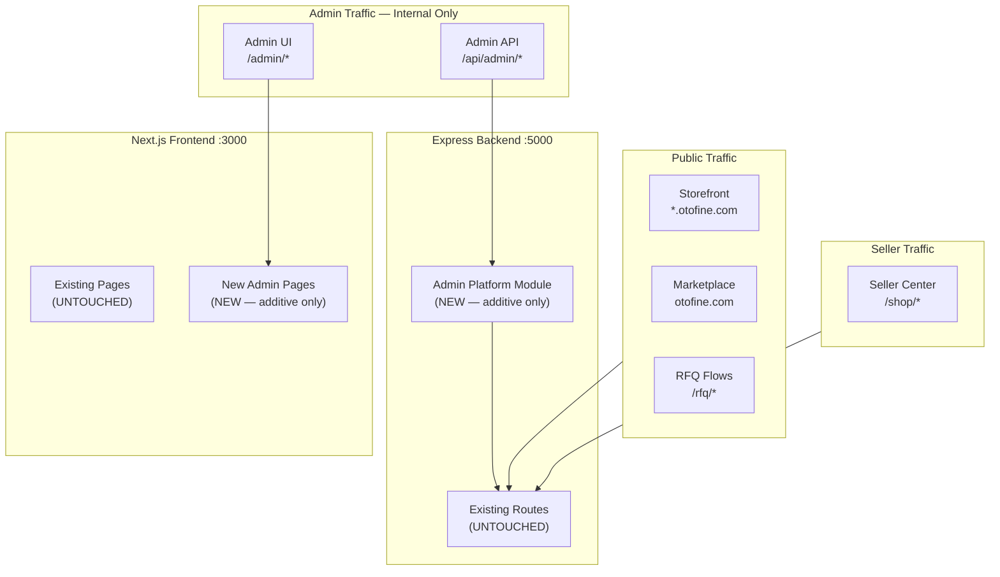
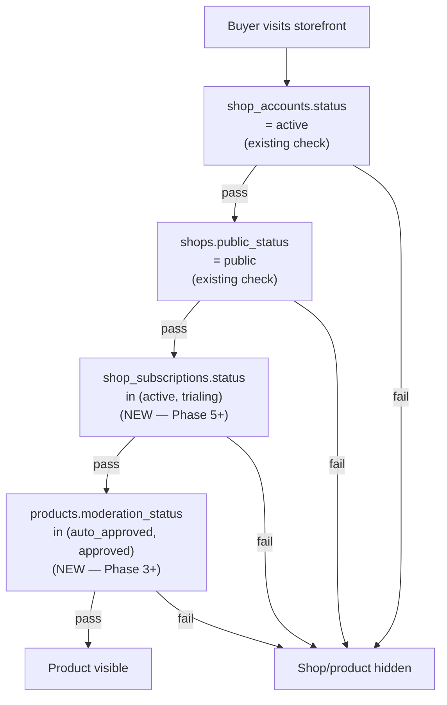
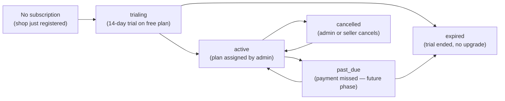
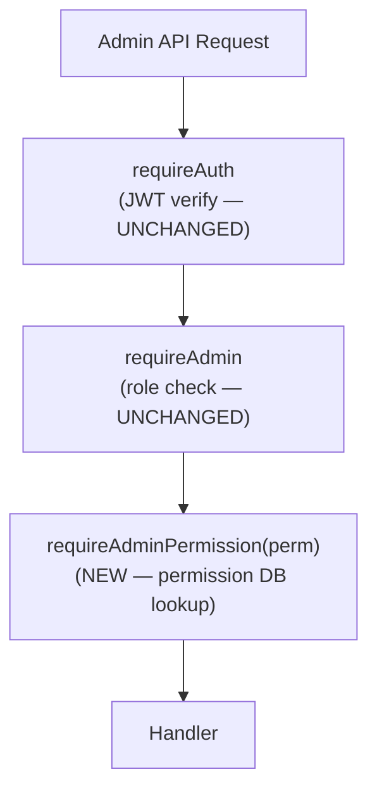
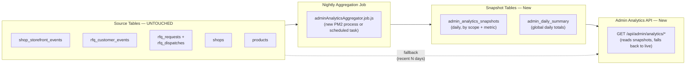

# Otofine — Admin Platform Architecture Design

> **Phase:** Architecture Design Only  
> **Date:** 2026-05-26  
> **Scope:** Additive architecture design. No implementation, no migrations, no code changes.  
> **Source of truth:** All five system-audit documents in `/docs/system-audit/`.

---

## Table of Contents

1. [Admin Platform Boundaries](#1-admin-platform-boundaries)
2. [Domain Separation Strategy](#2-domain-separation-strategy)
3. [Recommended Module Structure](#3-recommended-module-structure)
4. [Database Expansion Strategy](#4-database-expansion-strategy)
5. [Visibility & Moderation Policy Architecture](#5-visibility--moderation-policy-architecture)
6. [Subscription Lifecycle Architecture](#6-subscription-lifecycle-architecture)
7. [Admin Auth & RBAC Strategy](#7-admin-auth--rbac-strategy)
8. [Analytics Aggregation Strategy](#8-analytics-aggregation-strategy)
9. [Risk Engine Strategy](#9-risk-engine-strategy)
10. [Queue & Background Job Strategy](#10-queue--background-job-strategy)
11. [Audit Logging Architecture](#11-audit-logging-architecture)
12. [Rollout & Feature-Flag Strategy](#12-rollout--feature-flag-strategy)
13. [Safe Extension Points](#13-safe-extension-points)
14. [High-Risk Areas That Must Remain Untouched](#14-high-risk-areas-that-must-remain-untouched)
15. [Recommended Implementation Phases](#15-recommended-implementation-phases)

---

## 1. Admin Platform Boundaries

### 1.1 Platform Scope

The admin platform is a set of internal tools for the Otofine operations team. It sits strictly *inside* the existing Express backend and Next.js frontend. It is not a separate service, not a separate subdomain, and not a separate deployment unit at this stage.



### 1.2 What the Admin Platform Owns

| Domain | Admin Capability | Touches Existing? |
|---|---|---|
| Shop approval | Review and approve new shops | Writes to `shops.public_status` (additive action) |
| Product moderation | Review reported/flagged products | Adds `product_moderation_status` column |
| Billing/subscription | Plan management, shop tier assignment | New tables only |
| Seller CRM | Notes, tags, segments on seller accounts | New tables only |
| Risk/fraud | Signal collection, risk queue, action log | New tables only |
| Analytics dashboards | Aggregated operational metrics | New summary tables; reads existing event tables |
| RBAC | Admin role and permission management | New tables; extends existing `requireAdmin` chain |
| Audit logging | Immutable log of all admin actions | New table |

### 1.3 What the Admin Platform Does NOT Own

- Wildcard subdomain routing logic
- Storefront rendering or SEO metadata
- Product CRUD for sellers (creation, editing)
- RFQ dispatch, wave, escalation logic
- Product slug generation or canonical URL structure
- Seller auth flows
- Typesense indexing or nightly rebuild

### 1.4 Boundary Enforcement Model

```
Admin request → Nginx (apex config, /admin/* path)
  → Next.js :3000 (frontend pages under /admin/*)
     → AdminGuard.jsx (client-side role check — UX gate only)
        → API calls via adminApi.js
           → Express :5000 (/api/admin/*)
              → requireAuth middleware (JWT verify — unchanged)
              → requireAdmin middleware (role check — unchanged)
              → requireAdminPermission(perm) (NEW — DB-backed permission check)
              → handler
```

The existing `requireAuth → requireAdmin` chain remains the security boundary. The new `requireAdminPermission` middleware is a strictly additive extension applied only to new admin routes.

---

## 2. Domain Separation Strategy

### 2.1 Existing Domain Layout (Current Production)

```
backend/
├── domains/
│   ├── auth/          ← seller + admin login, JWT, refresh tokens
│   ├── shopPublic/    ← storefront API (⚠️ MUST NOT TOUCH)
│   └── storefrontEvents/  ← event ingestion (⚠️ MUST NOT TOUCH)
└── modules/
    └── rfq/           ← entire RFQ subsystem (⚠️ MUST NOT TOUCH)
```

### 2.2 New Admin Domain Layout

The admin platform is organized as a single top-level module `backend/modules/admin/` with internal sub-modules. This mirrors the self-contained structure of `modules/rfq/`.

```
backend/modules/admin/
├── index.js                    ← barrel — mounts all admin sub-routes
├── config/
│   └── adminPlatform.config.js ← feature flags and config
├── core/
│   ├── rbac/                   ← role/permission tables and middleware
│   └── auditLog/               ← append-only admin action log
├── shopModeration/             ← shop approval queue, status actions
├── productModeration/          ← product approval queue
├── billing/                    ← plans, subscriptions, invoices
├── sellerCrm/                  ← notes, tags, seller segments
├── riskEngine/                 ← risk signals, scores, fraud queue
└── analytics/                  ← aggregated operational dashboards
```

### 2.3 Route Mount Strategy

The admin platform module is mounted once in `backend/server.js`:

```javascript
// backend/server.js — ADDITIVE mount only
// ... existing routes (untouched) ...

// Admin Platform Module (new)
import adminPlatformRoutes from './modules/admin/index.js';
app.use('/api/admin', adminPlatformRoutes);
```

The existing `routes/admin.routes.js` remains mounted at `/api/admin` for backward compatibility. The new module routes are added as sub-paths under `/api/admin` (e.g., `/api/admin/moderation/shops`, `/api/admin/billing/plans`), so there is no conflict with existing `/api/admin/shops` and `/api/admin/part-knowledge` routes.

### 2.4 Frontend Separation

```
frontend/app/admin/
├── login/page.js              ← existing (untouched)
├── forgot-password/page.js    ← existing (untouched)
├── shops/page.js              ← existing (untouched — basic list + block/delete)
├── part-knowledge/page.js     ← existing (untouched)
├── seo/page.js                ← existing (untouched)
├── seo-articles/page.js       ← existing (untouched)
├── seo-pages/page.js          ← existing (untouched)
│
│   ─── NEW pages below ───
│
├── dashboard/page.js          ← new: admin home overview
├── moderation/
│   ├── shops/page.js          ← new: shop approval queue
│   └── products/page.js       ← new: product moderation queue
├── billing/
│   ├── plans/page.js          ← new: plan management
│   └── subscriptions/page.js  ← new: shop subscription view
├── sellers/
│   ├── page.js                ← new: seller CRM list
│   └── [shopId]/page.js       ← new: individual seller CRM profile
├── risk/page.js               ← new: risk/fraud queue
├── analytics/page.js          ← new: operational dashboards
├── audit/page.js              ← new: audit log viewer
└── settings/
    └── roles/page.js          ← new: RBAC management
```

All new pages are wrapped in the existing `AdminGuard.jsx` component. No changes to `AdminGuard.jsx` itself.

---

## 3. Recommended Module Structure

Each sub-module follows the same internal structure as `modules/rfq/`:

```
backend/modules/admin/{module}/
├── routes/
│   └── {module}.admin.routes.js
├── controllers/
│   └── {module}.admin.controller.js
├── services/
│   └── {module}.admin.service.js
├── repositories/
│   └── {module}.admin.repository.js
└── (optional) middlewares/
    └── {module}.middleware.js
```

### 3.1 Module Inventory

#### `core/rbac/`
- **Routes:** `/api/admin/rbac/roles`, `/api/admin/rbac/permissions`, `/api/admin/accounts`
- **Services:** Role CRUD, permission assignment, admin account management
- **Repository:** `admin_roles`, `admin_permissions`, `admin_role_permissions`, `admin_accounts`
- **Middleware:** `requireAdminPermission(permissionCode)` — new, additive only

#### `core/auditLog/`
- **Routes:** `/api/admin/audit-log` (read-only query endpoint)
- **Service:** `auditLog.service.js` — thin INSERT wrapper, called from controllers
- **Repository:** `admin_audit_log`
- **No middleware** — write path is a service call from within controllers

#### `shopModeration/`
- **Routes:** `/api/admin/moderation/shops`, `/api/admin/moderation/shops/:id/approve`, `/api/admin/moderation/shops/:id/reject`, `/api/admin/moderation/shops/:id/suspend`
- **Services:** `shopApproval.service.js`, `shopModerationAction.service.js`
- **Repository:** `shop_moderation_queue`, `shop_moderation_actions`
- **Events emitted:** Writes to `admin_audit_log`

#### `productModeration/`
- **Routes:** `/api/admin/moderation/products`, `/api/admin/moderation/products/:id/approve`, `/api/admin/moderation/products/:id/reject`
- **Services:** `productModerationQueue.service.js`
- **Repository:** `product_moderation_queue`, `product_moderation_actions`

#### `billing/`
- **Routes:** `/api/admin/billing/plans`, `/api/admin/billing/subscriptions`, `/api/admin/billing/subscriptions/:shopId`
- **Services:** `billingPlan.service.js`, `shopSubscription.service.js`, `billingCycle.service.js`
- **Repository:** `billing_plans`, `shop_subscriptions`, `billing_invoices`

#### `sellerCrm/`
- **Routes:** `/api/admin/sellers`, `/api/admin/sellers/:shopId`, `/api/admin/sellers/:shopId/notes`, `/api/admin/sellers/:shopId/tags`
- **Services:** `sellerCrm.service.js`, `sellerSegment.service.js`
- **Repository:** `seller_crm_notes`, `seller_crm_tags`, `seller_segments`, `seller_segment_memberships`

#### `riskEngine/`
- **Routes:** `/api/admin/risk/signals`, `/api/admin/risk/scores`, `/api/admin/risk/queue`, `/api/admin/risk/actions`
- **Services:** `riskSignal.service.js`, `riskScore.service.js`, `riskQueue.service.js`
- **Repository:** `risk_signals`, `risk_scores`, `risk_actions`
- **Background:** `jobs/adminRiskScorer.job.js` (new — DB-backed job queue)

#### `analytics/`
- **Routes:** `/api/admin/analytics/overview`, `/api/admin/analytics/shops`, `/api/admin/analytics/rfq`, `/api/admin/analytics/products`
- **Services:** `adminAnalytics.service.js` — reads from snapshot table; falls back to live queries
- **Repository:** `admin_analytics_snapshots`
- **Background:** `jobs/adminAnalyticsAggregator.job.js` (new — nightly aggregation)

---

## 4. Database Expansion Strategy

### 4.1 Migration Conventions

All new admin platform migrations follow existing conventions:
- Numbered SQL files in `backend/migrations/` — start from `051_` to avoid conflicts with existing `001–050` range
- MySQL only (no SQL Server variants needed for admin tables)
- Every table definition uses `CREATE TABLE IF NOT EXISTS`
- All FK references use explicit `CONSTRAINT` names
- New migration runner: `backend/scripts/run-admin-migration.js`
- A new `schema_migrations` tracking table (described below) is introduced as the first admin migration to prevent double-application

### 4.2 Migration State Tracking (New — Not Additive to Existing)

The existing migration system has no state table. A new `schema_migrations` table is introduced as the first admin migration. It tracks only admin platform migrations — it does not retroactively track previously applied migrations.

```sql
-- 051_admin_schema_migrations.sql
CREATE TABLE IF NOT EXISTS schema_migrations (
  id         INT UNSIGNED AUTO_INCREMENT PRIMARY KEY,
  filename   VARCHAR(255) NOT NULL,
  applied_at DATETIME(3) DEFAULT CURRENT_TIMESTAMP(3),
  UNIQUE KEY uq_schema_migration_filename (filename)
);
```

The new `run-admin-migration.js` runner checks `schema_migrations` before applying each file.

### 4.3 RBAC Tables

```sql
-- 052_admin_rbac.sql

CREATE TABLE IF NOT EXISTS admin_accounts (
  id            INT UNSIGNED AUTO_INCREMENT PRIMARY KEY,
  email         VARCHAR(255) NOT NULL,
  password_hash VARCHAR(255) NOT NULL,
  display_name  VARCHAR(100) NULL,
  is_active     TINYINT(1) DEFAULT 1,
  created_at    DATETIME(3) DEFAULT CURRENT_TIMESTAMP(3),
  updated_at    DATETIME(3) DEFAULT CURRENT_TIMESTAMP(3) ON UPDATE CURRENT_TIMESTAMP(3),
  UNIQUE KEY uq_admin_accounts_email (email)
);

-- Existing `admin` table row is the superadmin; admin_accounts rows are regular admins
-- admin_accounts does NOT replace the existing `admin` table
-- The existing `admin` table continues to serve the existing /api/auth/admin-login flow

CREATE TABLE IF NOT EXISTS admin_roles (
  id          INT UNSIGNED AUTO_INCREMENT PRIMARY KEY,
  name        VARCHAR(100) NOT NULL,
  description VARCHAR(255) NULL,
  is_system   TINYINT(1) DEFAULT 0,  -- 1 = built-in, cannot delete
  created_at  DATETIME(3) DEFAULT CURRENT_TIMESTAMP(3),
  UNIQUE KEY uq_admin_roles_name (name)
);

CREATE TABLE IF NOT EXISTS admin_permissions (
  id          INT UNSIGNED AUTO_INCREMENT PRIMARY KEY,
  code        VARCHAR(100) NOT NULL,  -- e.g. 'shop:moderate', 'billing:manage'
  description VARCHAR(255) NULL,
  module      VARCHAR(50) NOT NULL,   -- 'shopModeration', 'billing', etc.
  UNIQUE KEY uq_admin_permissions_code (code)
);

CREATE TABLE IF NOT EXISTS admin_role_permissions (
  role_id       INT UNSIGNED NOT NULL,
  permission_id INT UNSIGNED NOT NULL,
  PRIMARY KEY (role_id, permission_id),
  CONSTRAINT fk_arp_role       FOREIGN KEY (role_id)       REFERENCES admin_roles(id)       ON DELETE CASCADE,
  CONSTRAINT fk_arp_permission FOREIGN KEY (permission_id) REFERENCES admin_permissions(id) ON DELETE CASCADE
);

CREATE TABLE IF NOT EXISTS admin_account_roles (
  admin_account_id INT UNSIGNED NOT NULL,
  role_id          INT UNSIGNED NOT NULL,
  granted_by       INT UNSIGNED NULL,  -- admin_account_id of granter
  granted_at       DATETIME(3) DEFAULT CURRENT_TIMESTAMP(3),
  PRIMARY KEY (admin_account_id, role_id),
  CONSTRAINT fk_aar_account FOREIGN KEY (admin_account_id) REFERENCES admin_accounts(id) ON DELETE CASCADE,
  CONSTRAINT fk_aar_role    FOREIGN KEY (role_id)          REFERENCES admin_roles(id)    ON DELETE CASCADE
);
```

### 4.4 Audit Log Table

```sql
-- 053_admin_audit_log.sql

CREATE TABLE IF NOT EXISTS admin_audit_log (
  id            BIGINT UNSIGNED AUTO_INCREMENT PRIMARY KEY,
  admin_id      INT UNSIGNED NULL,  -- NULL = system action; no FK to allow flexible actor types
  actor_type    ENUM('admin','system','superadmin') DEFAULT 'admin',
  action        VARCHAR(100) NOT NULL,       -- e.g. 'shop.approve', 'product.reject', 'plan.create'
  target_type   VARCHAR(50) NULL,            -- e.g. 'shop', 'product', 'billing_plan'
  target_id     BIGINT UNSIGNED NULL,
  before_json   JSON NULL,
  after_json    JSON NULL,
  ip_address    VARCHAR(45) NULL,
  user_agent    VARCHAR(512) NULL,
  metadata_json JSON NULL,
  created_at    DATETIME(3) DEFAULT CURRENT_TIMESTAMP(3),
  INDEX idx_audit_admin_id    (admin_id),
  INDEX idx_audit_action      (action),
  INDEX idx_audit_target      (target_type, target_id),
  INDEX idx_audit_created_at  (created_at)
);
```

### 4.5 Shop Moderation Tables

```sql
-- 054_admin_shop_moderation.sql

-- Tracks shops pending admin review (new registration approval flow)
CREATE TABLE IF NOT EXISTS shop_moderation_queue (
  id              BIGINT UNSIGNED AUTO_INCREMENT PRIMARY KEY,
  shop_id         BIGINT UNSIGNED NOT NULL,
  account_id      BIGINT UNSIGNED NOT NULL,
  status          ENUM('pending','approved','rejected','needs_info') DEFAULT 'pending',
  assigned_to     INT UNSIGNED NULL,          -- admin_account_id
  priority        TINYINT UNSIGNED DEFAULT 0, -- 0=normal, 1=urgent, 2=high
  submitted_at    DATETIME(3) DEFAULT CURRENT_TIMESTAMP(3),
  reviewed_at     DATETIME(3) NULL,
  reviewed_by     INT UNSIGNED NULL,
  rejection_reason VARCHAR(512) NULL,
  notes_json      JSON NULL,
  INDEX idx_smq_shop_id  (shop_id),
  INDEX idx_smq_status   (status, submitted_at),
  INDEX idx_smq_assigned (assigned_to, status)
);

-- Append-only history of all moderation actions on a shop
CREATE TABLE IF NOT EXISTS shop_moderation_actions (
  id          BIGINT UNSIGNED AUTO_INCREMENT PRIMARY KEY,
  shop_id     BIGINT UNSIGNED NOT NULL,
  admin_id    INT UNSIGNED NULL,
  action      ENUM('approve','reject','suspend','unsuspend','request_info','force_disable','verify','unverify') NOT NULL,
  reason      VARCHAR(512) NULL,
  metadata_json JSON NULL,
  created_at  DATETIME(3) DEFAULT CURRENT_TIMESTAMP(3),
  INDEX idx_sma_shop_id   (shop_id),
  INDEX idx_sma_created   (created_at),
  INDEX idx_sma_action    (action)
);
```

**Additive integration note:** The `shops.public_status` ENUM already has `suspended` and `draft` values. The shop moderation module writes to these existing fields via SQL UPDATE on the `shops` table. The existing `findPublicShopBySlug` query (`WHERE slug = ? AND public_status = 'public'`) is not modified — the moderation action simply sets the status to a value that the existing visibility check already handles.

### 4.6 Product Moderation Tables

```sql
-- 055_admin_product_moderation.sql

-- New column on existing products table (additive)
ALTER TABLE products
  ADD COLUMN IF NOT EXISTS moderation_status
    ENUM('auto_approved','pending_review','approved','rejected','flagged')
    DEFAULT 'auto_approved'
    AFTER shopId,
  ADD COLUMN IF NOT EXISTS moderated_at    DATETIME(3) NULL,
  ADD COLUMN IF NOT EXISTS moderated_by    INT UNSIGNED NULL,
  ADD INDEX IF NOT EXISTS idx_products_mod_status (moderation_status);

-- Product moderation queue
CREATE TABLE IF NOT EXISTS product_moderation_queue (
  id            BIGINT UNSIGNED AUTO_INCREMENT PRIMARY KEY,
  product_id    BIGINT UNSIGNED NOT NULL,
  shop_id       BIGINT UNSIGNED NOT NULL,
  trigger_type  ENUM('new_product','seller_edit','flagged_by_buyer','admin_flag','auto_risk') NOT NULL,
  status        ENUM('pending','reviewed','approved','rejected') DEFAULT 'pending',
  assigned_to   INT UNSIGNED NULL,
  priority      TINYINT UNSIGNED DEFAULT 0,
  queued_at     DATETIME(3) DEFAULT CURRENT_TIMESTAMP(3),
  reviewed_at   DATETIME(3) NULL,
  reviewed_by   INT UNSIGNED NULL,
  rejection_reason VARCHAR(512) NULL,
  INDEX idx_pmq_product_id (product_id),
  INDEX idx_pmq_shop_id    (shop_id),
  INDEX idx_pmq_status     (status, queued_at)
);
```

**Visibility integration:** The existing product listing queries (`FROM products p ...`) will have an additive `AND (p.moderation_status = 'auto_approved' OR p.moderation_status = 'approved')` filter. This filter is **not added to existing repository files**. Instead, the admin module owns a new service that bulk-updates `moderation_status` and triggers cache invalidation via the existing `invalidateListCache()` function (which already handles this correctly for product writes).

### 4.7 Billing Tables

```sql
-- 056_admin_billing.sql

CREATE TABLE IF NOT EXISTS billing_plans (
  id            INT UNSIGNED AUTO_INCREMENT PRIMARY KEY,
  code          VARCHAR(50) NOT NULL,      -- 'free', 'basic', 'pro', 'enterprise'
  name          VARCHAR(100) NOT NULL,
  price_vnd     INT UNSIGNED DEFAULT 0,    -- monthly price in VND
  features_json JSON NULL,                 -- feature flags unlocked by plan
  max_products  INT UNSIGNED DEFAULT 100,
  is_active     TINYINT(1) DEFAULT 1,
  display_order TINYINT UNSIGNED DEFAULT 0,
  created_at    DATETIME(3) DEFAULT CURRENT_TIMESTAMP(3),
  UNIQUE KEY uq_billing_plans_code (code)
);

CREATE TABLE IF NOT EXISTS shop_subscriptions (
  id            BIGINT UNSIGNED AUTO_INCREMENT PRIMARY KEY,
  shop_id       BIGINT UNSIGNED NOT NULL,
  plan_id       INT UNSIGNED NOT NULL,
  status        ENUM('trialing','active','past_due','cancelled','expired') DEFAULT 'trialing',
  current_period_start DATETIME(3) NULL,
  current_period_end   DATETIME(3) NULL,
  trial_ends_at        DATETIME(3) NULL,
  cancelled_at         DATETIME(3) NULL,
  created_at    DATETIME(3) DEFAULT CURRENT_TIMESTAMP(3),
  updated_at    DATETIME(3) DEFAULT CURRENT_TIMESTAMP(3) ON UPDATE CURRENT_TIMESTAMP(3),
  UNIQUE KEY uq_shop_subscriptions_shop (shop_id),
  INDEX idx_ss_status            (status),
  INDEX idx_ss_period_end        (current_period_end),
  CONSTRAINT fk_ss_plan FOREIGN KEY (plan_id) REFERENCES billing_plans(id) ON DELETE RESTRICT
);

CREATE TABLE IF NOT EXISTS billing_invoices (
  id              BIGINT UNSIGNED AUTO_INCREMENT PRIMARY KEY,
  shop_id         BIGINT UNSIGNED NOT NULL,
  subscription_id BIGINT UNSIGNED NOT NULL,
  amount_vnd      INT UNSIGNED NOT NULL,
  status          ENUM('draft','open','paid','void','uncollectable') DEFAULT 'draft',
  due_date        DATE NULL,
  paid_at         DATETIME(3) NULL,
  period_start    DATE NULL,
  period_end      DATE NULL,
  notes           TEXT NULL,
  created_at      DATETIME(3) DEFAULT CURRENT_TIMESTAMP(3),
  INDEX idx_bi_shop_id    (shop_id),
  INDEX idx_bi_status     (status),
  INDEX idx_bi_due_date   (due_date),
  CONSTRAINT fk_bi_subscription FOREIGN KEY (subscription_id) REFERENCES shop_subscriptions(id) ON DELETE RESTRICT
);
```

**Design note:** Billing is initially internal-only (no payment gateway integration). The admin assigns plans manually. Payment gateway integration (Stripe, VNPay, etc.) is a future extension that adds a `billing_transactions` table and a webhook handler without changing the subscription lifecycle model.

### 4.8 Seller CRM Tables

```sql
-- 057_admin_seller_crm.sql

CREATE TABLE IF NOT EXISTS seller_crm_notes (
  id         BIGINT UNSIGNED AUTO_INCREMENT PRIMARY KEY,
  shop_id    BIGINT UNSIGNED NOT NULL,
  admin_id   INT UNSIGNED NOT NULL,
  content    TEXT NOT NULL,
  is_pinned  TINYINT(1) DEFAULT 0,
  created_at DATETIME(3) DEFAULT CURRENT_TIMESTAMP(3),
  updated_at DATETIME(3) DEFAULT CURRENT_TIMESTAMP(3) ON UPDATE CURRENT_TIMESTAMP(3),
  INDEX idx_scn_shop_id   (shop_id),
  INDEX idx_scn_admin_id  (admin_id),
  INDEX idx_scn_pinned    (shop_id, is_pinned)
);

CREATE TABLE IF NOT EXISTS seller_crm_tags (
  id       INT UNSIGNED AUTO_INCREMENT PRIMARY KEY,
  name     VARCHAR(50) NOT NULL,
  color    VARCHAR(7) DEFAULT '#888888',  -- hex color
  UNIQUE KEY uq_seller_crm_tags_name (name)
);

CREATE TABLE IF NOT EXISTS seller_crm_tag_assignments (
  shop_id    BIGINT UNSIGNED NOT NULL,
  tag_id     INT UNSIGNED NOT NULL,
  assigned_by INT UNSIGNED NOT NULL,
  assigned_at DATETIME(3) DEFAULT CURRENT_TIMESTAMP(3),
  PRIMARY KEY (shop_id, tag_id),
  CONSTRAINT fk_scta_tag FOREIGN KEY (tag_id) REFERENCES seller_crm_tags(id) ON DELETE CASCADE
);

CREATE TABLE IF NOT EXISTS seller_segments (
  id          INT UNSIGNED AUTO_INCREMENT PRIMARY KEY,
  name        VARCHAR(100) NOT NULL,
  description VARCHAR(255) NULL,
  rules_json  JSON NOT NULL,  -- criteria definition for dynamic segment membership
  is_dynamic  TINYINT(1) DEFAULT 0,  -- 1 = auto-refreshed via job; 0 = manual list
  refreshed_at DATETIME(3) NULL,
  created_at  DATETIME(3) DEFAULT CURRENT_TIMESTAMP(3),
  UNIQUE KEY uq_seller_segments_name (name)
);

CREATE TABLE IF NOT EXISTS seller_segment_memberships (
  segment_id BIGINT UNSIGNED NOT NULL,
  shop_id    BIGINT UNSIGNED NOT NULL,
  added_at   DATETIME(3) DEFAULT CURRENT_TIMESTAMP(3),
  PRIMARY KEY (segment_id, shop_id)
);
```

### 4.9 Risk Engine Tables

```sql
-- 058_admin_risk_engine.sql

CREATE TABLE IF NOT EXISTS risk_signals (
  id          BIGINT UNSIGNED AUTO_INCREMENT PRIMARY KEY,
  entity_type ENUM('shop','account','product','rfq_request','ip') NOT NULL,
  entity_id   BIGINT UNSIGNED NOT NULL,
  signal_type VARCHAR(100) NOT NULL,  -- 'rapid_product_creation', 'rfq_spam_pattern', etc.
  weight      TINYINT UNSIGNED DEFAULT 1,  -- contribution to risk score
  metadata_json JSON NULL,
  detected_at DATETIME(3) DEFAULT CURRENT_TIMESTAMP(3),
  expires_at  DATETIME(3) NULL,
  INDEX idx_rs_entity  (entity_type, entity_id),
  INDEX idx_rs_signal  (signal_type),
  INDEX idx_rs_detected (detected_at)
);

CREATE TABLE IF NOT EXISTS risk_scores (
  id           BIGINT UNSIGNED AUTO_INCREMENT PRIMARY KEY,
  entity_type  ENUM('shop','account') NOT NULL,
  entity_id    BIGINT UNSIGNED NOT NULL,
  score        SMALLINT UNSIGNED DEFAULT 0,   -- 0–1000; higher = more risk
  risk_level   ENUM('low','medium','high','critical') DEFAULT 'low',
  signal_count SMALLINT UNSIGNED DEFAULT 0,
  computed_at  DATETIME(3) DEFAULT CURRENT_TIMESTAMP(3),
  UNIQUE KEY uq_risk_scores_entity (entity_type, entity_id),
  INDEX idx_risk_scores_level (risk_level),
  INDEX idx_risk_scores_score (score)
);

CREATE TABLE IF NOT EXISTS risk_actions (
  id          BIGINT UNSIGNED AUTO_INCREMENT PRIMARY KEY,
  entity_type ENUM('shop','account','product') NOT NULL,
  entity_id   BIGINT UNSIGNED NOT NULL,
  action      ENUM('flag','escalate','suspend','clear','whitelist') NOT NULL,
  admin_id    INT UNSIGNED NULL,  -- NULL = automated
  reason      VARCHAR(512) NULL,
  created_at  DATETIME(3) DEFAULT CURRENT_TIMESTAMP(3),
  INDEX idx_ra_entity  (entity_type, entity_id),
  INDEX idx_ra_created (created_at)
);
```

### 4.10 Analytics Snapshot Tables

```sql
-- 059_admin_analytics_snapshots.sql

-- Pre-computed daily metrics for fast admin dashboard reads
CREATE TABLE IF NOT EXISTS admin_analytics_snapshots (
  id          BIGINT UNSIGNED AUTO_INCREMENT PRIMARY KEY,
  snapshot_date DATE NOT NULL,
  scope_type  ENUM('global','shop','product','rfq') NOT NULL,
  scope_id    BIGINT UNSIGNED NULL,  -- NULL for global
  metric      VARCHAR(100) NOT NULL,
  value       BIGINT DEFAULT 0,
  value_float DECIMAL(10,4) NULL,  -- for rates and averages
  computed_at DATETIME(3) DEFAULT CURRENT_TIMESTAMP(3),
  UNIQUE KEY uq_analytics_snapshot (snapshot_date, scope_type, scope_id, metric),
  INDEX idx_as_date_scope (snapshot_date, scope_type),
  INDEX idx_as_scope_id   (scope_id, snapshot_date)
);

-- Global daily summaries for operational dashboard
CREATE TABLE IF NOT EXISTS admin_daily_summary (
  summary_date              DATE PRIMARY KEY,
  new_shops                 INT UNSIGNED DEFAULT 0,
  active_shops              INT UNSIGNED DEFAULT 0,
  new_products              INT UNSIGNED DEFAULT 0,
  storefront_views          INT UNSIGNED DEFAULT 0,
  rfq_submissions           INT UNSIGNED DEFAULT 0,
  rfq_quoted                INT UNSIGNED DEFAULT 0,
  rfq_spam_flagged          INT UNSIGNED DEFAULT 0,
  pending_moderation_shops  INT UNSIGNED DEFAULT 0,
  pending_moderation_products INT UNSIGNED DEFAULT 0,
  high_risk_accounts        INT UNSIGNED DEFAULT 0,
  computed_at               DATETIME(3) DEFAULT CURRENT_TIMESTAMP(3)
);
```

### 4.11 Admin Job Queue Table

```sql
-- 060_admin_job_queue.sql

-- DB-backed queue for admin background tasks (follows rfq_escalation_jobs pattern)
CREATE TABLE IF NOT EXISTS admin_job_queue (
  id               BIGINT UNSIGNED AUTO_INCREMENT PRIMARY KEY,
  job_type         VARCHAR(100) NOT NULL,   -- 'analytics_aggregate', 'risk_score', 'crm_segment_refresh'
  payload_json     JSON NOT NULL,
  status           ENUM('queued','processing','done','failed','dead') DEFAULT 'queued',
  idempotency_key  VARCHAR(255) NULL,
  attempts         TINYINT UNSIGNED DEFAULT 0,
  max_attempts     TINYINT UNSIGNED DEFAULT 3,
  run_at           DATETIME(3) DEFAULT CURRENT_TIMESTAMP(3),
  locked_until     DATETIME(3) DEFAULT '1970-01-01 00:00:00.000',
  last_error       TEXT NULL,
  created_at       DATETIME(3) DEFAULT CURRENT_TIMESTAMP(3),
  updated_at       DATETIME(3) DEFAULT CURRENT_TIMESTAMP(3) ON UPDATE CURRENT_TIMESTAMP(3),
  UNIQUE KEY uq_ajq_idempotency (idempotency_key),
  INDEX idx_ajq_status_run (status, run_at),
  INDEX idx_ajq_job_type   (job_type, status)
);
```

---

## 5. Visibility & Moderation Policy Architecture

### 5.1 Current Visibility Gates (Unchanged)

The existing visibility model uses two independent gates:

```
Shop visible on storefront IF:
  shops.public_status = 'public'          ← seller-controlled
  AND (upstream: shop_accounts.status not blocked/suspended/deleted)
```

Products are visible if their shop is visible — there is no per-product visibility check today.

### 5.2 New Layered Visibility Model

The admin platform adds two new gates **additively**. The existing queries are not modified. New visibility checks are enforced through:

1. **Admin-side status writes:** Admin moderation actions update existing fields (`public_status`, `shop_accounts.status`) that the existing visibility queries already filter.
2. **Per-product moderation status:** A new `moderation_status` column is added to `products`. Existing listing queries are NOT modified initially. The new column is used only by the admin moderation UI and by a new, separate product visibility check injected at the API layer for future phases.



### 5.3 Shop Approval Flow (New)

```
New shop registration (existing /api/auth/shop-register — UNCHANGED)
  → shop_accounts row created: status = 'pending'
  → shops row created: public_status = 'draft'
  → NEW: INSERT shop_moderation_queue row: status = 'pending'
  → NEW: Admin notified (via admin_job_queue trigger)

Admin reviews in /admin/moderation/shops:
  APPROVE:
    → UPDATE shop_accounts SET status = 'active'
    → INSERT shop_moderation_actions (action='approve')
    → INSERT admin_audit_log
    → Send welcome email to seller

  REJECT:
    → UPDATE shop_accounts SET status = 'blocked', rejection_reason = ?
    → UPDATE shop_moderation_queue SET status = 'rejected'
    → INSERT shop_moderation_actions (action='reject')
    → INSERT admin_audit_log

  APPROVE + ALLOW PUBLISH:
    → Same as APPROVE
    → (seller still needs to set public_status = 'public' themselves)
```

**Implementation note:** The registration hook (INSERT into `shop_moderation_queue`) is added via a new service call in `shopAuth.service.js` — the ONLY modification to existing code in Phase 2. This is a pure additive call that does not alter the existing return value or error handling.

### 5.4 Product Moderation Policy

Two modes supported:

**Auto-approval mode** (default — no change to existing behavior):
- New products receive `moderation_status = 'auto_approved'` automatically
- No admin action required
- Existing seller workflows unchanged

**Manual review mode** (opt-in per shop or globally via feature flag `ADMIN_PRODUCT_MODERATION_ENABLED`):
- New products receive `moderation_status = 'pending_review'`
- Admin reviews in `/admin/moderation/products`
- Admin approves → `moderation_status = 'approved'`
- Product becomes visible in listings

**Flag mode** (triggered by buyer report or risk signal):
- `moderation_status = 'flagged'`
- Product hidden from listings until admin reviews
- Seller notified

---

## 6. Subscription Lifecycle Architecture

### 6.1 Design Principles

- Billing is additive — it does not gate existing seller functionality until Phase 6 enforcement is enabled
- Plans define feature caps (max products, analytics depth, storefront badge) not access gates initially
- Subscription status does not affect storefront visibility in Phase 5 — enforcement is a separate feature-flagged phase

### 6.2 Plan Tiers

| Plan | Code | Price | Max Products | Key Features |
|---|---|---|---|---|
| Free | `free` | 0 | 100 | Basic storefront, RFQ, SEO eligibility |
| Basic | `basic` | TBD | 500 | + Analytics dashboard, priority in directory |
| Pro | `pro` | TBD | 2000 | + CRM features for seller, advanced analytics |
| Enterprise | `enterprise` | Custom | Unlimited | + Dedicated support, custom subdomain branding |

### 6.3 Subscription Lifecycle



### 6.4 Integration with Existing Systems

The subscription status is read by the new admin platform services. In Phase 5 only, the backend API for `GET /api/public/shops/:slug` gains an additive subscription eligibility check — gated by `ADMIN_SUBSCRIPTION_ENFORCEMENT_ENABLED` env flag. Until the flag is enabled, subscription status is informational only and does not affect any existing behavior.

---

## 7. Admin Auth & RBAC Strategy

### 7.1 Current State (From Audit)

- One hardcoded role: `"admin"` string in JWT payload
- Shared `JWT_SECRET` for both `"shop"` and `"admin"` tokens
- Existing `requireAdmin` middleware: `req.user.role === "admin"` — no DB call
- Existing `admin` table: single row, email + passwordHash

### 7.2 Additive RBAC Design

The design **does not modify** the existing `requireAdmin` middleware, the existing JWT payload, or the existing `JWT_SECRET`. It adds a new layer on top.



### 7.3 `requireAdminPermission` Middleware Design

New middleware in `backend/modules/admin/core/rbac/middlewares/adminPermission.middleware.js`:

```
requireAdminPermission(permissionCode):
  1. Read req.user (set by existing requireAuth — no change)
  2. Check if req.user.role === 'admin' (superadmin — skip permission check, allow all)
  3. If req.user.adminAccountId is set (multi-admin accounts — Phase 1+):
     → Check Redis cache: `admin:perms:{adminAccountId}` (TTL: 5 min)
     → Cache miss: SELECT permissions FROM admin_accounts + admin_role_permissions
     → Cache result
     → If permissionCode not in permissions: 403
  4. Else (superadmin via existing admin table): allow
```

**Key design decision:** The existing `admin` table superadmin always passes `requireAdminPermission` without a DB check. This ensures zero backward compatibility risk. New `admin_accounts` rows (regular admins with roles) are subject to permission checking.

### 7.4 Built-in Permission Codes

| Permission Code | Module | Description |
|---|---|---|
| `shop:view` | shopModeration | View shop list and details |
| `shop:moderate` | shopModeration | Approve, reject, suspend shops |
| `shop:verify` | shopModeration | Set verified_at badge |
| `product:view` | productModeration | View product moderation queue |
| `product:moderate` | productModeration | Approve, reject, flag products |
| `billing:view` | billing | View plans and subscriptions |
| `billing:manage` | billing | Create, edit, assign plans |
| `seller:view` | sellerCrm | View seller CRM profiles |
| `seller:crm_write` | sellerCrm | Add notes, tags, segments |
| `risk:view` | riskEngine | View risk signals and scores |
| `risk:action` | riskEngine | Take risk actions |
| `analytics:view` | analytics | View all dashboards |
| `audit:view` | auditLog | View audit log |
| `admin:manage` | rbac | Manage admin accounts and roles |

### 7.5 Built-in Roles (Seed Data)

| Role | Permissions |
|---|---|
| `superadmin` | All (system role — maps to existing `admin` table) |
| `moderator` | `shop:view`, `shop:moderate`, `product:view`, `product:moderate`, `risk:view`, `risk:action` |
| `support` | `shop:view`, `seller:view`, `seller:crm_write`, `audit:view` |
| `analyst` | `analytics:view`, `audit:view`, `shop:view`, `seller:view` |
| `billing_admin` | `billing:view`, `billing:manage`, `seller:view` |

### 7.6 Admin Account JWT Strategy

The new `admin_accounts` login flow (Phase 1) issues a JWT with an additional `adminAccountId` field in the payload. The existing JWT secret is reused. The admin JWT payload becomes:

```javascript
// Superadmin (existing admin table — unchanged payload shape)
{ id, role: "admin", email }

// Multi-admin account (new admin_accounts table)
{ id, role: "admin", email, adminAccountId, roleIds: [1, 2] }
```

`requireAdmin` sees `role === "admin"` and passes (unchanged behavior). `requireAdminPermission` reads `adminAccountId` to do permission lookup. If `adminAccountId` is absent (superadmin path), all permissions are granted.

### 7.7 Separate JWT Secret (Phase 2 Enhancement)

After Phase 1 stabilizes, a `ADMIN_JWT_SECRET` env var can be introduced. The `token.service.js` is updated to use `ADMIN_JWT_SECRET` for `role === "admin"` tokens and `JWT_SECRET` for `role === "shop"` tokens. This separates the compromise surface. This is a deferred security hardening step, not part of the initial admin platform launch.

---

## 8. Analytics Aggregation Strategy

### 8.1 Current Analytics State (From Audit)

- **Raw event tables:** `shop_storefront_events`, `rfq_customer_events`, `rfq_assist_events`, `rfq_reminder_outcomes`
- **Live query analytics:** `rfqAnalytics.service.js` (7+ unbuffered COUNTs on raw tables), `shopMetrics.service.js` (10 parallel queries per dashboard load)
- **No summary/snapshot tables exist**
- Admin analytics (`/api/rfq/admin/analytics`) queries raw tables directly — no caching

### 8.2 Admin Analytics Architecture



### 8.3 Aggregation Job Design

`backend/jobs/adminAnalyticsAggregator.job.js`:

- Triggered nightly via `admin_job_queue` (`job_type = 'analytics_aggregate'`)
- Processes: yesterday's date only (not full history on every run)
- Computes metrics from source tables
- INSERTs/UPDATEs `admin_analytics_snapshots` and `admin_daily_summary` for that date
- Idempotent: uses `INSERT ... ON DUPLICATE KEY UPDATE`
- No side effects on source tables

**Metrics computed per run:**

| Metric | Source | Aggregation |
|---|---|---|
| `new_shops` | `shops.created_at` | COUNT |
| `storefront_views` | `shop_storefront_events WHERE event_type='storefront_view'` | COUNT |
| `rfq_submissions` | `rfq_requests` by status | COUNT |
| `rfq_quoted_rate` | `rfq_dispatches` | AVG |
| `product_clicks` | `shop_storefront_events WHERE event_type='product_click'` | COUNT per shop |
| `rfq_response_rate` | `rfq_dispatches` accepted/total | RATIO |
| `top_categories` | `rfq_requests.category_key` | GROUP BY COUNT |
| `top_provinces` | `rfq_requests.location_json` | GROUP BY COUNT |

### 8.4 Admin Dashboard Panels

**Global overview (reads `admin_daily_summary`):**
- New shops (D, W, M trends)
- Active storefronts
- RFQ volume + conversion funnel
- Top categories by RFQ demand
- New products (D, W)
- Pending moderation counts

**Per-shop analytics (reads `admin_analytics_snapshots WHERE scope_type='shop' AND scope_id=?`):**
- Storefront view trend (28 days)
- RFQ received / quoted / expired
- Seller response rate
- Product click distribution

**RFQ funnel (reads `admin_analytics_snapshots WHERE scope_type='rfq'`):**
- Submission → OTP → dispatched → quoted → accepted funnel
- Wave performance
- Escalation rate

---

## 9. Risk Engine Strategy

### 9.1 Signal Collection

Risk signals are fed from multiple sources without modifying the source flows:

| Source | Signal | Collection Method |
|---|---|---|
| `rfq_requests.spam_flag = 1` | `rfq_spam_pattern` | Aggregated by admin analytics job |
| Rapid product creation | `rapid_product_creation` | New hook in product.service.js (additive: after product write, count recent creates) |
| Account age < 7 days + high product count | `new_account_high_volume` | Risk scorer job |
| `shop_accounts.status` changes | `status_change` | New: written at moderation action time |
| Phone number reuse across multiple accounts | `phone_reuse` | Risk scorer job |
| Duplicate product slugs across shops | `content_duplication` | Risk scorer job |
| Storefront analytics anomaly | `traffic_spike` | Risk scorer job |

### 9.2 Risk Score Computation

`backend/modules/admin/riskEngine/services/riskScore.service.js`:

```
computeRiskScore(entityType, entityId):
  1. SELECT active risk_signals WHERE entity_id = ? AND (expires_at IS NULL OR expires_at > NOW())
  2. sum = SUM(weight) for each signal
  3. risk_level = 
       sum >= 80  → 'critical'
       sum >= 50  → 'high'
       sum >= 20  → 'medium'
       else       → 'low'
  4. UPSERT risk_scores SET score=sum, risk_level=?, computed_at=NOW()
```

### 9.3 Risk Queue

High and critical risk entities are surfaced in `/admin/risk`:
- Admin reviews signal detail
- Admin can take actions: `flag` (informational), `escalate` (assign to reviewer), `suspend` (triggers shop suspension), `clear` (false positive), `whitelist` (suppress future signals)

All actions write to `risk_actions` and `admin_audit_log`.

### 9.4 Automated Risk Signals (No Existing Code Changes)

The risk signal ingestion runs as part of the admin worker job. It reads from existing tables (read-only access) and writes to `risk_signals`. No existing routes or services are modified.

---

## 10. Queue & Background Job Strategy

### 10.1 Current Job Infrastructure (From Audit)

- `jobs/scheduler.js` — node-cron (not in PM2, potentially not running)
- RFQ workers use polling loops with DB-backed queues (`rfq_escalation_jobs`, `rfq_auto_wave_jobs`)
- No generalized job queue; each worker type has its own table

### 10.2 New Admin Worker Design

A single new PM2 process: `admin-worker` runs `backend/jobs/adminWorker.js`.

The worker polls `admin_job_queue` using the same `FOR UPDATE SKIP LOCKED` pattern as `rfqEscalation.worker.js`:

```javascript
// backend/jobs/adminWorker.js
// Pattern: identical to rfqEscalation.worker.js
// - SELECT FROM admin_job_queue WHERE status='queued' AND run_at <= NOW() FOR UPDATE SKIP LOCKED LIMIT 1
// - dispatch to handler by job_type
// - UPDATE status = 'done' or 'failed'
```

### 10.3 Job Types and Handlers

| Job Type | Handler | Trigger | Frequency |
|---|---|---|---|
| `analytics_aggregate` | `adminAnalyticsAggregator` | Scheduled nightly | Daily 04:00 |
| `risk_score_batch` | `riskScoreBatch` | Scheduled nightly | Daily 04:30 |
| `billing_cycle_check` | `billingCycleChecker` | Scheduled daily | Daily 09:00 |
| `crm_segment_refresh` | `crmSegmentRefresher` | Scheduled nightly | Daily 03:30 |
| `moderation_notify` | `moderationNotifier` | Triggered by moderation action | On-demand |
| `shop_welcome_email` | `shopWelcomeEmail` | Triggered after approval | On-demand |

### 10.4 Job Scheduling

Jobs are scheduled by inserting rows into `admin_job_queue` with a specific `run_at`. The admin worker picks up any job whose `run_at <= NOW()`.

A new `backend/jobs/adminScheduler.js` (equivalent to `scheduler.js`) enqueues recurring jobs using node-cron. This is registered as a separate PM2 process `admin-scheduler`.

### 10.5 PM2 Additions

Two new PM2 processes:

| Name | Script | Mode | Poll |
|---|---|---|---|
| `admin-scheduler` | `jobs/adminScheduler.js` | fork | node-cron |
| `admin-worker` | `jobs/adminWorker.js` | fork | 10s poll |

These are additive PM2 entries. Existing PM2 processes are not modified.

---

## 11. Audit Logging Architecture

### 11.1 Design Principles

- **Append-only:** No UPDATE or DELETE on `admin_audit_log`
- **Synchronous write:** The audit log write completes before the API response is sent (not fire-and-forget). A write failure returns a 500 error.
- **Structured schema:** `before_json` and `after_json` capture the full entity state transition, not just a summary
- **Service abstraction:** All controllers call `auditLog.service.js:logAdminAction({...})` — never write directly to the table

### 11.2 Audit Service Interface

```javascript
// backend/modules/admin/core/auditLog/services/auditLog.service.js

async function logAdminAction({
  adminId,        // INT (admin_account_id or legacy admin.id)
  actorType,      // 'admin' | 'superadmin' | 'system'
  action,         // string e.g. 'shop.approve'
  targetType,     // string e.g. 'shop'
  targetId,       // BIGINT
  before,         // object snapshot before action (or null)
  after,          // object snapshot after action (or null)
  req,            // Express req — for ip_address + user_agent
  metadata,       // additional context object (optional)
})
```

### 11.3 What Gets Logged

| Action Pattern | Trigger |
|---|---|
| `shop.approve` / `shop.reject` / `shop.suspend` | Every shop moderation action |
| `product.approve` / `product.reject` / `product.flag` | Every product moderation action |
| `billing.plan.create` / `billing.plan.update` | Plan management |
| `billing.subscription.assign` | Subscription assignment |
| `seller.crm.note_add` / `seller.crm.tag_assign` | CRM writes |
| `risk.action.suspend` / `risk.action.clear` | Risk actions with effect |
| `rbac.role.create` / `rbac.account.role_assign` | RBAC changes |
| `admin.account.create` / `admin.account.deactivate` | Admin account management |

### 11.4 Audit Log Viewer (Frontend)

`/admin/audit/page.js`:
- Filterable by: admin_id, action, target_type, date range
- Displays before/after JSON diff
- Read-only — no mutations from this page
- Pagination: cursor-based on `(created_at, id)` descending

---

## 12. Rollout & Feature-Flag Strategy

### 12.1 Pattern (Consistent with Existing Codebase)

Feature flags follow the existing `PUBLIC_SHOPSITE_SUBDOMAIN_ENABLED` pattern: environment variables read at startup, centralized in a config module.

New config module: `backend/modules/admin/config/adminPlatform.config.js`

```javascript
// backend/modules/admin/config/adminPlatform.config.js
export const adminPlatformConfig = {
  rbacEnabled:                  process.env.ADMIN_RBAC_ENABLED === 'true',
  shopModerationEnabled:        process.env.ADMIN_SHOP_MODERATION_ENABLED === 'true',
  productModerationEnabled:     process.env.ADMIN_PRODUCT_MODERATION_ENABLED === 'true',
  billingEnabled:               process.env.ADMIN_BILLING_ENABLED === 'true',
  subscriptionEnforcementEnabled: process.env.ADMIN_SUBSCRIPTION_ENFORCEMENT_ENABLED === 'true',
  sellerCrmEnabled:             process.env.ADMIN_SELLER_CRM_ENABLED === 'true',
  riskEngineEnabled:            process.env.ADMIN_RISK_ENGINE_ENABLED === 'true',
  analyticsEnabled:             process.env.ADMIN_ANALYTICS_ENABLED === 'true',
  auditLogEnabled:              process.env.ADMIN_AUDIT_LOG_ENABLED === 'true',
  productModerationDefault:     process.env.ADMIN_PRODUCT_MODERATION_DEFAULT || 'auto_approved',
};
```

### 12.2 Route-Level Feature Gating

Each admin sub-module's route file reads its feature flag at mount time:

```javascript
// Example: shopModeration routes
if (!adminPlatformConfig.shopModerationEnabled) {
  router.use('*', (req, res) => res.status(404).json({ error: 'Feature not enabled' }));
}
```

This allows individual admin platform modules to be toggled independently without redeployment.

### 12.3 Frontend Feature Gating

New admin pages call a `/api/admin/platform/features` endpoint that returns the enabled feature flags. Pages render a "feature not yet enabled" state if the flag is false. No route redirect needed — the admin UI is internal and does not affect SEO.

### 12.4 Rollout Order

Each phase is independently flaggable. Recommended enable sequence:

```
Phase 1: ADMIN_RBAC_ENABLED=true, ADMIN_AUDIT_LOG_ENABLED=true
Phase 2: ADMIN_SHOP_MODERATION_ENABLED=true
Phase 3: ADMIN_PRODUCT_MODERATION_ENABLED=true
         ADMIN_PRODUCT_MODERATION_DEFAULT=auto_approved  ← start in auto mode
Phase 4: ADMIN_ANALYTICS_ENABLED=true
Phase 5: ADMIN_BILLING_ENABLED=true
Phase 6: ADMIN_SELLER_CRM_ENABLED=true
Phase 7: ADMIN_RISK_ENGINE_ENABLED=true
Phase 7+: ADMIN_SUBSCRIPTION_ENFORCEMENT_ENABLED=true  ← last, highest-risk
```

---

## 13. Safe Extension Points

These are the exact locations where new admin platform code can be attached without risk to existing production behavior:

### 13.1 Backend Extension Points

| Location | Type | Safe Action |
|---|---|---|
| `backend/server.js` | Route mount | Add `app.use('/api/admin', adminPlatformRoutes)` after existing mounts |
| `backend/modules/admin/index.js` | New barrel file | Mount all admin sub-routes here |
| `backend/domains/auth/services/shopAuth.service.js` | Post-registration hook | After `INSERT INTO shops` succeeds, call new `shopModerationQueue.service.js:enqueue(shopId)` — additive call, no change to return value |
| `shops.public_status` ENUM | Existing field | Write `suspended`, `disabled` via admin action — these values already exist |
| `shop_accounts.status` ENUM | Existing field | Write `blocked`, `suspended` via admin action — these values already exist |
| `shops.verified_at` | Existing column | Set this timestamp as part of shop verification flow |
| `rfqAdminOps.service.js` | Existing service | Add new exported functions; do not modify existing ones |
| `products.moderation_status` | New column | ADD COLUMN additive migration — no existing queries break |
| `admin_audit_log` | New table | Pure INSERT from new service |
| `admin_job_queue` | New table | Pure INSERT/UPDATE from new worker |

### 13.2 Frontend Extension Points

| Location | Type | Safe Action |
|---|---|---|
| `frontend/app/admin/` | New pages | Add new page files only — do not modify existing pages |
| `frontend/api/adminApi.js` | API client | Add new exported functions — do not modify existing ones |
| `frontend/components/AdminGuard.jsx` | Guard | Wrap new admin pages — do not modify the guard itself |
| `frontend/app/admin/layout.js` (create new) | Layout | Add a shared layout for new admin pages if needed |

### 13.3 What Requires Careful Coordination (Not Unsafe, But Needs Review)

| Location | Change | Risk Level |
|---|---|---|
| `shopAuth.service.js` post-registration hook | Additive service call | LOW — isolated, no return value change |
| `products` table `moderation_status` column | Additive `ALTER TABLE` | LOW — existing queries unaffected (new column, default value) |
| `billing/subscription` enforcement check in `shopPublic.service.js` | Additive WHERE clause | MEDIUM — gated by feature flag; only added in Phase 5+ |
| `admin` table supplemented by `admin_accounts` | Additive table | LOW — `admin` table is not altered |

---

## 14. High-Risk Areas That Must Remain Untouched

The following files and systems must not be modified during admin platform development. Any admin platform feature that appears to require a change to these files should be redesigned to be purely additive.

### 14.1 Wildcard Subdomain Infrastructure (CRITICAL — DO NOT TOUCH)

| File | Risk |
|---|---|
| `frontend/middleware.js` | All subdomain routing — modification breaks every storefront |
| `frontend/lib/shopHost.js` | Host classification logic — change breaks subdomain detection |
| `frontend/lib/shopsite/isWildcardStorefrontHost.js` | Predicate for storefront detection |
| `frontend/next.config.mjs` | API proxy rewrite — breaking this kills all backend data fetching |
| `/etc/nginx/sites-available/otofine-shop-subdomain.conf` | Live wildcard vhost |

### 14.2 SEO Infrastructure (CRITICAL — DO NOT TOUCH)

| File | Risk |
|---|---|
| `frontend/lib/seo/productSeoUrl.js` | Canonical URL contract — change triggers mass redirect storm |
| `frontend/app/[slug]/page.js` | Canonical enforcement + metadata for all indexed pages |
| `frontend/app/sitemap.js` | Crawl discovery |
| `frontend/app/robots.js` | Crawl budget |
| `backend/services/seoComposer.js` | SEO article HTML generation |
| `backend/services/seoSlugResolver.service.js` | Slug matching (contains known bug — leave until dedicated fix) |
| `backend/services/categorySeoComposer.js` | Category SEO content |
| `backend/utils/productSlug.js` | Backend slug generation |
| `frontend/lib/shopsite/buildShopMetadata.js` | Storefront metadata + robots gate |
| `frontend/lib/shopsite/buildShopJsonLd.js` | JSON-LD for storefronts |

### 14.3 Storefront Rendering (CRITICAL — DO NOT TOUCH)

| File/Directory | Risk |
|---|---|
| `frontend/app/(shopsite)/` | All storefront routes |
| `frontend/components/shopsite/` | All storefront UI components |
| `frontend/lib/shopsite/` | All storefront lib modules |
| `backend/domains/shopPublic/` | Storefront API domain — entire directory |
| `backend/domains/storefrontEvents/` | Analytics event ingestion |
| `backend/services/productList.service.js` | Product listing with filters |
| `backend/services/shopMetrics.service.js` | Seller metrics (seller-side analytics) |

### 14.4 RFQ Flows (DO NOT TOUCH)

| File/Directory | Risk |
|---|---|
| `backend/modules/rfq/` | Entire RFQ module — self-contained, live traffic |
| `backend/jobs/rfqAutoWave.worker.js` | RFQ dispatch dispatch |
| `backend/jobs/rfqEscalation.worker.js` | RFQ escalation |
| `backend/jobs/rfqBuyerReminder.worker.js` | Buyer notifications |
| `backend/services/rfqPush.service.js` | Push notifications |

### 14.5 Core Auth Middleware (DO NOT TOUCH)

| File | Risk |
|---|---|
| `backend/domains/auth/middlewares/auth.middleware.js` | `requireAuth`, `requireAdmin`, `requireShop` — gates all protected routes |
| `backend/domains/auth/services/token.service.js` | JWT sign/verify |
| `backend/domains/auth/services/session.service.js` | Refresh token rotation |
| `backend/domains/auth/services/shopAuth.service.js` | Login gate (except the post-registration hook noted in §13) |
| `backend/config/db.js` | DB connection pool |

### 14.6 Product Write Path (DO NOT TOUCH)

| File | Risk |
|---|---|
| `backend/services/product.service.js` | Core product CRUD — writes to `product_list_view` + Typesense |
| `backend/services/productListViewSync.service.js` | `product_list_view` sync |
| `backend/services/typesenseRealtimeSync.service.js` | Typesense sync |

---

## 15. Recommended Implementation Phases

Each phase is independently deployable. Later phases build on earlier ones but can be paused without affecting existing or earlier-phase behavior.

### Phase 1: Foundation — RBAC + Audit Log + Admin Auth

**Goal:** Establish the security and accountability infrastructure before any operational features are built.

**Scope:**
- New migrations: `051` (schema_migrations), `052` (admin RBAC), `053` (audit log)
- New module: `backend/modules/admin/core/rbac/`
- New module: `backend/modules/admin/core/auditLog/`
- New PM2 process: `admin-worker`, `admin-scheduler`
- New config: `adminPlatform.config.js`
- New frontend pages: `/admin/settings/roles`, `/admin/audit`
- Feature flags: `ADMIN_RBAC_ENABLED=true`, `ADMIN_AUDIT_LOG_ENABLED=true`
- **Zero changes to existing code**

**Duration estimate:** 2–3 weeks

---

### Phase 2: Shop Moderation

**Goal:** Give ops team visibility into all shops and the ability to manage their status with a full audit trail.

**Scope:**
- New migrations: `054` (shop_moderation)
- New module: `backend/modules/admin/shopModeration/`
- New frontend pages: `/admin/moderation/shops`
- **One additive change** to existing code: post-registration hook in `shopAuth.service.js`
- Email notification via existing Resend integration (new service call, existing infrastructure)
- Feature flag: `ADMIN_SHOP_MODERATION_ENABLED=true`

**Duration estimate:** 2 weeks

---

### Phase 3: Product Moderation

**Goal:** Enable per-product content review without disrupting existing seller workflows.

**Scope:**
- New migrations: `055` (product_moderation — includes `ALTER TABLE products ADD COLUMN`)
- New module: `backend/modules/admin/productModeration/`
- New frontend pages: `/admin/moderation/products`
- Start in `ADMIN_PRODUCT_MODERATION_DEFAULT=auto_approved` (no seller workflow change)
- Feature flag: `ADMIN_PRODUCT_MODERATION_ENABLED=true`

**Duration estimate:** 2 weeks

---

### Phase 4: Analytics Dashboards

**Goal:** Replace the current ad-hoc admin analytics (raw table queries) with fast, cached operational dashboards.

**Scope:**
- New migrations: `059` (analytics snapshots), `060` (job queue)
- New module: `backend/modules/admin/analytics/`
- New job: `backend/jobs/adminAnalyticsAggregator.job.js`
- New scheduler: `backend/jobs/adminScheduler.js`
- New frontend pages: `/admin/analytics`, `/admin/dashboard`
- PM2: add `admin-scheduler`, `admin-worker`
- Feature flag: `ADMIN_ANALYTICS_ENABLED=true`

**Duration estimate:** 3 weeks

---

### Phase 5: Billing & Subscription

**Goal:** Establish plan infrastructure and enable admin to assign plans to shops.

**Scope:**
- New migrations: `056` (billing)
- New module: `backend/modules/admin/billing/`
- New frontend pages: `/admin/billing/plans`, `/admin/billing/subscriptions`
- Seed `billing_plans` table with initial plan definitions
- Feature flag: `ADMIN_BILLING_ENABLED=true`
- `ADMIN_SUBSCRIPTION_ENFORCEMENT_ENABLED=false` at this phase (enforcement is a separate decision)

**Duration estimate:** 3 weeks

---

### Phase 6: Seller CRM

**Goal:** Enable ops team to annotate seller accounts with notes, tags, and segments for support and growth operations.

**Scope:**
- New migrations: `057` (CRM)
- New module: `backend/modules/admin/sellerCrm/`
- New frontend pages: `/admin/sellers`, `/admin/sellers/[shopId]`
- Feature flag: `ADMIN_SELLER_CRM_ENABLED=true`

**Duration estimate:** 2 weeks

---

### Phase 7: Risk Engine

**Goal:** Surface fraud signals and give the ops team a queue to review and act on high-risk shops/products.

**Scope:**
- New migrations: `058` (risk engine)
- New module: `backend/modules/admin/riskEngine/`
- New job: `adminRiskScorer.job.js`
- New frontend pages: `/admin/risk`
- Feature flag: `ADMIN_RISK_ENGINE_ENABLED=true`

**Duration estimate:** 3–4 weeks

---

### Phase 7+ (Deferred): Subscription Enforcement

**Goal:** Gate storefront visibility on subscription status.

**Prerequisites:** Phase 5 complete, billing plans assigned to all active shops, seller communication sent.

**Scope:**
- Single additive WHERE clause in `shopPublic.service.js`: `AND ss.status IN ('active','trialing')`
- Feature flag: `ADMIN_SUBSCRIPTION_ENFORCEMENT_ENABLED=true` (deploy false, enable separately)

**Risk:** Highest-risk phase — can suppress storefront visibility for shops without active subscriptions. Must only be enabled after all existing shops have been assigned to plans.

---

## Appendix: Architecture Summary Table

| Concern | Approach | Existing Code Changed? |
|---|---|---|
| Admin platform boundaries | New `/modules/admin/` module | No — additive mount in `server.js` |
| RBAC | New tables + new middleware | No — existing `requireAdmin` unchanged |
| Audit logging | New table + service | No — pure additive writes |
| Shop moderation | New tables + post-registration hook | Minimal — one additive call in `shopAuth.service.js` |
| Product moderation | New column on `products` + new table | Yes — ALTER TABLE additive column |
| Billing | New tables | No |
| Seller CRM | New tables | No |
| Risk engine | New tables + read-only access to existing tables | No |
| Analytics | New snapshot tables + read-only aggregation | No |
| Background jobs | New job queue table + new PM2 workers | No — existing workers untouched |
| Feature flags | New `adminPlatform.config.js` | No — new config file |
| Storefront routing | UNTOUCHED | No |
| SEO chains | UNTOUCHED | No |
| RFQ dispatch | UNTOUCHED | No |
| Seller workflows | UNTOUCHED | No |
